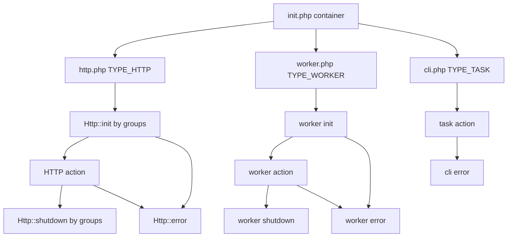

# Appwrite

Self-hosted Backend-as-a-Service. Hybrid monolithic-microservice architecture on PHP 8.5+ and Swoole 6, delivered as Docker containers.

## Commands

| Command | Purpose |
|---------|---------|
| `docker compose up -d --force-recreate --build` | Build and start all services (combined worker + scheduler by default) |
| `docker compose -f docker-compose.yml -f docker-compose.separate.yml --profile separate up -d` | Start per-queue worker and scheduler containers instead |
| `docker compose exec appwrite test tests/e2e/Services/[Service]` | Run E2E tests for a service |
| `docker compose exec appwrite test tests/e2e/Services/[Service] --filter=[Method]` | Run a single test method |
| `docker compose exec appwrite test tests/unit/` | Run unit tests |
| `composer format` | Auto-format code (Pint, PSR-12) |
| `composer format <file>` | Format a specific file |
| `composer lint <file>` | Check formatting of a file |
| `composer analyze` | Static analysis (PHPStan 2, level 4) |
| `composer check` | Same as `analyze` |
| `composer refactor:check` | Rector dry-run over `tests/` (CI "Refactor" check) |
| `composer refactor` | Apply Rector fixes |

`composer check` / `composer analyze` over the whole project is very slow. Prefer specific files during development.

## Stack

- PHP 8.5+, Swoole 6.x (async runtime, replaces PHP-FPM)
- Utopia PHP (HTTP routing, CLI, DI, queue)
- PostgreSQL (default platform DB); adapters: postgresql, mariadb, mongodb via utopia-php/database. DocumentsDB defaults to mongodb; VectorsDB to postgresql
- Redis 7.x (cache, queue, pub/sub); Docker + Traefik 3.x
- PHPUnit 12, Pint 1 (PSR-12), PHPStan 2 (level 4), Rector 2

## Layout

- **src/Appwrite/** -- domain libraries (one directory per problem). Key libraries:
  - **Auth** -- keys, OAuth, MFA
  - **Event** -- queue publishers (functions, mails, webhooks, deletes, …)
  - **Network** -- CORS, origin, DNS, client platforms
  - **SDK** -- spec and SDK method metadata
  - **Migration** -- versioned data migrations
  - **GraphQL** -- schema and resolvers
  - **Messaging**, **Realtime**, **PubSub** -- realtime fan-out
  - **Database** -- platform/project DB factory
  - **Vcs** -- Git provider helpers
  - **Deployment** -- build and deploy helpers
  - **Usage** -- metrics
  - **Utopia** -- HTTP `Request` / `Response` / models (Appwrite adapters on Utopia)
  - **Extend** -- shared exceptions
- **src/Appwrite/Platform/** -- HTTP modules, workers, CLI tasks. Register modules in `src/Appwrite/Platform/Appwrite.php`. See [Modules](#modules).
- **src/Executor/** -- Open Runtimes executor HTTP client (create/run/delete function and site runtimes)
- **src/Utopia/** -- Composer PSR-4 overrides of Utopia packages (currently `Bus` only)
- **app/config/** -- static product config (collections, locales, SDKs, runtimes, scopes, errors, OAuth, storage)
- **app/assets/** -- bundled data (fonts, common-password dictionary)
- **app/views/** -- server-side templates (installer, errors, proxy)
- **app/init.php** -- bootstrap; **app/init/** -- constants, models, registers, resources, span, database filters/formats
- **app/http.php**, **app/worker.php**, **app/realtime.php**, **app/cli.php** -- process entry harnesses
- **app/controllers/** -- leftover HTTP controllers; new endpoints go in modules
- **bin/** -- CLI entry points (`worker`, `worker-*`, `schedule`, `schedule-*`, `queue-*`, plus `doctor`, `install`, `migrate`, `realtime`, …)
- **docs/** -- references, tutorials, SDK getting-started notes
- **tests/e2e/**, **tests/unit/** -- tests; **public/** -- fonts, images, generated SDKs

## Libraries

`src/Appwrite/` is domain libraries, not a dumping ground. Each directory solves **one problem**. Do not grow a library into a second concern; add a new directory instead. See [Layout](#layout) for the current set.

Keep Appwrite-specific domain here (product events, SDK specs, GraphQL, usage, migrations, platform modules). If a library is **generic enough to build any kind of app** — validators, storage, cache, queues, HTTP, databases, locks, DNS — it belongs in the `utopia-php` ecosystem as a Composer dependency, not under `src/Appwrite/`. Overrides of Utopia packages live in `src/Utopia/` (currently `Bus` only).

## Modules

Each module under `src/Appwrite/Platform/Modules/` owns one domain: HTTP endpoints, optional workers, and rarely CLI tasks. Generally each API service is its own module; put related code under one roof. Register new modules in `src/Appwrite/Platform/Appwrite.php`.

A module contains:

- `Module.php` -- registers services from `Services/`
- `Http/` -- HTTP endpoints
- `Services/` -- `Http.php`, optionally `Workers.php` / `Tasks.php`
- `Workers/` -- optional module-specific workers
- `Tasks/` -- optional; most CLI tasks live in `src/Appwrite/Platform/Tasks/`

Directly under `Http/` there are only service directories. A single-service module uses one directory named after the service (`Modules/Account/Http/Account`). A multi-service module uses one per service (`Modules/Databases/Http/Databases` and `Modules/Databases/Http/TablesDB`).

Nest resources and properties as directories. Top-level resources in the same module are **siblings**, not nested under the parent resource folder. Template deployments live at `Modules/Functions/Http/Deployments/Template/Create.php` (`Deployments/` is a sibling of `Functions/`; `template` is a property). Action file names and constructor methods: [HTTP actions](#http-actions). Init/shutdown/error hooks: [Lifecycle](#lifecycle).

```
src/Appwrite/Platform/Modules/Functions
├── Module.php
├── Workers
│   └── Builds.php
├── Http
│   ├── Functions
│   │   ├── Create.php
│   │   ├── XList.php
│   │   ├── Update.php
│   │   ├── Delete.php
│   │   └── Get.php
│   └── Deployments
│       ├── XList.php
│       ├── Delete.php
│       ├── Get.php
│       └── Template
│           └── Create.php
└── Services
    ├── Http.php
    └── Workers.php
```

## HTTP actions

Action files must be `Get.php`, `Create.php`, `Update.php`, `Delete.php`, or `XList.php` (`List` is reserved). Model non-CRUD work as a property update (`Teams/Http/Memberships/Status/Update.php` → `PATCH /v1/teams/:teamId/memberships/:membershipId/status`). Never RPC-style files (`Verify.php`, `Block.php`).

| REST verb | HTTP | File | SDK `name` | Example |
|-----------|------|------|------------|---------|
| `create` | POST | `Create.php` | `create` | `POST /v1/account/verifications` |
| `get` | GET | `Get.php` | `get` | `GET /v1/teams/:teamId` |
| `list` | GET | `XList.php` | `list` | `GET /v1/teams` |
| `update` | PATCH / PUT | `Update.php` | `update` | `PATCH /v1/account/sessions/:sessionId` |
| `delete` | DELETE | `Delete.php` | `delete` | `DELETE /v1/teams/:teamId` |

Path, directory, action class, `getName()`, and SDK `Method` `name` describe the same REST operation. SDK `name` is a REST verb, plus a qualifier when needed (`createStringColumn`, `updateStatus`). Never RPC verbs (`verify`, `block`, `send`). `getName()` is a stable registered id (legacy values like `createTeam` exist); new code should match the REST verb (+ qualifier).

Skeleton (full example: `src/Appwrite/Platform/Modules/Teams/Http/Teams/Create.php`):

```php
class Create extends Action
{
    public static function getName(): string { return 'create'; }

    public function __construct()
    {
        $this->setHttpMethod(Action::HTTP_REQUEST_METHOD_POST)
            ->setHttpPath('/v1/teams')
            ->label('scope', 'teams.write')
            ->inject('response')->inject('dbForProject')
            ->callback($this->action(...));
    }
}
```

Common injections: `$response`, `$request`, `$dbForProject`, `$dbForPlatform`, `$user`, `$project`, `$queueForEvents`, `$queueForMails`, `$queueForDeletes`.

HTTP actions `use Utopia\Platform\Scope\HTTP`. Constructor methods (chain on `$this`):

| Method | Role |
|--------|------|
| `setHttpMethod()` | `HTTP_REQUEST_METHOD_GET` / `POST` / `PATCH` / `PUT` / `DELETE` |
| `setHttpPath()` | Route, with `:param` segments (`/v1/teams/:teamId`) |
| `httpAlias()` | Extra path that hits the same action (legacy URLs) |
| `desc()` | Short human description |
| `groups()` | Hook buckets. Almost always include `api`; add the service (`teams`, `functions`) so matching init/shutdown hooks run. Extra groups opt into extra hooks (`session` → session-limit shutdown) |
| `label()` | Metadata (see below) |
| `param($key, $default, $validator, $description, $optional = false, $injections = [])` | Request/route/CLI argument. 5th arg `true` = optional. 6th = inject names when the validator is a closure (e.g. `['dbForProject']`). Named: `optional: true`, `skipValidation: true` |
| `inject()` | Object dependency from the container — see [Reuse](#reuse) |
| `callback()` | Handler. Use `$this->action(...)` |

Common `label()` keys: `scope` (`teams.write`), `event` (`teams.[teamId].create`), `audits.event` / `audits.resource`, `sdk` (`new Method(...)`), `resourceType`, `usage.resource` / `usage.metric` / `usage.params`, `abuse-key` / `abuse-limit` / `abuse-time`, `docs` (`false` for non-public routes). Example: [`Teams/Http/Teams/Create.php`](src/Appwrite/Platform/Modules/Teams/Http/Teams/Create.php); aliases: [`Webhooks/Http/Webhooks/XList.php`](src/Appwrite/Platform/Modules/Webhooks/Http/Webhooks/XList.php); abuse/usage: [`Tokens/Http/Tokens/Buckets/Files/Create.php`](src/Appwrite/Platform/Modules/Tokens/Http/Tokens/Buckets/Files/Create.php).

Workers and tasks are also `Action` classes, without HTTP path/method. Workers: `desc` + `inject('message')` + other objects + `callback` — [`Workers/Mails.php`](src/Appwrite/Platform/Workers/Mails.php). Tasks: `desc` + CLI `param`s + `inject` + `callback` — [`Tasks/QueueRetry.php`](src/Appwrite/Platform/Tasks/QueueRetry.php).

## Lifecycle

Three process entrypoints load `app/init.php`, then register that process type:

| Process | Entrypoint | `platform->init(...)` |
|---------|------------|------------------------|
| HTTP | [`app/http.php`](app/http.php) | `Service::TYPE_HTTP` (from [`app/controllers/general.php`](app/controllers/general.php)) |
| Worker | [`app/worker.php`](app/worker.php) | `Service::TYPE_WORKER` |
| CLI task | [`app/cli.php`](app/cli.php) | `Service::TYPE_TASK` |

**HTTP request:** matching `Http::init()` hooks (by `groups`) → action → matching `Http::shutdown()` hooks. On exception, `Http::error()` runs instead of remaining shutdown work. CORS/router/locale live in [`app/controllers/general.php`](app/controllers/general.php); auth, scopes, abuse, and event enqueue live in [`app/controllers/shared/api.php`](app/controllers/shared/api.php) (`groups(['api'])`). Add a new cross-cutting hook next to those files with `Http::init()` / `shutdown()` / `error()`, `->groups([...])` matching the actions it should wrap, `->inject(...)`, and `->action(...)`. Do not inject callables; do not invent global functions.

**Worker job:** [`app/worker.php`](app/worker.php) `$worker->init()` (per-message resources, span) → worker action (`inject('message')`) → `$worker->shutdown()`. `$worker->error()` logs failures.

**CLI task:** [`app/cli.php`](app/cli.php) runs the named task action. `$cli->error()` logs; `$cli->shutdown()` clears timers. Tasks do not run HTTP init/shutdown groups.



## Reuse

Follow existing patterns fanatically. Match the nearest module that already does the job (`Teams/Http/Teams/Create.php`, `Users/Http/Users/Create.php`, `Compute/Base.php`). Do not invent a parallel style.

Favor reuse through existing domain structures over new abstractions. Preferred, in order:

1. **Private methods on the action** when the logic is only for that action. Example: `cancel()` in [`Functions/Http/Deployments/Status/Update.php`](src/Appwrite/Platform/Modules/Functions/Http/Deployments/Status/Update.php); `handlePushEvent()` in [`VCS/Http/GitHub/Events/Create.php`](src/Appwrite/Platform/Modules/VCS/Http/GitHub/Events/Create.php).
2. **Shared action base** only when sibling actions share a real domain step. Example: [`Users/Base.php`](src/Appwrite/Platform/Modules/Users/Base.php) `createUser()` used by [`Users/Http/Users/Create.php`](src/Appwrite/Platform/Modules/Users/Http/Users/Create.php) and the hash-specific creates; [`Compute/Base.php`](src/Appwrite/Platform/Modules/Compute/Base.php) shared by Functions and Sites. Keep inheritance flat — GitHub/Gitea/GitLab/Bitbucket event handlers duplicate similar private methods rather than a deep `Events/Base`.
3. **Domain libraries** at `src/Appwrite/{Concept}/` for a clear business concept. Example: [`src/Appwrite/Event`](src/Appwrite/Event) (queue publishers), [`src/Appwrite/Auth`](src/Appwrite/Auth) (password and OAuth validators), [`src/Appwrite/Network`](src/Appwrite/Network), [`src/Appwrite/Deployment`](src/Appwrite/Deployment).
4. **Extend existing documents** when the behavior belongs on the entity. Example: [`Documents/User.php`](src/Appwrite/Utopia/Database/Documents/User.php) (`isPrivileged()`, `isKey()`, `getRoles()`, `tokenVerify()`) used from [`Teams/Http/Teams/Create.php`](src/Appwrite/Platform/Modules/Teams/Http/Teams/Create.php) — not a `UserHelper`.

Do not create a class unless it is a well-defined domain concept. Every new class adds cognitive load. If you cannot explain its purpose in the domain, it should not exist. Do not create `Helper`, `Utils`, or similarly named classes or methods — that usually means the domain is not modeled.

Do not optimize for reuse at all costs. A little duplication is better than an abstraction that is harder to follow. Prioritize readability and consistency with existing patterns over extracting every repeated line.

Do not use dependency injection as a reuse hack. Inject **object dependencies** (`Database $dbForProject`, `Event $queueForEvents`, `User $user` in [`Teams/Http/Teams/Create.php`](src/Appwrite/Platform/Modules/Teams/Http/Teams/Create.php)), registered in [`app/init/resources.php`](app/init/resources.php). Never inject a `callable` / `Closure` to share a procedure, and never add a global function, static `Utils` method, or any other global-shaped hook to make code reusable. Put shared behavior on the domain object, a domain library, or a private/base method — or duplicate it.

Actions should read like a story. The `action()` method is the plot: [`Teams/Http/Teams/Create.php`](src/Appwrite/Platform/Modules/Teams/Http/Teams/Create.php) creates the team, then the membership, then events, then the response. Do not jump through extra layers. Extract a method only when it improves clarity, encapsulates meaningful domain behavior, or has genuine reuse — not because a block is used once.

## Conventions

- PSR-12 (Pint), PSR-4 autoloading. Avoid dependencies outside the `utopia-php` ecosystem. Never hardcode credentials — use env vars. Code changes may require a container restart; logs live on the relevant container.
- When updating documents, pass only changed attributes as a sparse Document:

```php
// correct
$dbForProject->updateDocument('users', $user->getId(), new Document([
    'name' => $name,
]));
// incorrect -- passing the full document is inefficient
$user->setAttribute('name', $name);
$dbForProject->updateDocument('users', $user->getId(), $user);
```

  Exceptions: migrations, `array_merge()` with `getArrayCopy()`, updates where nearly all attributes change, complex nested relationship logic requiring full document state.

Follow PSR-12/PSR-4 unless noted. These apply to code, paths, labels, tests, and configuration:

1. **Minimum viable length.** As short as clarity allows, as long as clarity requires.
2. **Prefer single words** when unambiguous; compound names only to avoid ambiguity.
3. **Do not repeat enclosing context.** Parent namespaces, paths, and modules already establish scope.
4. **Prefer established terms** already used in the same module or layer. Do not copy outdated nearby patterns; new code follows this document.
5. **REST verbs only on the HTTP surface** — see [HTTP actions](#http-actions).

| Context | Avoid | Prefer |
|---------|-------|--------|
| `Modules/Teams/Http/Teams/` | `createTeam`, `listTeams` | `create`, `list` |
| SDK `namespace: 'teams'` | `name: 'createTeam'` | `name: 'create'` |
| `Modules/Functions/Http/Deployments/` | `createFunctionDeployment` | `create` / `createTemplateDeployment` |
| `Modules/Project/.../Platforms/Android/` | `createProjectAndroidPlatform` | `create`; SDK `createAndroidPlatform` |
| Block a user | `blockUser`, `Block.php` | `updateStatus`, `Users/Status/Update.php` |
| Membership confirm | `confirmMembership`, `Confirm.php` | `updateMembershipStatus`, `Memberships/Status/Update.php` |
| Session expiry | `expireSession`, `logoutSession` | `updateSession`, `PATCH .../sessions/:sessionId` |
| Domain/user verification | `verifyDomain`, `Verify.php` | `createVerification` / `updateVerification` |
| Type-specific column | `createColumn` | `createStringColumn`, `Columns/String/Create.php` |
| Injected `$project` | `$projectDocument`, `$currentProject` | `$project` |
| Several publishers in one handler | `$publisher` | `$publisherForBuilds`, `$publisherForDatabase` |
| Several storage devices | `$device` | `$deviceForLocal`, `$deviceForSites` |
| Two IDs on one route | `:id` | `:teamId`, `:membershipId` |
| Attribute on a team document | `teamName` | `name` |
| Event label | `teams.teams.[teamId].create` | `teams.[teamId].create` |
| E2E method in a Teams test class | `testCreateTeamsTeam` | `testCreateTeam` |
| Span key | `functionId`, `realtime.project.id` | `function.id`, `project.id` |
| Env var | `REDIS_HOST` | `_APP_REDIS_HOST` |
| `bin/` script | `functions-worker` | `worker-functions` |

Add a qualifier only when the verb or single name is ambiguous (`createStringColumn`, `:deploymentId`, `publisherForBuilds`).

- **PHP:** namespaces PSR-4 mirroring `src/`; classes PascalCase; methods/variables camelCase; constants `SCREAMING_SNAKE_CASE`.
- **Modules:** PascalCase, prefer one word (`Teams`, `Storage`); standard abbreviations OK (`VCS`, `JWT`, `SMTP`). Workers/tasks: PascalCase domain noun. `bin/` entry points: kebab-case with a role prefix (`worker-functions`).
- **Identifiers:** HTTP `getName()` is `{restVerb}` or `{restVerb}{Resource}`. Workers: lowercase plural (`functions`). Tasks: lowercase, matching the bin script.
- **Paths:** lowercase, kebab-case where needed, plural resources. Route params camelCase; `Id` suffix when multiple IDs appear (`:teamId`, `:deploymentId`). JSON camelCase; system fields keep `$` prefixes (`$id`, `$createdAt`).
- **Scopes:** `{resource}.{read|write}`; special scopes `account`, `public`. **Events:** `teams.[teamId].create`. **Audits:** `audits.event` `{resource}.{action}`; `audits.resource` `{type}/{id}`.
- **Collections:** lowercase plural. Attributes camelCase; do not prefix with the collection name. `resourceType` is usually plural (`functions`, `sites`, `deployments`).
- **DI:** inject object dependencies only (`$dbForProject`, `$queueForEvents`, `$user`). `{role}For{Target}` only when multiple of that role coexist (`dbForProject` / `dbForPlatform`). Register new resources in `app/init/resources.php` and `app/init/resources/request.php`. Never inject callbacks or global-shaped functions to reuse logic — see [Reuse](#reuse).
- **Models:** class PascalCase; `getName()` matches. `Response::MODEL_*` constants `SCREAMING_SNAKE_CASE`; values camelCase singular (`team`) or `{name}List`.
- **Env:** `_APP_` + `SCREAMING_SNAKE_CASE`.
- **Spans:** in handlers only `Span::add($key, $value)` — never `Span::init`, `setError`, or `Span::finish`. Keys `snake_case`; dots only for child relationships (`project.id`, `storage.bucket.id`). Cross-cutting ids (`project.id`, `function.id`, `user.id`) stay at top level, not under a subsystem.

## Tests

**E2E** (`tests/e2e/Services/{Service}/`) is the contract for the HTTP/API surface. Cover every route for **success and failure** through the real API: status codes, headers, cookies, response shape, SDK-visible contracts, validation, auth, scopes, permissions, project mode, and client vs server vs console sides. Also cover persistence, queue-visible behavior, worker and CLI-task integration, and cross-subsystem workflows users can observe. Shared logic in `{Service}Base` traits; suites `{Feature}{ConsoleClientTest|CustomClientTest|CustomServerTest}`. Use `Tests\E2E\Client` and existing scope traits (`Scope`, `ProjectCustom`, `SideClient`, `SideServer`, `ProjectConsole`). Methods `test{Verb}` or `test{Verb}{Qualifier}`. Group assertions under `Test for SUCCESS` / `Test for FAILURE` blocks. Generate unique IDs, emails, and names so parallel runs do not collide.

**Unit** (`tests/unit/`) covers **local src libraries only** (`src/Appwrite/Auth`, `Network`, `URL`, validators, mappers, parsers, filters). Path mirrors source; class `{ClassUnderTest}Test`. Use `PHPUnit\Framework\TestCase`, data providers for matrices, and named fakes over anonymous mocks. Do **not** unit-test HTTP route actions (`Platform/Modules/**/Http`), CLI tasks, or workers — e2e covers those surfaces; unit-test the libraries they call. If an e2e test finds a library bug and no unit test fails, add a unit regression on that library. Never use reflection to reach private members. Do not run Swoole coroutine work in the shared unit process. Never call production third-party services from automated tests.

Structure tests as Arrange, Act, Assert. Assert observable behavior (status, body fields, error type, permission outcome, persisted value), not private call order. Avoid full-document assertions when a sparse check is enough. Avoid sleeps; prefer existing polling helpers. Run the narrowest command that validates the change (`composer lint <file>`, a single `--filter`, one service suite) before broadening.

## SDK specs

Two independent ways to keep an endpoint out of a generated SDK (both lifted when `_APP_SDK_PREVIEW=enabled`):

1. `exclude` in `app/config/sdks.php` — per-SDK `services` / `methods` lists.
2. `hide:` on `Appwrite\SDK\Method` — `true` drops from every spec; an array drops listed platforms only.

Preview builds set the flag on **both** the `specs` and `sdks` steps in `.github/workflows/sdk-preview.yml`. Read the flag inline at each `hide:` call site with a comment, never behind a helper: `hide: System::getEnv('_APP_SDK_PREVIEW', 'disabled') !== 'enabled'`. `->label('docs', false)` is separate (mocks, OAuth callbacks) and stays unconditional.

## Releases

### Patch version

When bumping a patch (e.g. `1.9.0` → `1.9.1`):

- [`docker-compose.yml`](docker-compose.yml) — `appwrite-console` image tag (`appwrite/new:X.Y.Z`)
- [`app/init/constants.php`](app/init/constants.php) — set `APP_VERSION_STABLE`; increment `APP_CACHE_BUSTER` by 1
- [`README.md`](README.md) and [`README-CN.md`](README-CN.md) — `appwrite/appwrite:X.Y.Z` in all three install blocks each
- [`src/Appwrite/Migration/Migration.php`](src/Appwrite/Migration/Migration.php) — add the version to `$versions`, mapping to a new migration class or the same class as the previous version

Ask the user to review, publish notes on the [Appwrite changelog](https://appwrite.io/changelog), generate specs if the API changed, and add request/response filters if needed.

### Self-hosted RC / final

A release is not ready until a **fresh install** and an **upgrade from the previous stable** both work with realistic data. Previous baseline = highest stable semver tag lower than the target (ignore RC/beta/alpha; prefer `git ls-remote --tags origin`).

**Fresh install:** `docker compose down -v` then `up -d --force-recreate --build --wait`. Check `docker compose ps` / logs for crash loops, missing env, failed workers. Hit `/v1/health/version` on the public port. Run unit tests, `tests/e2e/General`, and service e2e. Exercise console users, projects, databases/rows, storage, and (when in scope) functions/sites through public APIs — not empty-stack health checks alone.

**Upgrade:** install the previous stable image, seed broad data (empty values, long strings, relationships, mixed permissions), keep volumes, switch to the target image, run migrate. Migration must complete, be idempotent, and preserve seeded data through public API reads/writes.

**Metadata:** `APP_VERSION_STABLE` / `APP_CACHE_BUSTER`; Appwrite and console tags in `docker-compose.yml` and [`app/views/install/compose.phtml`](app/views/install/compose.phtml); README install snippets; `Migration.php` `$versions`; [changelog](https://appwrite.io/changelog). For public API breaks: request filters in `src/Appwrite/Utopia/Request/Filters/V*.php`, response filters in `src/Appwrite/Utopia/Response/Filters/V*.php`, registered in [`app/controllers/general.php`](app/controllers/general.php) for `x-appwrite-response-format`. Unit-test filters under `tests/unit/Utopia/{Request,Response}/Filters`; add e2e with that header when routing, auth, or persistence is involved.

Do not approve an RC/final until both gates pass, metadata matches the target, and unintended public breaks have filters (or the owner documents the break on the changelog).
