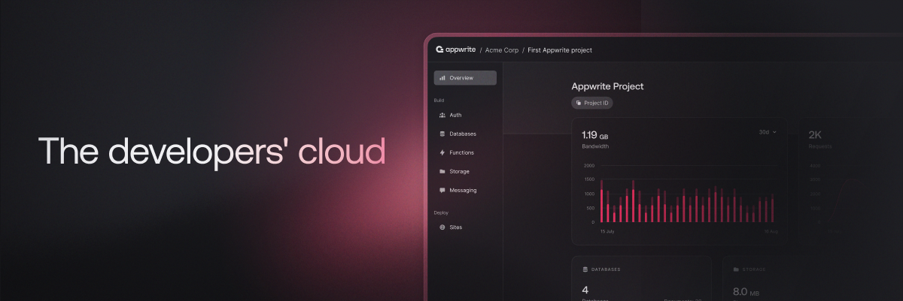

> 好消息！Appwrite 云现已进入公开测试版！立即访问 cloud.appwrite.io 注册，体验无忧的托管服务。今天就加入我们的云端吧！☁️🎉

<br />
<p align="center">
    <a href="https://appwrite.io" target="_blank"></a>
    <br />
    <br />
    <b>适用于[Flutter/Vue/Angular/React/iOS/Android/* 等等平台 *]的完整后端服务</b>
    <br />
    <br />
</p>

<!-- [](https://travis-ci.com/appwrite/appwrite) -->
[](https://appwrite.io/company/careers)
[](https://hacktoberfest.appwrite.io)
[](https://appwrite.io/discord?r=Github)
[](https://github.com/appwrite/appwrite/actions)
[](https://twitter.com/appwrite)

<!-- [](https://hub.docker.com/r/appwrite/appwrite) -->
<!-- [](docs/tutorials/add-translations.md) -->
<!-- [](https://store.appwrite.io) -->

[English](README.md) | 简体中文

[**Appwrite 云公开测试版！立即注册！**](https://cloud.appwrite.io)

Appwrite是一个基于Docker的端到端开发者平台，其容器化的微服务库可应用于网页端，移动端，以及后端。Appwrite 通过视觉化界面简化了从零开始编写 API 的繁琐过程，在保证软件安全的前提下为开发者创造了一个高效的开发环境。

Appwrite 可以提供给开发者用户验证，外部授权，用户数据读写检索，文件储存，图像处理，云函数计算，[等多种服务](https://appwrite.io/docs).


更多信息请到 Appwrite 官网查看： [https://appwrite.io](https://appwrite.io)

内容：

- [安装](#安装)
  - [Unix](#unix)
  - [Windows](#windows)
    - [CMD](#cmd)
    - [PowerShell](#powershell)
  - [从旧版本升级](#从旧版本升级)
- [入门](#入门)
  - [软件服务](#软件服务)
  - [开发套件](#开发套件)
    - [客户端](#客户端)
    - [服务器](#服务器)
    - [开发者社区](#开发者社区)
- [软件架构](#软件架构)
- [贡献代码](#贡献代码)
- [安全](#安全)
- [订阅我们](#订阅我们)
- [版权说明](#版权说明)

## 安装

Appwrite 的容器化服务器只需要一行指令就可以运行。您可以使用 docker-compose 在本地主机上运行 Appwrite，也可以在任何其他容器化工具（如 [Kubernetes](https://kubernetes.io/docs/home/)、[Docker Swarm](https://docs.docker.com/engine/swarm/) 或 [Rancher](https://rancher.com/docs/)）上运行 Appwrite。

启动 Appwrite 服务器的最简单方法是运行我们的 docker-compose 文件。在运行安装命令之前，请确保您的机器上安装了 [Docker](https://dockerdocs.cn/get-docker/index.html)：

### Unix

```bash
docker run -it --rm \
    --volume /var/run/docker.sock:/var/run/docker.sock \
    --volume "$(pwd)"/appwrite:/usr/src/code/appwrite:rw \
    --entrypoint="install" \
    appwrite/appwrite:1.5.4
```

### Windows

#### CMD

```cmd
docker run -it --rm ^
    --volume //var/run/docker.sock:/var/run/docker.sock ^
    --volume "%cd%"/appwrite:/usr/src/code/appwrite:rw ^
    --entrypoint="install" ^
    appwrite/appwrite:1.5.4
```

#### PowerShell

```powershell
docker run -it --rm `
    --volume /var/run/docker.sock:/var/run/docker.sock `
    --volume ${pwd}/appwrite:/usr/src/code/appwrite:rw `
    --entrypoint="install" `
    appwrite/appwrite:1.5.4
```

运行后，可以在浏览器上访问 http://localhost 找到 Appwrite 控制台。在非 Linux 的本机主机上完成安装后，服务器可能需要几分钟才能启动。


需要自定义容器构架，请查看我们的 Docker [环境变量](https://appwrite.io/docs/environment-variables) 文档。您还可以参考我们的 [docker-compose.yml](https://appwrite.io/install/compose) 和 [.env](https://appwrite.io/install/env) 文件手动设置环境。

### 从旧版本升级

如果您从旧版本升级 Appwrite 服务器，则应在设置完成后使用 Appwrite 迁移工具。有关这方面的更多信息，请查看 [安装文档](https://appwrite.io/docs/installation)。

## 入门

开始使用 Appwrite 只需要在控制台创建一个新项目，选择开发平台，然后抓取我们的开发套件。您可以从以下的教程中找到你喜欢的平台开始使用 Appwrite。

* [开始使用 Web](https://appwrite.io/docs/getting-started-for-web)
* [开始使用 Flutter](https://appwrite.io/docs/getting-started-for-flutter)
* [开始使用 Apple](https://appwrite.io/docs/getting-started-for-apple)
* [开始使用 Android](https://appwrite.io/docs/getting-started-for-android)
* [开始使用 Server](https://appwrite.io/docs/getting-started-for-server)
* [开始使用 CLI](https://appwrite.io/docs/command-line)

### 软件服务

* [**帐户**](https://appwrite.io/docs/references/cloud/client-web/account) -管理当前用户的帐户和登录方式。跟踪和管理用户 Session，登录设备，登录方法和查看相关记录。
* [**用户**](https://appwrite.io/docs/server/users) - 在以管理员模式登录时管理和列出所有用户。
* [**团队**](https://appwrite.io/docs/references/cloud/client-web/teams) - 管理用户分组。邀请成员，管理团队中的用户权限和用户角色。
* [**数据库**](https://appwrite.io/docs/references/cloud/client-web/databases) - 管理数据库文档和文档集。用检索界面来对文档和文档集进行读取，创建，更新，和删除。
* [**贮存**](https://appwrite.io/docs/references/cloud/client-web/storage) - 管理文件的阅读、创建、删除和预览。设置文件的预览来满足程序的个性化需求。所有文件都由 ClamAV 扫描并安全存储和加密。
* [**云函数**](https://appwrite.io/docs/server/functions) - 在安全，隔离的环境中运行自定义代码。这些代码可以被事件，CRON，或者手动操作触发。
* [**语言适配**](https://appwrite.io/docs/references/cloud/client-web/locale) - 根据用户所在的的国家和地区做出合适的语言适配。
* [**头像**](https://appwrite.io/docs/references/cloud/client-web/avatars) -管理用户头像、国家旗帜、浏览器图标、信用卡符号，和生成二维码。 
如需完整的 API 界面文档，请访问 [https://appwrite.io/docs](https://appwrite.io/docs)。如需更多教程、新闻和公告，请订阅我们的 [博客](https://medium.com/appwrite-io) 和 加入我们的[Discord 社区](https://discord.gg/GSeTUeA)。

### 开发套件

以下是当前支持的平台和语言列表。如果您想帮助我们为您选择的平台添加支持，您可以访问我们的 [SDK 生成器](https://github.com/appwrite/sdk-generator) 项目并查看我们的 [贡献指南](https://github.com/appwrite/sdk-generator/blob/master/CONTRIBUTING.md)。

#### 客户端
* ✅  &nbsp; [Web](https://github.com/appwrite/sdk-for-web) (由 Appwrite 团队维护)
* ✅  &nbsp; [Flutter](https://github.com/appwrite/sdk-for-flutter) (由 Appwrite 团队维护)
* ✅  &nbsp; [Apple](https://github.com/appwrite/sdk-for-apple) - **公测** (由 Appwrite 团队维护)
* ✅  &nbsp; [Android](https://github.com/appwrite/sdk-for-android) (由 Appwrite 团队维护)

#### 服务器
* ✅  &nbsp; [NodeJS](https://github.com/appwrite/sdk-for-node) (由 Appwrite 团队维护)
* ✅  &nbsp; [PHP](https://github.com/appwrite/sdk-for-php) (由 Appwrite 团队维护)
* ✅  &nbsp; [Dart](https://github.com/appwrite/sdk-for-dart) - (由 Appwrite 团队维护)
* ✅  &nbsp; [Deno](https://github.com/appwrite/sdk-for-deno) - **公测** (由 Appwrite 团队维护)
* ✅  &nbsp; [Ruby](https://github.com/appwrite/sdk-for-ruby) (由 Appwrite 团队维护)
* ✅  &nbsp; [Python](https://github.com/appwrite/sdk-for-python) (由 Appwrite 团队维护)
* ✅  &nbsp; [Kotlin](https://github.com/appwrite/sdk-for-kotlin) - **公测** (由 Appwrite 团队维护)
* ✅  &nbsp; [Apple](https://github.com/appwrite/sdk-for-apple) - **公测** (由 Appwrite 团队维护)
* ✅  &nbsp; [.NET](https://github.com/appwrite/sdk-for-dotnet) - **公测** (由 Appwrite 团队维护)

#### 开发者社区
* ✅  &nbsp; [Appcelerator Titanium](https://github.com/m1ga/ti.appwrite) (维护者 [Michael Gangolf](https://github.com/m1ga/))  
* ✅  &nbsp; [Godot Engine](https://github.com/GodotNuts/appwrite-sdk) (维护者 [fenix-hub @GodotNuts](https://github.com/fenix-hub))  

找不到需要的的 SDK？ - 欢迎通过发起PR来帮助我们完善Appwrite的软件生态环境 [SDK 生成器](https://github.com/appwrite/sdk-generator)!


## 软件架构


Appwrite 使用高拓展性的微服务架构。此外，Appwrite 支持多种 API（REST、WebSocket 和 即将推出的 GraphQL），来迎合您的个性化开发习惯。

Appwrite API 界面层利用后台缓存和任务委派来提供极速的响应时间。后台的 Worker 代理还允许您使用消息队列来处理负载，并精确控制硬件合理分配和成本。您可以在 [贡献指南](CONTRIBUTING.md#architecture-1) 中了解有关我们架构的更多信息。

## 贡献代码

为了确保正确审查，所有代码贡献 - 包括来自具有直接提交更改权限的贡献者 - 都必须提交PR请求并在合并分支之前得到核心开发人员的批准。

我们欢迎所有人提交PR！如果您愿意提供帮助，可以在 [贡献指南](CONTRIBUTING.md) 中了解有关如何为项目做出贡献的更多信息。

## 安全

为了保护您的隐私，请避免在GitHub 上发布安全问题。发送问题至 security@appwrite.io，我们将为您做更细致的解答。

## 订阅我们

加入我们在世界各地不断发展的社区！请参阅我们的官方 [博客](https://medium.com/appwrite-io)。在 [Twitter](https://twitter.com/appwrite)、[Facebook 页面](https://www.facebook.com/appwrite.io)、[Facebook 群组](https://www.facebook.com/appwrite.io/groups/)、[开发者社区](https://dev.to/appwrite) 等平台订阅我们或加入我们的 [Discord 社区](https://discord.gg/GSeTUeA) 以获得更多帮助，想法和讨论。

## 版权说明

版权详情，访问 [BSD 3-Clause License](./LICENSE)。
