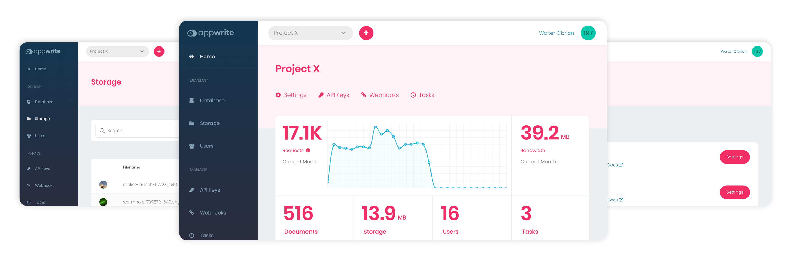

> 好消息！Appwrite Cloud 现已开启公测！立即访问 cloud.appwrite.io 注册，体验省心的托管服务。快来加入我们的云端大家庭吧！:cloud: :tada:

<br />
<p align="center">
    <a href="https://appwrite.io" target="_blank"></a>
    <br />
    <br />
    <b>适用于 [Flutter/Vue/Angular/React/iOS/Android/* 等平台 *] 的全栈后端服务</b>
    <br />
    <br />
</p>

<!-- [](https://travis-ci.com/appwrite/appwrite) -->

[](https://appwrite.io/company/careers)
[](https://hacktoberfest.appwrite.io)
[](https://appwrite.io/discord?r=Github)
[](https://github.com/appwrite/appwrite/actions)
[](https://twitter.com/appwrite)

<!-- [](https://hub.docker.com/r/appwrite/appwrite) -->
<!-- [](docs/tutorials/add-translations.md) -->
<!-- [](https://store.appwrite.io) -->

[English](README.md) | 简体中文

[**Appwrite 云公开测试版！立即注册！**](https://cloud.appwrite.io)

Appwrite 是一个开源的后端全栈开发平台，旨在简化 Web、移动和 AI 应用的构建。它将后端基础设施与 Web 托管集成在一起，让团队无需拼凑零散的技术栈，即可轻松构建、发布和扩展应用。Appwrite 提供托管云平台服务，同时也支持在您控制的基础设施上进行自建托管。

借助 Appwrite，您可以添加身份验证、数据库、存储、云函数、消息推送、实时通信以及集成的 Web 应用托管（Sites）。它旨在减少开发现代产品所需的重复性后端工作，同时为开发者提供安全的底层原语和灵活 API，助力更快地构建生产级应用。



更多信息请访问 Appwrite 官网： [https://appwrite.io](https://appwrite.io)

目录：

- [开始使用](#开始)
- [安装与设置](#安装)
  - [Unix](#unix)
  - [Windows](#windows)
    - [CMD](#cmd)
    - [PowerShell](#powershell)
  - [从旧版本升级](#从旧版本升级)
- [入门指南](#入门)
  - [产品功能](#产品功能)
  - [SDK](#sdk)
    - [客户端](#客户端)
    - [服务器](#服务器)
    - [开发者社区](#开发者社区)
- [架构设计](#架构设计)
- [代码贡献](#代码贡献)
- [安全性](#安全性)
- [关注我们](#关注我们)
- [开源协议](#开源协议)

## 开始

要轻松开始使用 Appwrite，您可以[**免费注册 Appwrite Cloud**](https://cloud.appwrite.io/)。在 Appwrite Cloud 公测期间，您可以完全免费使用 Appwrite，且无需提供信用卡信息。

## 安装

Appwrite 采用容器化设计。运行您的服务器就像在终端执行一条命令一样简单。您可以使用 docker-compose 在本地运行 Appwrite，也可以使用其他容器编排工具，如 [Kubernetes](https://kubernetes.io/docs/home/)、[Docker Swarm](https://docs.docker.com/engine/swarm/) 或 [Rancher](https://rancher.com/docs/)。

启动 Appwrite 服务器的最简单方法是运行我们的 docker-compose 文件。在执行安装命令之前，请确保您的机器上已安装 [Docker](https://dockerdocs.cn/get-docker/index.html)：

### Unix

```bash
docker run -it --rm \
    --volume /var/run/docker.sock:/var/run/docker.sock \
    --volume "$(pwd)"/appwrite:/usr/src/code/appwrite:rw \
    --entrypoint="install" \
    appwrite/appwrite:1.9.0
```

### Windows

#### CMD

```cmd
docker run -it --rm ^
    --volume //var/run/docker.sock:/var/run/docker.sock ^
    --volume "%cd%"/appwrite:/usr/src/code/appwrite:rw ^
    --entrypoint="install" ^
    appwrite/appwrite:1.9.0
```

#### PowerShell

```powershell
docker run -it --rm `
    --volume /var/run/docker.sock:/var/run/docker.sock `
    --volume ${pwd}/appwrite:/usr/src/code/appwrite:rw `
    --entrypoint="install" `
    appwrite/appwrite:1.9.0
```

安装完成后，您可以在浏览器中访问 http://localhost 进入 Appwrite 控制台。请注意，在非 Linux 原生主机上，完成安装后服务器可能需要几分钟才能启动。

如需自定义容器架构，请查看我们的 Docker [环境变量](https://appwrite.io/docs/environment-variables) 文档。您也可以参考我们的 [docker-compose.yml](https://appwrite.io/install/compose) 和 [.env](https://appwrite.io/install/env) 文件手动设置环境。

### 从旧版本升级

如果您正准备将 Appwrite 服务器从旧版本升级，请在设置完成后使用 Appwrite 迁移工具。有关更多详细信息，请参阅 [安装文档](https://appwrite.io/docs/self-hosting)。

## 一键部署

除了在本地运行 Appwrite，您还可以使用预配置的方案快速部署 Appwrite。这让您无需在本地计算机上安装 Docker 即可快速上手。

请从以下云服务商中选择一个：

<table border="0">
  <tr>
    <td align="center" width="100" height="100">
      <a href="https://marketplace.digitalocean.com/apps/appwrite">
        
          <br /><sub><b>DigitalOcean</b></sub></a>
        </a>
    </td>
    <td align="center" width="100" height="100">
      <a href="https://www.linode.com/marketplace/apps/appwrite/appwrite/">
        
          <br /><sub><b>Akamai Compute</b></sub></a>
      </a>
    </td>
    <td align="center" width="100" height="100">
      <a href="https://aws.amazon.com/marketplace/pp/prodview-2hiaeo2px4md6">
        
          <br /><sub><b>AWS Marketplace</b></sub></a>
      </a>
    </td>
  </tr>
</table>

## 入门

开始使用 Appwrite 非常简单：在控制台中创建一个新项目，选择您的开发平台，然后集成相应的 SDK。您可以参考以下针对不同平台的快速入门教程。

| 平台分类 | 技术 |
| ------------------ | --------------------------------------------------------------------------- |
| **Web 应用**       | [Web 快速开始](https://appwrite.io/docs/quick-starts/web)                   |
|                    | [Next.js 快速开始](https://appwrite.io/docs/quick-starts/nextjs)            |
|                    | [React 快速开始](https://appwrite.io/docs/quick-starts/react)               |
|                    | [Vue.js 快速开始](https://appwrite.io/docs/quick-starts/vue)                |
|                    | [Nuxt 快速开始](https://appwrite.io/docs/quick-starts/nuxt)                 |
|                    | [SvelteKit 快速开始](https://appwrite.io/docs/quick-starts/sveltekit)       |
|                    | [Refine 快速开始](https://appwrite.io/docs/quick-starts/refine)             |
|                    | [Angular 快速开始](https://appwrite.io/docs/quick-starts/angular)           |
| **移动与原生应用** | [React Native 快速开始](https://appwrite.io/docs/quick-starts/react-native) |
|                    | [Flutter 快速开始](https://appwrite.io/docs/quick-starts/flutter)           |
|                    | [Apple 快速开始](https://appwrite.io/docs/quick-starts/apple)               |
|                    | [Android 快速开始](https://appwrite.io/docs/quick-starts/android)           |
| **服务器**         | [Node.js 快速开始](https://appwrite.io/docs/quick-starts/node)              |
|                    | [Python 快速开始](https://appwrite.io/docs/quick-starts/python)             |
|                    | [.NET 快速开始](https://appwrite.io/docs/quick-starts/dotnet)               |
|                    | [Dart 快速开始](https://appwrite.io/docs/quick-starts/dart)                 |
|                    | [Ruby 快速开始](https://appwrite.io/docs/quick-starts/ruby)                 |
|                    | [Deno 快速开始](https://appwrite.io/docs/quick-starts/deno)                 |
|                    | [PHP 快速开始](https://appwrite.io/docs/quick-starts/php)                   |
|                    | [Kotlin 快速开始](https://appwrite.io/docs/quick-starts/kotlin)             |
|                    | [Swift 快速开始](https://appwrite.io/docs/quick-starts/swift)               |

## 产品功能

- [**账户 (Account)**](https://appwrite.io/docs/references/cloud/client-web/account) - 管理当前用户的账户和登录方式。跟踪并管理用户会话、登录设备、登录方法并查看相关审计日志。
- [**用户 (Users)**](https://appwrite.io/docs/server/users) - 以管理员模式管理和列出所有用户。
- [**团队 (Teams)**](https://appwrite.io/docs/references/cloud/client-web/teams) - 管理用户分组。邀请成员，管理团队成员的权限和角色。
- [**数据库 (Databases)**](https://appwrite.io/docs/references/cloud/client-web/databases) - 管理数据库、集合（Collections）和文档。通过直观的界面对数据进行读取、创建、更新和删除。
- [**存储 (Storage)**](https://appwrite.io/docs/references/cloud/client-web/storage) - 管理文件的上传、下载、删除和预览。支持自定义预览参数以满足您的应用需求。所有文件均由 ClamAV 扫描，并经过安全加密存储。
- [**云函数 (Functions)**](https://appwrite.io/docs/server/functions) - 在安全、隔离的环境中运行自定义代码。支持通过事件、定时任务（CRON）或手动触发。
- [**消息推送 (Messaging)**](https://appwrite.io/docs/references/cloud/client-web/messaging) - 使用 Appwrite 消息功能通过推送通知、电子邮件和短信与用户进行沟通。
- [**本地化 (Locale)**](https://appwrite.io/docs/references/cloud/client-web/locale) - 根据用户的地理位置提供相应的语言和地区适配。
- [**头像与图标 (Avatars)**](https://appwrite.io/docs/references/cloud/client-web/avatars) - 管理用户头像、国旗、浏览器图标、信用卡标志，并支持生成二维码。
- [**MCP (模型上下文协议)**](https://appwrite.io/docs/tooling/mcp) - 利用 Appwrite 的 MCP 服务器，让大语言模型（LLM）和 AI 工具（如 Claude Desktop、Cursor 和 Windsurf Editor）能够通过自然语言直接与您的 Appwrite 项目交互。
- [**站点 (Sites)**](https://appwrite.io/docs/products/sites) - 与后端服务无缝集成，直接通过 Appwrite 部署和扩展您的 Web 应用程序。

如需完整的 API 参考文档，请访问 [https://appwrite.io/docs](https://appwrite.io/docs)。欲获取更多教程、新闻和公告，请订阅我们的 [博客](https://appwrite.io/blog) 并加入我们的 [Discord 社区](https://appwrite.io/discord)。

## SDK

以下是当前支持的平台和语言列表。如果您想帮助我们支持更多平台，可以前往我们的 [SDK 生成器](https://github.com/appwrite/sdk-generator) 项目并阅读 [贡献指南](https://github.com/appwrite/sdk-generator/blob/master/CONTRIBUTING.md)。

#### 客户端

- :white_check_mark: &nbsp; [Web](https://github.com/appwrite/sdk-for-web) (由 Appwrite 官方维护)
- :white_check_mark: &nbsp; [Flutter](https://github.com/appwrite/sdk-for-flutter) (由 Appwrite 官方维护)
- :white_check_mark: &nbsp; [Apple](https://github.com/appwrite/sdk-for-apple) - (公开测试) (由 Appwrite 官方维护)
- :white_check_mark: &nbsp; [Android](https://github.com/appwrite/sdk-for-android) (由 Appwrite 官方维护)
- :white_check_mark: &nbsp; [React Native](https://github.com/appwrite/sdk-for-react-native) (由 Appwrite 官方维护)

#### 服务器

- :white_check_mark: &nbsp; [NodeJS](https://github.com/appwrite/sdk-for-node) (由 Appwrite 官方维护)
- :white_check_mark: &nbsp; [PHP](https://github.com/appwrite/sdk-for-php) (由 Appwrite 官方维护)
- :white_check_mark: &nbsp; [Dart](https://github.com/appwrite/sdk-for-dart) - (由 Appwrite 官方维护)
- :white_check_mark: &nbsp; [Deno](https://github.com/appwrite/sdk-for-deno) - (公开测试) (由 Appwrite 官方维护)
- :white_check_mark: &nbsp; [Ruby](https://github.com/appwrite/sdk-for-ruby) (由 Appwrite 官方维护)
- :white_check_mark: &nbsp; [Python](https://github.com/appwrite/sdk-for-python) (由 Appwrite 官方维护)
- :white_check_mark: &nbsp; [Kotlin](https://github.com/appwrite/sdk-for-kotlin) - (公开测试) (由 Appwrite 官方维护)
- :white_check_mark: &nbsp; [Swift](https://github.com/appwrite/sdk-for-swift) - (公开测试) (由 Appwrite 官方维护)
- :white_check_mark: &nbsp; [.NET](https://github.com/appwrite/sdk-for-dotnet) - (公开测试) (由 Appwrite 官方维护)

### 开发者社区

- :white_check_mark: &nbsp; [Appcelerator Titanium](https://github.com/m1ga/ti.appwrite) (由 [Michael Gangolf](https://github.com/m1ga/) 维护)
- :white_check_mark: &nbsp; [Godot Engine](https://github.com/GodotNuts/appwrite-sdk) (由 [fenix-hub @GodotNuts](https://github.com/fenix-hub) 维护)

找不到需要的 SDK？欢迎通过发起 Pull Request 来帮助我们完善 Appwrite 的生态系统：[SDK 生成器](https://github.com/appwrite/sdk-generator)!

## 架构设计


Appwrite 采用微服务架构，旨在实现轻松扩展和职责分离。此外，Appwrite 支持多种 API 协议，如 REST、WebSocket 和 GraphQL，让您能够利用已有的知识和偏好的协议进行交互。

Appwrite API 层通过利用内存缓存并将繁重任务委派给后台工作进程（Workers），实现了极快的响应速度。后台工作进程还允许您通过消息队列处理负载，从而精确控制计算能力和成本。您可以在 [贡献指南](CONTRIBUTING.md#architecture-1) 中了解更多关于我们架构的细节。

## 代码贡献

为了确保代码质量，所有的代码贡献（包括拥有提交权限的成员）都必须通过 Pull Request 进行，并在合并前由核心开发人员批准。

我们非常欢迎 PR！如果您想提供帮助，可以在 [贡献指南](CONTRIBUTING.md) 中了解如何参与到本项目中。

## 安全性

如发现安全问题，请通过邮件发送至 [security@appwrite.io](mailto:security@appwrite.io)，而不要在 GitHub 上发布公开 Issue。

## 关注我们

加入我们不断壮大的全球社区！欢迎查阅我们的官方 [博客](https://appwrite.io/blog)。在 [X](https://twitter.com/appwrite)、[LinkedIn](https://www.linkedin.com/company/appwrite/)、[Dev Community](https://dev.to/appwrite) 关注我们，或加入我们的 [Discord 服务器](https://appwrite.io/discord) 获取更多帮助、创意和交流。

## 开源协议

本项目基于 [BSD 3-Clause License](./LICENSE) 开源。
