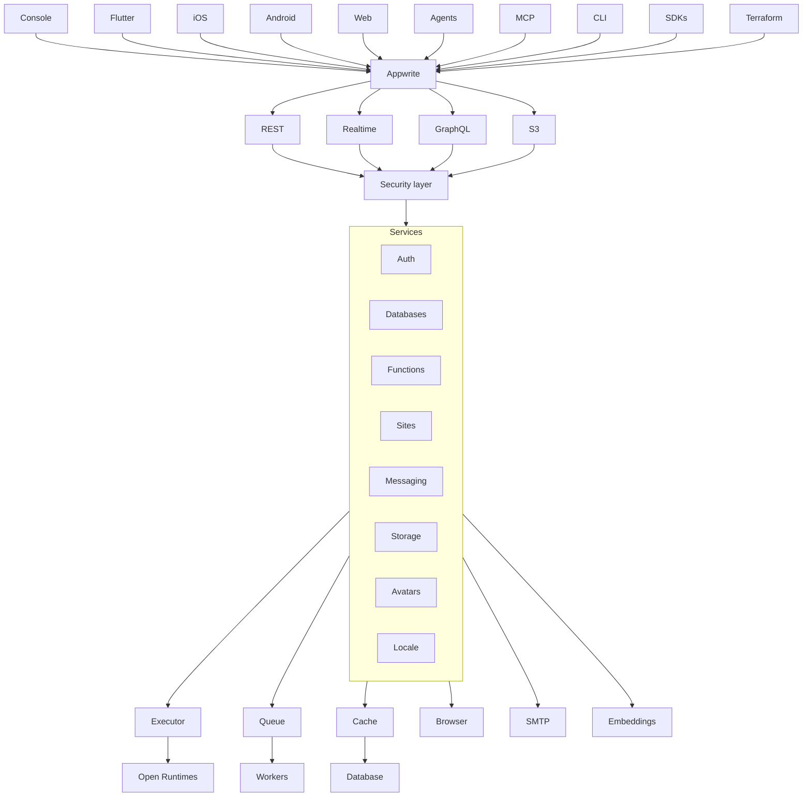

<br />
<p align="center">
    <h1>Appwrite</h1>
    <b>面向智能体与开发者的开源云。Appwrite 是面向 MCP 与智能体的平台，用于构建和扩展应用。为你的智能体提供 Auth、数据库、存储、云函数、消息、实时和托管，全部集中在一处。</b>
    <br />
    <br />
</p>

[](https://appwrite.io/discord)
[](https://x.com/appwrite)
[](https://cloud.appwrite.io)

[English](README.md) | 简体中文

Appwrite 是面向 MCP 与智能体的开源平台，用于构建和扩展应用。MCP 已包含在内，编程智能体可以直接操作线上的 Appwrite 项目。Appwrite 提供托管云服务，也可以在你自己控制的基础设施上自托管。

它既面向开发者，也面向你工作流中的 AI 智能体。通过托管 MCP 服务器连接 Cursor、Claude Code、Codex 等智能体，或将 SDK 集成到应用中。模块化产品从最初的原型到生产规模都保持统一。

更多信息请到 Appwrite 官网查看：[https://appwrite.io](https://appwrite.io)。

内容：

- [产品](#产品)
- [安装与配置](#安装与配置)
- [自托管](#自托管)
  - [Unix](#unix)
  - [Windows](#windows)
    - [CMD](#cmd)
    - [PowerShell](#powershell)
  - [Docker API 版本不匹配](#docker-api-版本不匹配)
  - [从旧版本升级](#从旧版本升级)
- [一键配置](#一键配置)
- [入门](#入门)
  - [智能体](#智能体)
  - [开发套件](#开发套件)
    - [客户端](#客户端)
    - [服务器](#服务器)
- [软件架构](#软件架构)
- [贡献代码](#贡献代码)
- [安全](#安全)
- [订阅我们](#订阅我们)
- [版权说明](#版权说明)


## 产品

- **[Appwrite Auth](https://appwrite.io/docs/products/auth)** - 通过邮箱、短信、OAuth、匿名会话和 Magic URL 安全地验证用户。

- **[Appwrite Databases](https://appwrite.io/docs/products/databases)** - 使用 Appwrite 数据库或托管的 PostgreSQL 和 MySQL 进行建模、查询和扩展，以匹配你的用例和团队需求。

- **[Appwrite Storage](https://appwrite.io/docs/products/storage)** - 存储文件，支持压缩、加密、图像转换和访问控制。

- **[Appwrite Functions](https://appwrite.io/docs/products/functions)** - 部署无服务器函数，使用安全隔离的运行时和事件驱动执行。

- **[Appwrite Sites](https://appwrite.io/docs/products/sites)** - 从 Git 部署静态、SSR 和 CSR 前端，支持即时预览，并由 Appwrite 作为后端。

- **[Appwrite Messaging](https://appwrite.io/docs/products/messaging)** - 通过统一的消息服务发送邮件、短信和推送通知。

- **[Appwrite Firewall](https://appwrite.io/docs/products/network)** - 通过流量规则、滥用防护和边缘安全保护每个项目中的应用。

- **[Appwrite Realtime](https://appwrite.io/docs/apis/realtime)** - 订阅并响应项目中正在发生的事件。

- **[Appwrite MCP](https://appwrite.io/docs/tooling/ai/mcp-servers/api)** - 将智能体连接到你的 Appwrite 项目、API 和文档。Cloud 已包含 MCP，无需本地安装。


## 安装与配置

开始使用 Appwrite 最简单的方式是[注册 Appwrite Cloud](https://cloud.appwrite.io/)。Cloud 提供[免费套餐](https://appwrite.io/pricing)，你可以立即开始构建，需要扩展时再升级到付费套餐。

## 自托管

Appwrite 设计为在容器化环境中运行。从终端运行一条命令即可启动服务器。你可以使用 docker-compose 在本地运行 Appwrite，也可以在 [Kubernetes](https://kubernetes.io/docs/home/)、[Docker Swarm](https://docs.docker.com/engine/swarm/) 或 [Rancher](https://ranchermanager.docs.rancher.com/) 等容器编排工具上运行。

运行安装命令之前，请确保机器上已安装 [Docker](https://www.docker.com/products/docker-desktop)。安装向导监听 **20080** 端口；如果在远程主机上安装，请在安装完成前开放该端口。

### Unix

```bash
docker run -it --rm \
    --publish 20080:20080 \
    --volume /var/run/docker.sock:/var/run/docker.sock \
    --volume "$(pwd)"/appwrite:/usr/src/code/appwrite:rw \
    --entrypoint="install" \
    appwrite/appwrite:2.2.0
```

### Windows

#### CMD

```cmd
docker run -it --rm ^
    --publish 20080:20080 ^
    --volume //var/run/docker.sock:/var/run/docker.sock ^
    --volume "%cd%"/appwrite:/usr/src/code/appwrite:rw ^
    --entrypoint="install" ^
    appwrite/appwrite:2.2.0
```

#### PowerShell

```powershell
docker run -it --rm `
    --publish 20080:20080 `
    --volume /var/run/docker.sock:/var/run/docker.sock `
    --volume ${pwd}/appwrite:/usr/src/code/appwrite:rw `
    --entrypoint="install" `
    appwrite/appwrite:2.2.0
```

安装程序运行后，打开 http://localhost:20080 完成安装向导。安装完成后，访问 http://localhost 即可从浏览器进入 Appwrite 控制台。请注意，在非 Linux 本机主机上，安装完成后服务器可能需要几分钟才能启动。

### Docker API 版本不匹配

如果安装或升级失败，并出现类似 `client version 1.52 is too new. Maximum supported API version is 1.42` 的错误，说明 Appwrite 镜像内的 Docker CLI 比宿主机 Docker Engine 更新。请传入 `DOCKER_API_VERSION`，设为错误信息中的最高 API 版本（或升级宿主机上的 Docker）：

```bash
docker run -it --rm \
    --env DOCKER_API_VERSION=1.42 \
    --publish 20080:20080 \
    --volume /var/run/docker.sock:/var/run/docker.sock \
    --volume "$(pwd)"/appwrite:/usr/src/code/appwrite:rw \
    --entrypoint="install" \
    appwrite/appwrite:2.2.0
```

升级时，请为 `--entrypoint="upgrade"` 使用相同的 `--env DOCKER_API_VERSION=...` 参数。

需要自定义生产或高级安装，请查看我们的 Docker [环境变量](https://appwrite.io/docs/advanced/self-hosting/configuration/environment-variables) 文档。你也可以使用公开的 [docker-compose.yml](https://appwrite.io/install/compose) 和 [.env](https://appwrite.io/install/env) 文件手动设置环境。

### 从旧版本升级

如果您从旧版本升级 Appwrite 服务器，则应在设置完成后使用 Appwrite 迁移工具。有关这方面的更多信息，请查看 [安装文档](https://appwrite.io/docs/advanced/self-hosting)。

## 一键配置

除了在本地运行 Appwrite，您还可以使用预配置的设置启动 Appwrite。这样可以让您快速启动并运行 Appwrite，而无需在本地计算机上安装 Docker。

请从以下提供商中选择一个：

<table border="0">
  <tr>
    <td align="center" width="100" height="100">
      <a href="https://marketplace.digitalocean.com/apps/appwrite">
        
          <br /><sub><b>DigitalOcean</b></sub></a>
        </a>
    </td>
    <td align="center" width="100" height="100">
      <a href="https://www.linode.com/marketplace/apps/appwrite/appwrite/">
        
          <br /><sub><b>Akamai Compute</b></sub></a>
      </a>
    </td>
    <td align="center" width="100" height="100">
      <a href="https://aws.amazon.com/marketplace/pp/prodview-2hiaeo2px4md6">
        
          <br /><sub><b>AWS Marketplace</b></sub></a>
      </a>
    </td>
  </tr>
</table>

## 入门

开始使用 Appwrite 只需要创建一个新项目、连接智能体，或将 SDK 集成到代码中。你可以从提示词、快速开始教程或托管 MCP 服务器入手。

### 智能体

为你工作流中的 AI 智能体而设计。查询数据库、绘制流量图或发布一次变更：你的智能体都可以在线上的 Appwrite 项目中完成。托管 MCP 服务器使用 OAuth，因此你无需创建或管理 API 密钥。如果使用自托管实例，请改用[本地 MCP 服务器](https://appwrite.io/docs/advanced/self-hosting/mcp)。

将远程服务器添加到 Cursor、Claude Code、Codex、VS Code 和其他 MCP 客户端：

```json
{
    "mcpServers": {
        "appwrite": {
            "url": "https://mcp.appwrite.io/"
        }
    }
}
```

你也可以[一键将 MCP 服务器添加到 Cursor](https://cursor.com/install-mcp?name=appwrite&config=eyJ1cmwiOiJodHRwczovL21jcC5hcHB3cml0ZS5pby8ifQ==)。

安装特定语言的 [agent skills](https://appwrite.io/docs/tooling/ai/skills)，让模型生成正确的 SDK 调用：

```bash
npx skills add appwrite/agent-skills
```

浏览[快速开始提示词](https://appwrite.io/docs/tooling/ai/quickstart-prompts)，为仓库生成 [AGENTS.md](https://appwrite.io/docs/tooling/ai/agents-md)，或查看 [AI 工具文档](https://appwrite.io/docs/tooling/ai) 了解 IDE 和 vibe coding 配置。

你也可以从以下教程开始使用自己喜欢的平台。

| 类别               | 技术                                                                        |
| ------------------ | --------------------------------------------------------------------------- |
| **Web 应用**       | [Web 快速开始](https://appwrite.io/docs/quick-starts/web)                   |
|                    | [Next.js 快速开始](https://appwrite.io/docs/quick-starts/nextjs)            |
|                    | [React 快速开始](https://appwrite.io/docs/quick-starts/react)               |
|                    | [Vue.js 快速开始](https://appwrite.io/docs/quick-starts/vue)                |
|                    | [Nuxt 快速开始](https://appwrite.io/docs/quick-starts/nuxt)                 |
|                    | [SvelteKit 快速开始](https://appwrite.io/docs/quick-starts/sveltekit)       |
|                    | [Astro 快速开始](https://appwrite.io/docs/quick-starts/astro)               |
|                    | [TanStack Start 快速开始](https://appwrite.io/docs/quick-starts/tanstack-start) |
|                    | [Refine 快速开始](https://appwrite.io/docs/quick-starts/refine)             |
|                    | [Angular 快速开始](https://appwrite.io/docs/quick-starts/angular)           |
| **移动与原生应用** | [React Native 快速开始](https://appwrite.io/docs/quick-starts/react-native) |
|                    | [Flutter 快速开始](https://appwrite.io/docs/quick-starts/flutter)           |
|                    | [Apple 快速开始](https://appwrite.io/docs/quick-starts/apple)               |
|                    | [Android 快速开始](https://appwrite.io/docs/quick-starts/android)           |
| **服务器**         | [Node.js 快速开始](https://appwrite.io/docs/quick-starts/node)              |
|                    | [Python 快速开始](https://appwrite.io/docs/quick-starts/python)             |
|                    | [.NET 快速开始](https://appwrite.io/docs/quick-starts/dotnet)               |
|                    | [Dart 快速开始](https://appwrite.io/docs/quick-starts/dart)                 |
|                    | [Ruby 快速开始](https://appwrite.io/docs/quick-starts/ruby)                 |
|                    | [Deno 快速开始](https://appwrite.io/docs/quick-starts/deno)                 |
|                    | [PHP 快速开始](https://appwrite.io/docs/quick-starts/php)                   |
|                    | [Kotlin 快速开始](https://appwrite.io/docs/quick-starts/kotlin)             |
|                    | [Swift 快速开始](https://appwrite.io/docs/quick-starts/swift)               |
|                    | [Go 快速开始](https://appwrite.io/docs/quick-starts/go)                     |
|                    | [Rust 快速开始](https://appwrite.io/docs/quick-starts/rust)                 |

### 开发套件

以下是当前支持的平台和语言列表。如果您想帮助我们为您选择的平台添加支持，您可以访问我们的 [SDK 生成器](https://github.com/appwrite/sdk-generator) 项目并查看我们的 [贡献指南](https://github.com/appwrite/sdk-generator/blob/master/CONTRIBUTING.md)。

#### 客户端

- :white_check_mark: &nbsp; [Web](https://github.com/appwrite/sdk-for-web)
- :white_check_mark: &nbsp; [Flutter](https://github.com/appwrite/sdk-for-flutter)
- :white_check_mark: &nbsp; [Apple](https://github.com/appwrite/sdk-for-apple)
- :white_check_mark: &nbsp; [Android](https://github.com/appwrite/sdk-for-android)
- :white_check_mark: &nbsp; [React Native](https://github.com/appwrite/sdk-for-react-native)

#### 服务器

- :white_check_mark: &nbsp; [Node.js](https://github.com/appwrite/sdk-for-node)
- :white_check_mark: &nbsp; [Python](https://github.com/appwrite/sdk-for-python)
- :white_check_mark: &nbsp; [Dart](https://github.com/appwrite/sdk-for-dart)
- :white_check_mark: &nbsp; [PHP](https://github.com/appwrite/sdk-for-php)
- :white_check_mark: &nbsp; [Ruby](https://github.com/appwrite/sdk-for-ruby)
- :white_check_mark: &nbsp; [.NET](https://github.com/appwrite/sdk-for-dotnet)
- :white_check_mark: &nbsp; [Go](https://github.com/appwrite/sdk-for-go)
- :white_check_mark: &nbsp; [Swift](https://github.com/appwrite/sdk-for-swift)
- :white_check_mark: &nbsp; [Kotlin](https://github.com/appwrite/sdk-for-kotlin)
- :white_check_mark: &nbsp; [Rust](https://github.com/appwrite/sdk-for-rust)

找不到需要的 SDK？ - 欢迎通过发起 PR 来帮助我们完善 Appwrite 的软件生态环境 [SDK 生成器](https://github.com/appwrite/sdk-generator)!

## 软件架构


```mermaid
flowchart TB
  Console & Flutter & iOS & Android & Web & Agents & MCP & CLI & SDKs & Terraform --> Appwrite
  Appwrite --> REST & Realtime & GraphQL & S3
  REST & Realtime & GraphQL & S3 --> securityLayer[Security layer]
  securityLayer --> services
  subgraph services [Services]
    Auth
    Databases
    Functions
    Sites
    Messaging
    Storage
    Avatars
    Locale
  end
  services --> Executor & Queue & Cache & Browser & SMTP & Embeddings
  Cache --> Database
  Queue --> Workers
  Executor --> openRuntimes[Open Runtimes]
```

Appwrite 使用面向扩展与职责拆分的混合单体-微服务架构。此外，Appwrite 支持多种 API（REST、WebSocket 和 GraphQL），来迎合您的个性化开发习惯。

Appwrite API 界面层利用内存缓存和任务委派来提供极速的响应时间。后台的 Worker 代理还允许您使用消息队列来处理负载，并精确控制硬件合理分配和成本。您可以在 [AGENTS.md](AGENTS.md) 中了解有关我们架构的更多信息。

## 贡献代码

为了确保正确审查，所有代码贡献 - 包括来自具有直接提交更改权限的贡献者 - 都必须提交 PR 请求并在合并分支之前得到核心开发人员的批准。

我们欢迎所有人提交 PR！如果您愿意提供帮助，可以在 [贡献指南](CONTRIBUTING.md) 中了解有关如何为项目做出贡献的更多信息。

## 安全

请通过 [SECURITY.md](SECURITY.md) 报告安全漏洞。请勿在 GitHub 上公开提交安全问题。

## 订阅我们

加入我们在世界各地不断发展的社区！请参阅我们的 [博客](https://appwrite.io/blog)，或在 [Discord](https://appwrite.io/discord)、[GitHub](https://github.com/appwrite)、[X](https://x.com/appwrite)、[LinkedIn](https://linkedin.com/company/appwrite)、[YouTube](https://youtube.com/c/appwrite)、[daily.dev](https://app.daily.dev/squads/appwrite)、[Bluesky](https://bsky.app/profile/appwrite.io)、[TikTok](https://tiktok.com/@appwrite) 和 [Instagram](https://instagram.com/appwrite.io) 关注我们。

## 版权说明

版权详情，访问 [BSD 3-Clause License](./LICENSE)。
