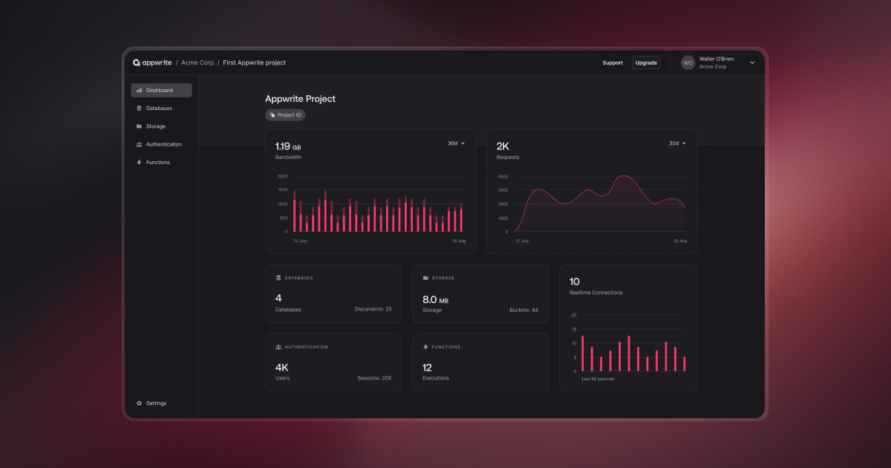

> သတင်းကောင်း! ယခု Appwrite Cloud သည် အများသုံး စမ်းသပ်ဆော့ဖ်ဝဲတွင် အသုံးပြုနိုင်ဖို့အတွက် အသင့်ရှိနေပါပြီနော်။ သင့်ရဲ့ အတွေ့အကြုံတွေအတွက် အခက်အခဲမရှိ၊ လက်ခံဆောင်ရွက်ပေးနိုင်သည့် [cloud.appwrite.io](https://cloud.appwrite.io) တွင် အခုပဲစာရင်းသွင်းလိုက်ပါ။ ယနေ့ Cloud ခေတ်ကြီးထဲမှာ ကျွန်ုပ်တို့နှင့် ပူးပေါင်းပါဝင်လိုက်ပါနော်။ ☁️🎉

<br />
<p align="center">
    <a href="https://appwrite.io" target="_blank"></a>
    <br />
    <b>Appwrite သည် ဝဘ်၊ မိုဘိုင်း၊ နှင့် Flutter အပလီကေးရှင်းများကို ဖန်တီးရန်အတွက် နောက်ခံပလက်ဖောင်းတစ်ခုဖြစ်သည်။ Open source အသိုင်းအဝိုင်းအဖြစ် တည်ဆောက်ထားခြင်းဖြစ်ပြီး သင်နှစ်သက်သော Coding languages များတွင် Developer အတွေ့အကြုံအတွက် အကောင်းဆုံးပြင်ဆင်ထားခြင်းလည်းဖြစ်သည်။</b>
    <br />
    <br />
</p>

<!-- [](https://travis-ci.com/appwrite/appwrite) -->

[](https://appwrite.io/company/careers)
[](https://hacktoberfest.appwrite.io)
[](https://appwrite.io/discord?r=Github)
[](https://github.com/appwrite/appwrite/actions)
[](https://twitter.com/appwrite)

<!-- [](https://hub.docker.com/r/appwrite/appwrite) -->
<!-- [](docs/tutorials/add-translations.md) -->
<!-- [](https://store.appwrite.io) -->

English | [简体中文](README-CN.md) | [မြန်မာ](README-MM.md)

[**Appwrite Cloud Public Beta အား ကြေညာခြင်း။ အခုပဲစာရင်းသွင်းနိုင်ပါသည်။**](https://cloud.appwrite.io)

Appwrite သည် Docker microservices အစုတစ်ခုအနေဖြင့် ထုပ်ပိုးထားသော Web၊ Mobile၊ Native သို့မဟုတ် Backend အက်ပ်များအတွက် အစမှ အဆုံးတည်ဆောက်နိုင်အောင် Backend သီးသန့်ဝန်ဆောင်မှုတစ်ခုဖြစ်သည်။ Appwrite သည် ခေတ်မီ Backend API ကို အစမှတည်ဆောက်ရန် လိုအပ်သော ရှုပ်ထွေးမှုများစွာနှင့် ထပ်တလဲလဲဖြစ်မှုများကို ရှင်းလင်းစွာ အခြေခံပေးထားပြီး လုံခြုံသောအက်ပ်များကို ပိုမိုမြန်ဆန်စွာတည်ဆောက်နိုင်စေပါသည်။

Appwrite ကိုအသုံးပြုခြင်းဖြင့် သင့်အက်ပ်ကို အသုံးပြုသူအထောက်အထားစိစစ်ခြင်းနှင့် လက်မှတ်ထိုးဝင်ခြင်းနည်းလမ်းများစွာ၊ အသုံးပြုသူများနှင့် အဖွဲ့ဒေတာကို သိမ်းဆည်းခြင်းနှင့် စုံစမ်းမေးမြန်းခြင်းအတွက် ဒေတာဘေ့စ်၊ သိုလှောင်မှုနှင့် ဖိုင်စီမံခန့်ခွဲမှု၊ ရုပ်ပုံခြယ်လှယ်ခြင်း၊ Cloud လုပ်ဆောင်ချက်များနှင့် [အခြားဝန်ဆောင်မှုများနှင့်](https://appwrite.io/docs) အတူ အလွယ်တကူ ပေါင်းစပ်နိုင်ပါသည်။

<p align="center">
    <br />
    <a href="https://www.producthunt.com/posts/appwrite-2?utm_source=badge-top-post-badge&utm_medium=badge&utm_souce=badge-appwrite-2" target="_blank"></a>
    <br />
    <br />
</p>



[https://appwrite.io](https://appwrite.io) တွင် ပိုမိုရှာဖွေပါ။

မာတိကာ :

- [တပ်ခြင်းခြင်း](#တပ်ခြင်းခြင်း)
  - [Unix](#unix)
  - [Windows](#windows)
    - [CMD](#cmd)
    - [PowerShell](#powershell)
  - [ဗားရှင်းအဟောင်းမှ အဆင့်မြှင့်တင်ခြင်း။](#ဗားရှင်းအဟောင်းမှ-အဆင့်မြှင့်တင်ခြင်း)
- [ကလစ်တစ်ချက်နှိပ်ပြီး တပ်ဆင်မှုများ](#ကလစ်တစ်ချက်နှိပ်ပြီး-တပ်ဆင်မှုများ)
- [စတင်အသုံးပြုခြင်း](#စတင်အသုံးပြုခြင်း)
  - [ဝန်ဆောင်မှုများ](#ဝန်ဆောင်မှုများ)
  - [SDKs](#sdks)
    - [Client (Frontend)](#client-frontend)
    - [ဆာဗာ (Backend)](#ဆာဗာ-backend)
    - [အဖွဲ့အစည်း](#အဖွဲ့အစည်း)
- [တည်ဆောက်ခြင်းအနုပညာ (ဗိသုကာ)](#တည်ဆောက်ခြင်းအနုပညာ-ဗိသုကာ)
- [ပါဝင်အကြံပြုခြင်း](#ပါဝင်အကြံပြုခြင်း)
- [လုံခြုံရေး](#လုံခြုံရေး)
- [ကျွန်ုပ်တို့နှင့် အတူရှိနိုင်ရန်](#ကျွန်ုပ်တို့နှင့်-အတူရှိနိုင်ရန်)
- [လိုင်စင်](#လိုင်စင်)

## တပ်ခြင်းခြင်း

Appwrite သည် Containerized environment တွင် run ရန် ဒီဇိုင်းထုတ်ထားခြင်းဖြစ်သည်။ သင့်ဆာဗာကို run ခြင်းသည် သင့် terminal မှ command တစ်ခုတည်းကို လုပ်ဆောင်ခြင်းကဲ့သို့ လွယ်ကူစေပါသည်။ Docker-compose ကို အသုံးပြု၍ သင်စက်၏ localhost တွင် Appwrite သို့မဟုတ် Kubernetes၊ Docker Swarm သို့မဟုတ် Rancher ကဲ့သို့သော အခြား Container orchestration tool တစ်ခုခုပေါ်တွင်လည်း သင် run နိုင်ပါသည်။

သင်၏ Appwrite ဆာဗာကို စတင်လည်ပတ်ရန် အလွယ်ကူဆုံးနည်းလမ်းမှာ ကျွန်ုပ်တို့၏ docker-compose ဖိုင်ကို လုပ်ဆောင်ခြင်းဖြင့် ဖြစ်သည်။ တပ်ဆင်မှု command မလုပ်ဆောင်မီ သင့်စက်တွင် [Docker](https://www.docker.com/products/docker-desktop) ကြိုတင်ထည့်သွင်းထားရမည်ဖြစ်ကြောင်း အသိပေးပါရစေ။

### Unix

```bash
docker run -it --rm \
    --volume /var/run/docker.sock:/var/run/docker.sock \
    --volume "$(pwd)"/appwrite:/usr/src/code/appwrite:rw \
    --entrypoint="install" \
    appwrite/appwrite:1.3.8
```

### Windows

#### CMD

```cmd
docker run -it --rm ^
    --volume //var/run/docker.sock:/var/run/docker.sock ^
    --volume "%cd%"/appwrite:/usr/src/code/appwrite:rw ^
    --entrypoint="install" ^
    appwrite/appwrite:1.3.8
```

#### PowerShell

```powershell
docker run -it --rm `
    --volume /var/run/docker.sock:/var/run/docker.sock `
    --volume ${pwd}/appwrite:/usr/src/code/appwrite:rw `
    --entrypoint="install" `
    appwrite/appwrite:1.3.8
```

Docker တပ်ဆင်မှုပြီးသည်နှင့်၊ သင်၏ဘရောက်ဆာမှ Appwrite console ကိုဝင်ရောက်ရန် http://localhost သို့သွားပါ။ Linux မဟုတ်သော မူရင်း host များတွင် တပ်ဆင်မှုပြီးမြောက်ပြီးနောက် ဆာဗာ စတင်အသုံးပြနိုင်ဖို့ မိနစ်အနည်းငယ် ကြာနိုင်သည်ကို သတိပြုပါရန်။

အဆင့်မြင့်ထုတ်လုပ်ခြင်းနှင့် သင်၏စိတ်ကြိုက်တပ်ဆင်ခြင်းများအတွက်၊ ကျွန်ုပ်တို့၏ Docker [environment variables](https://appwrite.io/docs/environment-variables) docs ကိုကြည့်ပါ။ ကျွန်ုပ်တို့၏ အများသုံး [docker-compose.yml](https://appwrite.io/install/compose) လမ်းညွှန်နှင့် [.env](https://appwrite.io/install/env) ဖိုင်များကို ကိုယ်တိုင်ထည့်သွင်းအသုံးပြုနိုင်ပါသည်။

### ဗားရှင်းအဟောင်းမှ အဆင့်မြှင့်တင်ခြင်း။

အကယ်၍ သင်သည် သင့် Apprite ဆာဗာကို အဟောင်းဗားရှင်းတစ်ခုမှ အဆင့်မြှင့်နေပါက သင့်တပ်ဆင်မှုပြီးသွားသည်နှင့် Appwrite (Migration tool) ကို အသုံးပြုသင့်သည်။ ယင်းနှင့်စပ်လျဉ်း၍ ပိုမိုသိရှိရန် [Installation Docs](https://appwrite.io/docs/installation) ကိုဖတ်ရှုနိုင်ပါသည်။

## ကလစ်တစ်ချက်နှိပ်ပြီး တပ်ဆင်မှုများ

Appwrite ကို စက်တွင်းတွင် လုပ်ဆောင်ခြင်းအပြင်၊ ကြိုတင်ပြင်ဆင်ထားသော စနစ်ထည့်သွင်းမှုကို အသုံးပြု၍ သင်သည် Appwrite ကို ဖွင့်နိုင်သည်။ ၎င်းသည် သင့်စက်တွင်းရှိ Docker ကို မထည့်သွင်းဘဲ Appwrite ဖြင့် လျင်မြန်စွာ စတင်လုပ်ဆောင်နိုင်စေပါသည်။

အောက်ပါဝန်ဆောင်မှုပေးသူများထဲမှ တစ်ခုကို ရွေးပါ-

<table border="0">
  <tr>
    <td align="center" width="100" height="100">
      <a href="https://marketplace.digitalocean.com/apps/appwrite">
        
          <br /><sub><b>DigitalOcean</b></sub></a>
        </a>
    </td>
    <td align="center" width="100" height="100">
      <a href="https://gitpod.io/#https://github.com/appwrite/integration-for-gitpod">
        
          <br /><sub><b>Gitpod</b></sub></a>    
      </a>
    </td>
    <td align="center" width="100" height="100">
      <a href="https://www.linode.com/marketplace/apps/appwrite/appwrite/">
        
          <br /><sub><b>Akamai</b></sub></a>    
      </a>
    </td>
  </tr>
</table>

## စတင်အသုံးပြုခြင်း

Appwrite ဖြင့် စတင်ခြင်းသည် ပရောဂျက်အသစ်ဖန်တီးခြင်း၊ သင့်ပလပ်ဖောင်းကို ရွေးချယ်ခြင်းနှင့် ၎င်း၏ SDK ကို သင့်ကုဒ်တွင် ပေါင်းစည်းခြင်းကဲ့သို့ပင် လွယ်ကူပါသည်။ ကျွန်ုပ်တို့၏ စတင်ခြင်းဆိုင်ရာ သင်ခန်းစာများထဲမှ တစ်ခုကို ဖတ်ခြင်းဖြင့် သင့်ရွေးချယ်မှုဆိုင်ရာ ပလပ်ဖောင်းကို အလွယ်တကူ စတင်နိုင်ပါသည်။

- [Web အတွက် စတင်ခြင်း](https://appwrite.io/docs/getting-started-for-web)
- [Flutter အတွက် စတင်ခြင်း](https://appwrite.io/docs/getting-started-for-flutter)
- [Apple အတွက် စတင်ခြင်း](https://appwrite.io/docs/getting-started-for-apple)
- [Android အတွက် စတင်ခြင်း](https://appwrite.io/docs/getting-started-for-android)
- [Server အတွက် စတင်ခြင်း](https://appwrite.io/docs/getting-started-for-server)
- [CLI အတွက် စတင်ခြင်း](https://appwrite.io/docs/command-line)

### ဝန်ဆောင်မှုများ

- [**အကောင့်**](https://appwrite.io/docs/client/account) - လက်ရှိအသုံးပြုသူ စစ်မှန်ကြောင်းအထောက်အထားနှင့် အကောင့်ကို စီမံပါ။ အသုံးပြုသူ စက်ရှင်များ၊ စက်များ၊ အကောင့်ဝင်နည်းများနှင့် လုံခြုံရေးမှတ်တမ်းများကို ခြေရာခံပြီး စီမံပါ။
- [**အသုံးပြုသူများ**](https://appwrite.io/docs/server/users) - Server SDKs နှင့် Backend ပေါင်းစည်းမှုများကို တည်ဆောက်သည့်အခါ ပရောဂျက်အသုံးပြုသူအားလုံးကို စီမံခန့်ခွဲပြီး စာရင်းပြုစုပါ။
- [**အဖွဲ့များ**](https://appwrite.io/docs/client/teams) - အသုံးပြုသူများကို အဖွဲ့များအတွင်း စီမံခန့်ခွဲပြီး အုပ်စုဖွဲ့ပါ။ အဖွဲ့အတွင်း အဖွဲ့ဝင်ခြင်း၊ ဖိတ်ကြားမှုများနှင့် အသုံးပြုသူအခန်းကဏ္ဍများကို စီမံခန့်ခွဲပါ။
- [**ဒေတာဘေစ့်များ**](https://appwrite.io/docs/client/databases) - ဒေတာဘေ့စ်များ၊ စုစည်းမှုများနှင့် စာရွက်စာတမ်းများကို စီမံခန့်ခွဲပါ။ အဆင့်မြင့် စစ်ထုတ်မှုများကို အသုံးပြု၍ စာရွက်စာတမ်းများကို ဖတ်ခြင်း၊ ဖန်တီးခြင်း၊ အပ်ဒိတ်လုပ်ခြင်း၊ ဖျက်ခြင်းနှင့် ဖျက်ခြင်းနှင့် စာရွက်စာတမ်းစုစည်းမှုစာရင်းများကို စစ်ထုတ်ပါ။
- [**သိုလှောင်မှုများ**](https://appwrite.io/docs/client/storage) - သိုလှောင်မှုဖိုင်များကို စီမံပါ။ ဖိုင်များကို ဖတ်ပါ၊ ဖန်တီးပါ၊ ဖျက်ပါ အစမ်းကြည့်ရှုပါ။ သင့်အက်ပ်ကို ပြီးပြည့်စုံစွာ အံဝင်ခွင်ကျဖြစ်စေရန် သင့်ဖိုင်များ၏ အစမ်းကြည့်ရှုမှုကို စီမံပါ။ ဖိုင်အားလုံးကို ClamAV မှ စကင်န်ဖတ်ပြီး လုံခြုံပြီး ကုဒ်ဝှက်ထားသော နည်းလမ်းဖြင့် သိမ်းဆည်းထားသည်။
- [**ဖန်ရှင်ဆိုင်ရာ ဆောင်ရွက်ချက်များ**](https://appwrite.io/docs/server/functions) - လုံခြုံပြီး သီးခြားပတ်ဝန်းကျင်တွင် သင့်စိတ်ကြိုက်ကုဒ်ကို လုပ်ဆောင်ခြင်းဖြင့် သင်၏ Appwrite ဆာဗာကို စိတ်ကြိုက်ပြင်ဆင်ပါ။ သင့်ကုဒ်ကို မည်သည့် Appwrite စနစ်ဖြစ်ရပ်တွင်မဆို ကိုယ်တိုင် သို့မဟုတ် CRON အချိန်ဇယားကို အသုံးပြု၍ အစပျိုးနိုင်သည်။
- [**အချိန်နှင့်တစ်ပြေးညီ**](https://appwrite.io/docs/realtime) - အသုံးပြုသူများ၊ သိုလှောင်မှု၊ လုပ်ဆောင်ချက်များ၊ ဒေတာဘေ့စ်များနှင့် အခြားအရာများ အပါအဝင် သင့် Appwrite ဝန်ဆောင်မှုများအတွက် အချိန်နှင့်တပြေးညီ ဖြစ်ရပ်များကို နားထောင်ပါ။
- [**နေရာဒေသ**](https://appwrite.io/docs/client/locale) - သင့်အသုံးပြုသူ၏တည်နေရာကိုခြေရာခံပြီး သင့်အက်ပ်ဒေသခံအခြေပြုဒေတာကို စီမံပါ။
- [**သရုပ်ဖော်ရုပ်ကောင်များ**](https://appwrite.io/docs/client/avatars) - သင့်အသုံးပြုသူများ၏ သရုပ်ဖော်ရုပ်ကောင်များ၊ နိုင်ငံများ၏ အလံများ၊ ဘရောက်ဆာအိုင်ကွန်များနှင့် ခရက်ဒစ်ကတ်သင်္ကေတများကို စီမံပါ။ လင့်ခ်များ သို့မဟုတ် ရိုးရိုးစာကြောင်းများမှ QR ကုဒ်များကို ဖန်တီးပါ။

API အချက်အလက်အပြည့်အစုံအတွက်၊ [https://appwrite.io/docs](https://appwrite.io/docs) သို့ ဝင်ရောက်ကြည့်ရှုပါ။ နောက်ထပ် သင်ခန်းစာများ၊ သတင်းများနှင့် ကြေငြာချက်များကို ကျွန်ုပ်တို့၏ [blog](https://medium.com/appwrite-io) နှင့် [Discord Server](https://discord.gg/GSeTUeA) တွင် ဝင်ရောက်ကြည့်ရှုပါ။

### SDKs

အောက်တွင် လက်ရှိပံ့ပိုးပေးထားသော ပလပ်ဖောင်းများနှင့် ဘာသာစကားများစာရင်းဖြစ်သည်။ သင်၏ရွေးချယ်မှုပလပ်ဖောင်းတွင် ပံ့ပိုးကူညီမှုထည့်လိုပါက ကျွန်ုပ်တို့၏ [SDK Generator](https://github.com/appwrite/sdk-generator) ပရောဂျက်သို့သွားရောက်ပြီး ကျွန်ုပ်တို့၏ [ပံ့ပိုးကူညီမှုလမ်းညွှန်](https http://github.com/appwrite/sdk-generator/blob/master/CONTRIBUTING.md) များကို ကြည့်ရှုနိုင်ပါသည်။

#### Client (Frontend)

- ✅ &nbsp; [Web](https://github.com/appwrite/sdk-for-web) (Appwrite Team အဖွဲ့မှ ထိန်းသိမ်းထားသည်။)
- ✅ &nbsp; [Flutter](https://github.com/appwrite/sdk-for-flutter) (Appwrite အဖွဲ့မှ ထိန်းသိမ်းထားသည်။)
- ✅ &nbsp; [Apple](https://github.com/appwrite/sdk-for-apple) - **Beta** (Appwrite အဖွဲ့မှ ထိန်းသိမ်းထားသည်။)
- ✅ &nbsp; [Android](https://github.com/appwrite/sdk-for-android) (Appwrite အဖွဲ့မှ ထိန်းသိမ်းထားသည်။)

#### ဆာဗာ (Backend)

- ✅ &nbsp; [NodeJS](https://github.com/appwrite/sdk-for-node) (Appwrite Team အဖွဲ့မှ ထိန်းသိမ်းထားသည်။)
- ✅ &nbsp; [PHP](https://github.com/appwrite/sdk-for-php) (Appwrite Team အဖွဲ့မှ ထိန်းသိမ်းထားသည်။)
- ✅ &nbsp; [Dart](https://github.com/appwrite/sdk-for-dart) - (Appwrite Team အဖွဲ့မှ ထိန်းသိမ်းထားသည်။)
- ✅ &nbsp; [Deno](https://github.com/appwrite/sdk-for-deno) - **Beta** (Appwrite Team အဖွဲ့မှ ထိန်းသိမ်းထားသည်။)
- ✅ &nbsp; [Ruby](https://github.com/appwrite/sdk-for-ruby) (Appwrite Team အဖွဲ့မှ ထိန်းသိမ်းထားသည်။)
- ✅ &nbsp; [Python](https://github.com/appwrite/sdk-for-python) (Appwrite Team အဖွဲ့မှ ထိန်းသိမ်းထားသည်။)
- ✅ &nbsp; [Kotlin](https://github.com/appwrite/sdk-for-kotlin) - **Beta** (Appwrite Team အဖွဲ့မှ ထိန်းသိမ်းထားသည်။)
- ✅ &nbsp; [Apple](https://github.com/appwrite/sdk-for-apple) - **Beta** (Appwrite Team အဖွဲ့မှ ထိန်းသိမ်းထားသည်။)
- ✅ &nbsp; [.NET](https://github.com/appwrite/sdk-for-dotnet) - **Experimental** (Appwrite Team အဖွဲ့မှ ထိန်းသိမ်းထားသည်။)

#### အဖွဲ့အစည်း

- ✅ &nbsp; [Appcelerator Titanium](https://github.com/m1ga/ti.appwrite) ([မိုက်ကယ် ဂန်းဂေါ့ဖ်](https://github.com/m1ga/)) မှ ထိမ်းသိမ်းထားသည်။
- ✅ &nbsp; [Godot Engine](https://github.com/GodotNuts/appwrite-sdk) ([fenix-hub @GodotNuts](https://github.com/fenix-hub)) မှ ထိမ်းသိမ်းထားသည်။

နောက်ထပ် SDK များကို ရှာဖွေနေပါသလား။ - ကျွန်ုပ်တို့၏ [SDK Generator](https://github.com/appwrite/sdk-generator) သို့ တောင်းဆိုချက်တစ်ခု ပံ့ပိုးပေးခြင်းဖြင့် ကျွန်ုပ်တို့ကို ကူညီပေးပါ။

## တည်ဆောက်ခြင်းအနုပညာ (ဗိသုကာ)


Appwrite သည် လွယ်ကူသောအတိုင်းအတာနှင့် တာဝန်လွှဲအပ်ခြင်းအတွက် ဒီဇိုင်းထုတ်ထားသည့် မိုက်ခရိုဝန်ဆောင်မှုဗိသုကာကို အသုံးပြုသည်။ ထို့အပြင်၊ Appwrite သည် သင်၏လက်ရှိအသိပညာနှင့် ရွေးချယ်မှုဆိုင်ရာ ပရိုတိုကောများကို အသုံးချခြင်းဖြင့် သင့်အရင်းအမြစ်များနှင့် အပြန်အလှန်တုံ့ပြန်နိုင်စေရန် REST၊ WebSocket နှင့် GraphQL ကဲ့သို့သော API အများအပြားကို ပံ့ပိုးပေးပါသည်။

Appwrite API အလွှာသည် မန်မိုရီအတွင်း သိမ်းဆည်းခြင်းအား အသုံးချကာ Appwrite နောက်ခံဝန်ထမ်းများထံ လေးလံသောအလုပ်များကို လွှဲအပ်ခြင်းဖြင့် အလွန်လျင်မြန်စေရန် ဒီဇိုင်းထုတ်ထားသည်။ နောက်ခံလုပ်သားများသည် ဝန်ကိုကိုင်တွယ်ရန် မက်ဆေ့ချ်တန်းစီခြင်းကို အသုံးပြု၍ သင်၏တွက်ချက်မှုစွမ်းရည်နှင့် ကုန်ကျစရိတ်များကို တိကျစွာထိန်းချုပ်နိုင်စေပါသည်။ [ပံ့ပိုးကူညီမှုလမ်းညွှန်](CONTRIBUTING.md#architecture-1) တွင် ကျွန်ုပ်တို့၏ဗိသုကာပညာအကြောင်း ပိုမိုလေ့လာနိုင်ပါသည်။

## ပါဝင်အကြံပြုခြင်း

ကုဒ်ပါဝင်ခွင့်ရှိသူများအပါအဝင် ကုဒ်ပံ့ပိုးမှုများအားလုံးကို ပေါင်းစည်းခြင်းမပြုမီ (pull) တောင်းဆိုချက်တစ်ခုမှတစ်ဆင့် လုပ်ဆောင်ရမည်ဖြစ်သည်။ ၎င်းသည် ကုဒ်အားလုံး၏ မှန်ကန်သော ပြန်လည်သုံးသပ်မှုကို သေချာစေရန်ဖြစ်သည်။

ကျွန်ုပ်တို့သည် အမှန်တကယ် ❤️ (pull) တောင်းဆိုချက်များကို ရယူလိုပါသည်။ သင်ထံမှ ကူညီလိုပါက [ပံ့ပိုးကူညီမှုလမ်းညွှန်](CONTRIBUTING.md) သို့သွားရောက်ပေးပါ။

## လုံခြုံရေး

လုံခြုံရေးဆိုင်ရာ ပြဿနာများအတွက်၊ GitHub တွင် အများမြင်အောင် ပြဿနာကို တင်ပြမည့်အစား [security@appwrite.io](mailto:security@appwrite.io) သို့ ကျွန်ုပ်တို့ထံ ကျေးဇူးပြု၍ အီးမေးလ်ပို့ပါနိုင်ပါရန်။

## ကျွန်ုပ်တို့နှင့် အတူရှိနိုင်ရန်

ကမ္ဘာတစ်ဝှမ်းရှိ ကျွန်ုပ်တို့၏ ကျယ်ပြန့်လှသော အဖွဲ့စည်း စကားဝိုင်းများတွင်လည်း ပါဝင်လိုက်ပါ။ ဒါက ကျွန်ုပ်တို့၏တရားဝင် [Blog](https://medium.com/appwrite-io) ဖြစ်ပါသည်။ [Twitter](https://twitter.com/appwrite), [Facebook Page](https://www.facebook.com/appwrite.io), [Facebook Group](https://www.facebook.com/groups/appwrite.developers/), [Dev Community](https://dev.to/appwrite) သို့မဟုတ် ကျွန်တော်တို့ တိုက်ရိုက်ထုတ်လွှင့်တင်ဆက်လေ့ရှိတဲ့ [Discord server](https://discord.gg/GSeTUeA) မှာလည်း လိုအပ်တဲ့ ဆွေးဆွေး၊ အကြံပြုချက်များ ပူးပေါင်းပါဝင်မေးမြန်းနိုင်ပါသည်။

## လိုင်စင်

ယခု (repository) အား [BSD 3-Clause License](./LICENSE) တွင်ရရှိနိုင်ပါသည်။
