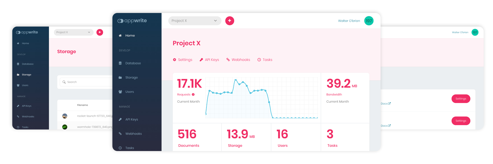

<br />
<p align="center">
    <a href="https://appwrite.io" target="_blank"></a>
    <br />
    <br />
    <b>A complete backend solution for your [Flutter / Vue / Angular / React / iOS / Android / *ANY OTHER*] app</b>
    <br />
    <br />
</p>

[](https://hacktoberfest.appwrite.io)
[](https://appwrite.io/discord)
[](https://hub.docker.com/r/appwrite/appwrite)
[](https://travis-ci.com/appwrite/appwrite)
[](https://twitter.com/appwrite_io)
[](docs/tutorials/add-translations.md)
<!-- [](https://store.appwrite.io) -->

[**Appwrite 0.10 has been released! Learn what's new!**](https://dev.to/appwrite/it-s-here-announcing-appwrite-0-10-and-the-new-appwrite-realtime-api-lbm)

Appwrite is an end-to-end backend server for Web, Mobile, Native, or Backend apps packaged as a set of Docker<nobr> microservices. Appwrite abstracts the complexity and repetitiveness required to build a modern backend API from scratch and allows you to build secure apps faster.

Using Appwrite, you can easily integrate your app with user authentication & multiple sign-in methods, a database for storing and querying users and team data, storage and file management, image manipulation, Cloud Functions, and [more services](https://appwrite.io/docs).



Find out more at: [https://appwrite.io](https://appwrite.io)

Table of Contents:

- [Installation](#installation)
  - [Unix](#unix)
  - [Windows](#windows)
    - [CMD](#cmd)
    - [PowerShell](#powershell)
  - [Upgrade from an Older Version](#upgrade-from-an-older-version)
- [Getting Started](#getting-started)
  - [Services](#services)
  - [SDKs](#sdks)
    - [Client](#client)
    - [Server](#server)
- [Contributing](#contributing)
- [Security](#security)
- [Follow Us](#follow-us)
- [License](#license)
      
Installation
-----------
Appwrite backend server is designed to run in a container environment. Running your server is as easy as running one command from your terminal. You can either run Appwrite on your localhost using docker-compose or on any other container orchestration tool like Kubernetes, Docker Swarm, or Rancher.

The easiest way to start running your Appwrite server is by running our docker-compose file. Before running the installation command make sure you have [Docker](https://www.docker.com/products/docker-desktop) installed on your machine:

### Unix

```bash
docker run -it --rm \
    --volume /var/run/docker.sock:/var/run/docker.sock \
    --volume "$(pwd)"/appwrite:/usr/src/code/appwrite:rw \
    --entrypoint="install" \
    appwrite/appwrite:0.10.4
```

### Windows

#### CMD

```cmd
docker run -it --rm ^
    --volume //var/run/docker.sock:/var/run/docker.sock ^
    --volume "%cd%"/appwrite:/usr/src/code/appwrite:rw ^
    --entrypoint="install" ^
    appwrite/appwrite:0.10.4
```

#### PowerShell

```powershell
docker run -it --rm ,
    --volume /var/run/docker.sock:/var/run/docker.sock ,
    --volume ${pwd}/appwrite:/usr/src/code/appwrite:rw ,
    --entrypoint="install" ,
    appwrite/appwrite:0.10.4
```

Once the Docker installation completes, go to http://localhost to access the Appwrite console from your browser. Please note that on non-linux native hosts, the server might take a few minutes to start after installation completes.


For advanced production and custom installation, check out our Docker [environment variables](https://appwrite.io/docs/environment-variables) docs. You can also use our public [docker-compose.yml](https://gist.github.com/eldadfux/977869ff6bdd7312adfd4e629ee15cc5#file-docker-compose-yml) file to manually set up an environment.

### Upgrade from an Older Version

If you are upgrading your Appwrite server from an older version, you should use the Appwrite migration tool once your setup is completed. For more information regarding this, check out the [Installation Docs](https://appwrite.io/docs/installation).

## Getting Started

Getting started with Appwrite is as easy as creating a new project, choosing your platform, and integrating its SDK in your code. You can easily get started with your platform of choice by reading one of our Getting Started tutorials.

* [Getting Started for Web](https://appwrite.io/docs/getting-started-for-web)
* [Getting Started for Flutter](https://appwrite.io/docs/getting-started-for-flutter)
* [Getting Started for Server](https://appwrite.io/docs/getting-started-for-server)
* [Getting Started for CLI](https://appwrite.io/docs/command-line)
* Getting Started for Android (`Coming soon...`)
* Getting Started for iOS (`Coming soon...`)

### Services

* [**Account**](https://appwrite.io/docs/client/account) - Manage current user authentication and account. Track and manage the user sessions, devices, sign-in methods, and security logs.
* [**Users**](https://appwrite.io/docs/server/users) - Manage and list all project users when in admin mode.
* [**Teams**](https://appwrite.io/docs/client/teams) - Manage and group users in teams. Manage memberships, invites, and user roles within a team.
* [**Database**](https://appwrite.io/docs/client/database) - Manage database collections and documents. Read, create, update, and delete documents and filter lists of document collections using advanced filters.
* [**Storage**](https://appwrite.io/docs/client/storage) - Manage storage files. Read, create, delete, and preview files. Manipulate the preview of your files to fit your app perfectly. All files are scanned by ClamAV and stored in a secure and encrypted way.
* [**Functions**](https://appwrite.io/docs/server/functions) - Customize your Appwrite server by executing your custom code in a secure, isolated environment. You can trigger your code on any Appwrite system event, manually or using a CRON schedule.
* [**Locale**](https://appwrite.io/docs/client/locale) - Track your user's location, and manage your app locale-based data.
* [**Avatars**](https://appwrite.io/docs/client/avatars) - Manage your users' avatars, countries' flags, browser icons, credit card symbols, and generate QR codes.

For the complete API documentation, visit [https://appwrite.io/docs](https://appwrite.io/docs). For more tutorials, news and announcements check out our [blog](https://medium.com/appwrite-io) and [Discord Server](https://discord.gg/GSeTUeA).

### SDKs

Below is a list of currently supported platforms and languages. If you wish to help us add support to your platform of choice, you can go over to our [SDK Generator](https://github.com/appwrite/sdk-generator) project and view our [contribution guide](https://github.com/appwrite/sdk-generator/blob/master/CONTRIBUTING.md).

#### Client
* ✅  &nbsp; [Web](https://github.com/appwrite/sdk-for-web) (Maintained by the Appwrite Team)
* ✅  &nbsp; [Flutter](https://github.com/appwrite/sdk-for-flutter) (Maintained by the Appwrite Team)
* ✅  &nbsp; [Android](https://github.com/appwrite/sdk-for-android) (Maintained by the Appwrite Team)

#### Server
* ✅  &nbsp; [NodeJS](https://github.com/appwrite/sdk-for-node) (Maintained by the Appwrite Team)
* ✅  &nbsp; [PHP](https://github.com/appwrite/sdk-for-php) (Maintained by the Appwrite Team)
* ✅  &nbsp; [Dart](https://github.com/appwrite/sdk-for-dart) **Beta** (Maintained by the Appwrite Team)
* ✅  &nbsp; [Deno](https://github.com/appwrite/sdk-for-deno) - **Beta** (Maintained by the Appwrite Team)
* ✅  &nbsp; [Ruby](https://github.com/appwrite/sdk-for-ruby) (Maintained by the Appwrite Team)
* ✅  &nbsp; [Python](https://github.com/appwrite/sdk-for-python) (Maintained by the Appwrite Team)
* ✅  &nbsp; [Kotlin](https://github.com/appwrite/sdk-for-kotlin) - **Beta** (Maintained by the Appwrite Team)
* ✅  &nbsp; [.NET](https://github.com/appwrite/sdk-for-dotnet) - **Experimental** (Maintained by the Appwrite Team)

Looking for more SDKs? - Help us by contributing a pull request to our [SDK Generator](https://github.com/appwrite/sdk-generator)!

## Contributing

All code contributions - including those of people having commit access - must go through a pull request and be approved by a core developer before being merged. This is to ensure a proper review of all the code.

We truly ❤️ pull requests! If you wish to help, you can learn more about how you can contribute to this project in the [contribution guide](CONTRIBUTING.md).

## Security

For security issues, kindly email us at [security@appwrite.io](mailto:security@appwrite.io) instead of posting a public issue on GitHub.

## Follow Us

Join our growing community around the world! See our official [Blog](https://medium.com/appwrite-io). Follow us on [Twitter](https://twitter.com/appwrite_io), [Facebook Page](https://www.facebook.com/appwrite.io), [Facebook Group](https://www.facebook.com/groups/appwrite.developers/) or join our live [Discord server](https://discord.gg/GSeTUeA) for more help, ideas, and discussions.

## License

This repository is available under the [BSD 3-Clause License](./LICENSE).
