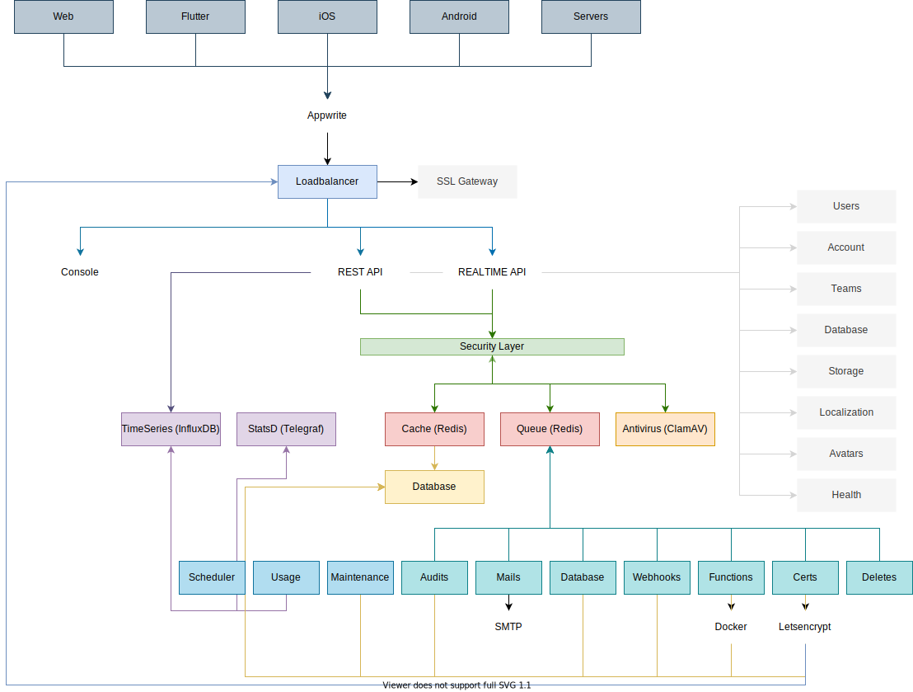

> It's going to get cloudy! 🌩 ☂️
> The Appwrite Cloud is coming soon! You can learn more about our upcoming hosted solution and signup for free credits at: https://appwrite.io/cloud

<br />
<p align="center">
    <a href="https://appwrite.io" target="_blank"></a>
    <br />
    <b>Appwrite is a backend platform for developing Web, Mobile, and Flutter applications. Built with the open source community and optimized for developer experience in the coding languages you love.</b>
    <br />
    <br />
</p>


<!-- [](https://travis-ci.com/appwrite/appwrite) -->

[](https://appwrite.io/company/careers)
[](https://hacktoberfest.appwrite.io)
[](https://appwrite.io/discord?r=Github)
[](https://github.com/appwrite/appwrite/actions)
[](https://twitter.com/appwrite)

<!-- [](https://hub.docker.com/r/appwrite/appwrite) -->
<!-- [](docs/tutorials/add-translations.md) -->
<!-- [](https://store.appwrite.io) -->

English | [简体中文](README-CN.md)

[**Announcing Appwrite 1.3 with Database Relationships! Learn what's new!**](https://dev.to/appwrite/join-celebrations-appwrite-13-ships-relationships-57fc)

Appwrite is an end-to-end backend server for Web, Mobile, Native, or Backend apps packaged as a set of Docker<nobr> microservices. Appwrite abstracts the complexity and repetitiveness required to build a modern backend API from scratch and allows you to build secure apps faster.

Using Appwrite, you can easily integrate your app with user authentication and multiple sign-in methods, a database for storing and querying users and team data, storage and file management, image manipulation, Cloud Functions, and [more services](https://appwrite.io/docs).

<p align="center">
    <br />
    <a href="https://www.producthunt.com/posts/appwrite-2?utm_source=badge-top-post-badge&utm_medium=badge&utm_souce=badge-appwrite-2" target="_blank"></a>
    <br />
    <br />
</p>


Find out more at: [https://appwrite.io](https://appwrite.io)

Table of Contents:

- [Installation](#installation)
  - [Unix](#unix)
  - [Windows](#windows)
    - [CMD](#cmd)
    - [PowerShell](#powershell)
  - [Upgrade from an Older Version](#upgrade-from-an-older-version)
- [One-Click Setups](#one-click-setups)
- [Getting Started](#getting-started)
  - [Services](#services)
  - [SDKs](#sdks)
    - [Client](#client)
    - [Server](#server)
    - [Community](#community)
- [Architecture](#architecture)
- [Contributing](#contributing)
- [Security](#security)
- [Follow Us](#follow-us)
- [License](#license)

## Installation

Appwrite is designed to run in a containerized environment. Running your server is as easy as running one command from your terminal. You can either run Appwrite on your localhost using docker-compose or on any other container orchestration tool, such as Kubernetes, Docker Swarm, or Rancher.

The easiest way to start running your Appwrite server is by running our docker-compose file. Before running the installation command, make sure you have [Docker](https://www.docker.com/products/docker-desktop) installed on your machine:

### Unix

```bash
docker run -it --rm \
    --volume /var/run/docker.sock:/var/run/docker.sock \
    --volume "$(pwd)"/appwrite:/usr/src/code/appwrite:rw \
    --entrypoint="install" \
    appwrite/appwrite:1.3.3
```

### Windows

#### CMD

```cmd
docker run -it --rm ^
    --volume //var/run/docker.sock:/var/run/docker.sock ^
    --volume "%cd%"/appwrite:/usr/src/code/appwrite:rw ^
    --entrypoint="install" ^
    appwrite/appwrite:1.3.3
```

#### PowerShell

```powershell
docker run -it --rm `
    --volume /var/run/docker.sock:/var/run/docker.sock `
    --volume ${pwd}/appwrite:/usr/src/code/appwrite:rw `
    --entrypoint="install" `
    appwrite/appwrite:1.3.3
```

Once the Docker installation is complete, go to http://localhost to access the Appwrite console from your browser. Please note that on non-Linux native hosts, the server might take a few minutes to start after completing the installation.

For advanced production and custom installation, check out our Docker [environment variables](https://appwrite.io/docs/environment-variables) docs. You can also use our public [docker-compose.yml](https://appwrite.io/install/compose) and [.env](https://appwrite.io/install/env) files to manually set up an environment.

### Upgrade from an Older Version

If you are upgrading your Appwrite server from an older version, you should use the Appwrite migration tool once your setup is completed. For more information regarding this, check out the [Installation Docs](https://appwrite.io/docs/installation).

## One-Click Setups

In addition to running Appwrite locally, you can also launch Appwrite using a pre-configured setup. This allows you to get up and running quickly with Appwrite without installing Docker on your local machine.

Choose from one of the providers below:

<table border="0">
  <tr>
    <td align="center" width="100" height="100">
      <a href="https://marketplace.digitalocean.com/apps/appwrite">
        
          <br /><sub><b>DigitalOcean</b></sub></a>
        </a>
    </td>
    <td align="center" width="100" height="100">
      <a href="https://gitpod.io/#https://github.com/appwrite/integration-for-gitpod">
        
          <br /><sub><b>Gitpod</b></sub></a>    
      </a>
    </td>
  </tr>
</table>

## Getting Started

Getting started with Appwrite is as easy as creating a new project, choosing your platform, and integrating its SDK into your code. You can easily get started with your platform of choice by reading one of our Getting Started tutorials.

- [Getting Started for Web](https://appwrite.io/docs/getting-started-for-web)
- [Getting Started for Flutter](https://appwrite.io/docs/getting-started-for-flutter)
- [Getting Started for Apple](https://appwrite.io/docs/getting-started-for-apple)
- [Getting Started for Android](https://appwrite.io/docs/getting-started-for-android)
- [Getting Started for Server](https://appwrite.io/docs/getting-started-for-server)
- [Getting Started for CLI](https://appwrite.io/docs/command-line)

### Services

- [**Account**](https://appwrite.io/docs/client/account) - Manage current user authentication and account. Track and manage the user sessions, devices, sign-in methods, and security logs.
- [**Users**](https://appwrite.io/docs/server/users) - Manage and list all project users when building backend integrations with Server SDKs.
- [**Teams**](https://appwrite.io/docs/client/teams) - Manage and group users in teams. Manage memberships, invites, and user roles within a team.
- [**Databases**](https://appwrite.io/docs/client/databases) - Manage databases, collections, and documents. Read, create, update, and delete documents and filter lists of document collections using advanced filters.
- [**Storage**](https://appwrite.io/docs/client/storage) - Manage storage files. Read, create, delete, and preview files. Manipulate the preview of your files to perfectly fit your app. All files are scanned by ClamAV and stored in a secure and encrypted way.
- [**Functions**](https://appwrite.io/docs/server/functions) - Customize your Appwrite server by executing your custom code in a secure, isolated environment. You can trigger your code on any Appwrite system event either manually or using a CRON schedule.
- [**Realtime**](https://appwrite.io/docs/realtime) - Listen to real-time events for any of your Appwrite services including users, storage, functions, databases, and more.
- [**Locale**](https://appwrite.io/docs/client/locale) - Track your user's location and manage your app locale-based data.
- [**Avatars**](https://appwrite.io/docs/client/avatars) - Manage your users' avatars, countries' flags, browser icons, and credit card symbols. Generate QR codes from links or plaintext strings.

For the complete API documentation, visit [https://appwrite.io/docs](https://appwrite.io/docs). For more tutorials, news and announcements check out our [blog](https://medium.com/appwrite-io) and [Discord Server](https://discord.gg/GSeTUeA).

### SDKs

Below is a list of currently supported platforms and languages. If you would like to help us add support to your platform of choice, you can go over to our [SDK Generator](https://github.com/appwrite/sdk-generator) project and view our [contribution guide](https://github.com/appwrite/sdk-generator/blob/master/CONTRIBUTING.md).

#### Client

- ✅ &nbsp; [Web](https://github.com/appwrite/sdk-for-web) (Maintained by the Appwrite Team)
- ✅ &nbsp; [Flutter](https://github.com/appwrite/sdk-for-flutter) (Maintained by the Appwrite Team)
- ✅ &nbsp; [Apple](https://github.com/appwrite/sdk-for-apple) - **Beta** (Maintained by the Appwrite Team)
- ✅ &nbsp; [Android](https://github.com/appwrite/sdk-for-android) (Maintained by the Appwrite Team)

#### Server

- ✅ &nbsp; [NodeJS](https://github.com/appwrite/sdk-for-node) (Maintained by the Appwrite Team)
- ✅ &nbsp; [PHP](https://github.com/appwrite/sdk-for-php) (Maintained by the Appwrite Team)
- ✅ &nbsp; [Dart](https://github.com/appwrite/sdk-for-dart) - (Maintained by the Appwrite Team)
- ✅ &nbsp; [Deno](https://github.com/appwrite/sdk-for-deno) - **Beta** (Maintained by the Appwrite Team)
- ✅ &nbsp; [Ruby](https://github.com/appwrite/sdk-for-ruby) (Maintained by the Appwrite Team)
- ✅ &nbsp; [Python](https://github.com/appwrite/sdk-for-python) (Maintained by the Appwrite Team)
- ✅ &nbsp; [Kotlin](https://github.com/appwrite/sdk-for-kotlin) - **Beta** (Maintained by the Appwrite Team)
- ✅ &nbsp; [Apple](https://github.com/appwrite/sdk-for-apple) - **Beta** (Maintained by the Appwrite Team)
- ✅ &nbsp; [.NET](https://github.com/appwrite/sdk-for-dotnet) - **Experimental** (Maintained by the Appwrite Team)

#### Community

- ✅ &nbsp; [Appcelerator Titanium](https://github.com/m1ga/ti.appwrite) (Maintained by [Michael Gangolf](https://github.com/m1ga/))
- ✅ &nbsp; [Godot Engine](https://github.com/GodotNuts/appwrite-sdk) (Maintained by [fenix-hub @GodotNuts](https://github.com/fenix-hub))

Looking for more SDKs? - Help us by contributing a pull request to our [SDK Generator](https://github.com/appwrite/sdk-generator)!

## Architecture



Appwrite uses a microservices architecture that was designed for easy scaling and delegation of responsibilities. In addition, Appwrite supports multiple APIs, such as REST, WebSocket, and GraphQL to allow you to interact with your resources by leveraging your existing knowledge and protocols of choice.

The Appwrite API layer was designed to be extremely fast by leveraging in-memory caching and delegating any heavy-lifting tasks to the Appwrite background workers. The background workers also allow you to precisely control your compute capacity and costs using a message queue to handle the load. You can learn more about our architecture in the [contribution guide](CONTRIBUTING.md#architecture-1).

## Contributing

All code contributions, including those of people having commit access, must go through a pull request and be approved by a core developer before being merged. This is to ensure a proper review of all the code.

We truly ❤️ pull requests! If you wish to help, you can learn more about how you can contribute to this project in the [contribution guide](CONTRIBUTING.md).

## Security

For security issues, kindly email us at [security@appwrite.io](mailto:security@appwrite.io) instead of posting a public issue on GitHub.

## Follow Us

Join our growing community around the world! Check out our official [Blog](https://medium.com/appwrite-io). Follow us on [Twitter](https://twitter.com/appwrite), [Facebook Page](https://www.facebook.com/appwrite.io), [Facebook Group](https://www.facebook.com/groups/appwrite.developers/), [Dev Community](https://dev.to/appwrite) or join our live [Discord server](https://discord.gg/GSeTUeA) for more help, ideas, and discussions.

## License

This repository is available under the [BSD 3-Clause License](./LICENSE).
