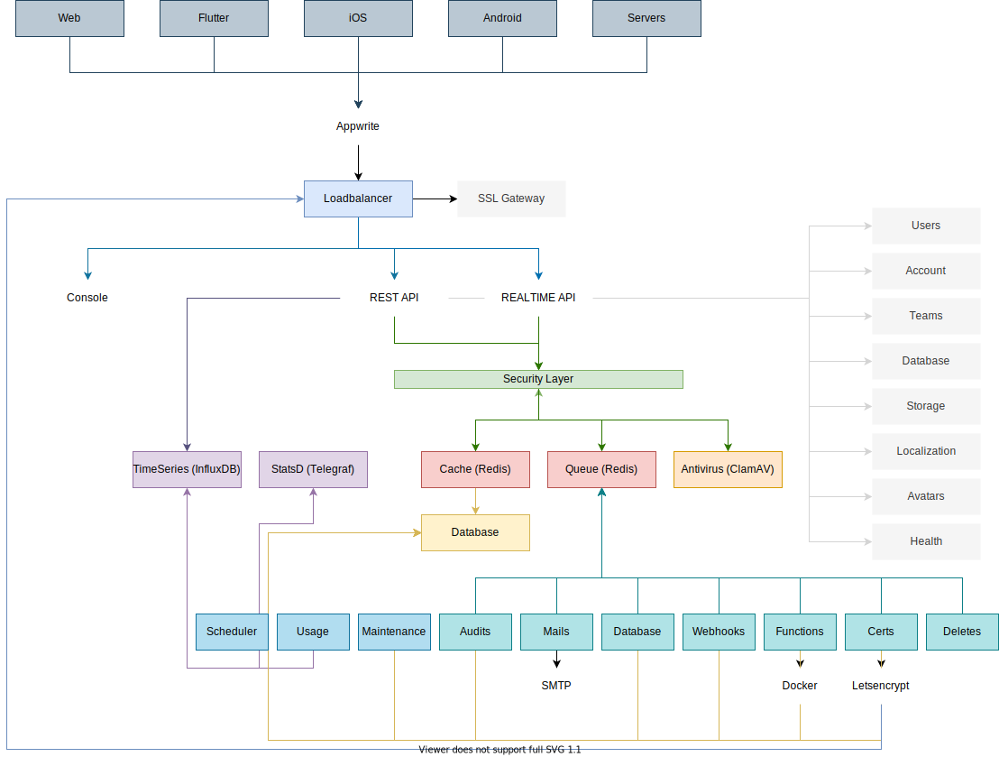

<br />
<p align="center">
    <h1>Appwrite</h1>
    <b>Appwrite is an open-source, all-in-one development platform. Use built-in backend infrastructure and web hosting, all from a single place.</b>
    <br />
    <br />
</p>

[](https://appwrite.io/discord)
[](https://x.com/appwrite)
[](https://cloud.appwrite.io)

English | [简体中文](README-CN.md)

Appwrite is an open-source development platform for building web, mobile, and AI applications. It brings together backend infrastructure and web hosting in one place, so teams can build, ship, and scale without stitching together a fragmented stack. Appwrite is available as a managed cloud platform and can also be self-hosted on infrastructure you control.

With Appwrite, you can add authentication, databases, storage, functions, messaging, realtime capabilities, and integrated web app hosting through Sites. It is designed to reduce the repetitive backend work required to launch modern products while giving developers secure primitives and flexible APIs to build production-ready applications faster.

Find out more at [https://appwrite.io](https://appwrite.io).

Table of Contents:

- [Products](#products)
- [Installation \& Setup](#installation--setup)
- [Self-Hosting](#self-hosting)
  - [Unix](#unix)
  - [Windows](#windows)
    - [CMD](#cmd)
    - [PowerShell](#powershell)
  - [Upgrade from an Older Version](#upgrade-from-an-older-version)
- [One-Click Setups](#one-click-setups)
- [Getting Started](#getting-started)
  - [SDKs](#sdks)
    - [Client](#client)
    - [Server](#server)
- [Architecture](#architecture)
- [Contributing](#contributing)
- [Security](#security)
- [Follow Us](#follow-us)
- [License](#license)


## Products

- **[Appwrite Auth](https://appwrite.io/docs/products/authentication)** - Secure user authentication with multiple login methods including email/password, SMS, OAuth, anonymous sessions, and magic links. Includes session management, multi-factor authentication, and user verification flows.

- **[Appwrite Databases](https://appwrite.io/docs/products/databases)** - Scalable structured data storage with support for databases, tables, and rows. Includes querying, pagination, indexing, and relationships to model complex application data.

- **[Appwrite Storage](https://appwrite.io/docs/products/storage)** - Secure file storage with support for uploads, downloads, encryption, compression, and file transformations for media and assets.

- **[Appwrite Functions](https://appwrite.io/docs/products/functions)** - Serverless compute platform to run custom backend logic in isolated runtimes, triggered by events or scheduled jobs.15 runtimes supported.

- **[Appwrite Messaging](https://appwrite.io/docs/products/messaging)** - Multi-channel messaging system for sending emails, SMS, and push notifications to users for engagement, alerts, and transactional workflows.

- **[Appwrite Sites](https://appwrite.io/docs/products/sites)** - Integrated hosting platform to deploy and scale web applications with support for custom domains, SSR, and seamless backend integration. Git integration and previews are supported.


## Installation & Setup

The easiest way to get started with Appwrite is by [signing up for Appwrite Cloud](https://cloud.appwrite.io/). While Appwrite Cloud is in public beta, you can build with Appwrite completely free, and we won't collect your credit card information.

## Self-Hosting

Appwrite is designed to run in a containerized environment. Running your server is as easy as running one command from your terminal. You can either run Appwrite on your localhost using docker-compose or on any other container orchestration tool, such as [Kubernetes](https://kubernetes.io/docs/home/), [Docker Swarm](https://docs.docker.com/engine/swarm/), or [Rancher](https://rancher.com/docs/).

Before running the installation command, make sure you have [Docker](https://www.docker.com/products/docker-desktop) installed on your machine:

### Unix

```bash
docker run -it --rm \
    --publish 20080:20080 \
    --volume /var/run/docker.sock:/var/run/docker.sock \
    --volume "$(pwd)"/appwrite:/usr/src/code/appwrite:rw \
    --entrypoint="install" \
    appwrite/appwrite:1.9.0
```

### Windows

#### CMD

```cmd
docker run -it --rm ^
    --publish 20080:20080 ^
    --volume //var/run/docker.sock:/var/run/docker.sock ^
    --volume "%cd%"/appwrite:/usr/src/code/appwrite:rw ^
    --entrypoint="install" ^
    appwrite/appwrite:1.9.0
```

#### PowerShell

```powershell
docker run -it --rm `
    --publish 20080:20080 `
    --volume /var/run/docker.sock:/var/run/docker.sock `
    --volume ${pwd}/appwrite:/usr/src/code/appwrite:rw `
    --entrypoint="install" `
    appwrite/appwrite:1.9.0
```

Once the Docker installation is complete, go to http://localhost to access the Appwrite console from your browser. Please note that on non-Linux native hosts, the server might take a few minutes to start after completing the installation.

For advanced production and custom installation, check out our Docker [environment variables](https://appwrite.io/docs/environment-variables) docs. You can also use our public [docker-compose.yml](https://appwrite.io/install/compose) and [.env](https://appwrite.io/install/env) files to manually set up an environment.

### Upgrade from an Older Version

If you are upgrading your Appwrite server from an older version, you should use the Appwrite migration tool once your setup is completed. For more information regarding this, check out the [Installation Docs](https://appwrite.io/docs/self-hosting).

## One-Click Setups

In addition to running Appwrite locally, you can also launch Appwrite using a pre-configured setup. This allows you to get up and running quickly with Appwrite without installing Docker on your local machine.

Choose from one of the providers below:

<table border="0">
  <tr>
    <td align="center" width="100" height="100">
      <a href="https://marketplace.digitalocean.com/apps/appwrite">
        
          <br /><sub><b>DigitalOcean</b></sub></a>
        </a>
    </td>
    <td align="center" width="100" height="100">
      <a href="https://www.linode.com/marketplace/apps/appwrite/appwrite/">
        
          <br /><sub><b>Akamai Compute</b></sub></a>
      </a>
    </td>
    <td align="center" width="100" height="100">
      <a href="https://aws.amazon.com/marketplace/pp/prodview-2hiaeo2px4md6">
        
          <br /><sub><b>AWS Marketplace</b></sub></a>
      </a>
    </td>
  </tr>
</table>

## Getting Started

Getting started with Appwrite is as easy as creating a new project, choosing your platform, and integrating its SDK into your code. You can easily get started with your platform of choice by reading one of our Getting Started tutorials.

| Platform              | Technology                                                                         |
| --------------------- | ---------------------------------------------------------------------------------- |
| **Web app**           | [Quick start for Web](https://appwrite.io/docs/quick-starts/web)                   |
|                       | [Quick start for Next.js](https://appwrite.io/docs/quick-starts/nextjs)            |
|                       | [Quick start for React](https://appwrite.io/docs/quick-starts/react)               |
|                       | [Quick start for Vue.js](https://appwrite.io/docs/quick-starts/vue)                |
|                       | [Quick start for Nuxt](https://appwrite.io/docs/quick-starts/nuxt)                 |
|                       | [Quick start for SvelteKit](https://appwrite.io/docs/quick-starts/sveltekit)       |
|                       | [Quick start for Refine](https://appwrite.io/docs/quick-starts/refine)             |
|                       | [Quick start for Angular](https://appwrite.io/docs/quick-starts/angular)           |
| **Mobile and Native** | [Quick start for React Native](https://appwrite.io/docs/quick-starts/react-native) |
|                       | [Quick start for Flutter](https://appwrite.io/docs/quick-starts/flutter)           |
|                       | [Quick start for Apple](https://appwrite.io/docs/quick-starts/apple)               |
|                       | [Quick start for Android](https://appwrite.io/docs/quick-starts/android)           |
| **Server**            | [Quick start for Node.js](https://appwrite.io/docs/quick-starts/node)              |
|                       | [Quick start for Python](https://appwrite.io/docs/quick-starts/python)             |
|                       | [Quick start for .NET](https://appwrite.io/docs/quick-starts/dotnet)               |
|                       | [Quick start for Dart](https://appwrite.io/docs/quick-starts/dart)                 |
|                       | [Quick start for Ruby](https://appwrite.io/docs/quick-starts/ruby)                 |
|                       | [Quick start for Deno](https://appwrite.io/docs/quick-starts/deno)                 |
|                       | [Quick start for PHP](https://appwrite.io/docs/quick-starts/php)                   |
|                       | [Quick start for Kotlin](https://appwrite.io/docs/quick-starts/kotlin)             |
|                       | [Quick start for Swift](https://appwrite.io/docs/quick-starts/swift)               |

### SDKs

Below is a list of currently supported platforms and languages. If you would like to help us add support to your platform of choice, you can go over to our [SDK Generator](https://github.com/appwrite/sdk-generator) project and view our [contribution guide](https://github.com/appwrite/sdk-generator/blob/master/CONTRIBUTING.md).

#### Client

- :white_check_mark: &nbsp; [Web](https://github.com/appwrite/sdk-for-web)
- :white_check_mark: &nbsp; [Flutter](https://github.com/appwrite/sdk-for-flutter)
- :white_check_mark: &nbsp; [Apple](https://github.com/appwrite/sdk-for-apple)
- :white_check_mark: &nbsp; [Android](https://github.com/appwrite/sdk-for-android)
- :white_check_mark: &nbsp; [React Native](https://github.com/appwrite/sdk-for-react-native)

#### Server

- :white_check_mark: &nbsp; [NodeJS](https://github.com/appwrite/sdk-for-node)
- :white_check_mark: &nbsp; [PHP](https://github.com/appwrite/sdk-for-php)
- :white_check_mark: &nbsp; [Dart](https://github.com/appwrite/sdk-for-dart)
- :white_check_mark: &nbsp; [Deno](https://github.com/appwrite/sdk-for-deno)
- :white_check_mark: &nbsp; [Ruby](https://github.com/appwrite/sdk-for-ruby)
- :white_check_mark: &nbsp; [Python](https://github.com/appwrite/sdk-for-python)
- :white_check_mark: &nbsp; [Kotlin](https://github.com/appwrite/sdk-for-kotlin)
- :white_check_mark: &nbsp; [Swift](https://github.com/appwrite/sdk-for-swift)
- :white_check_mark: &nbsp; [.NET](https://github.com/appwrite/sdk-for-dotnet)

Looking for more SDKs? - Help us by contributing a pull request to our [SDK Generator](https://github.com/appwrite/sdk-generator)!

## Architecture



Appwrite uses a microservices architecture that was designed for easy scaling and delegation of responsibilities. In addition, Appwrite supports multiple APIs, such as REST, WebSocket, and GraphQL to allow you to interact with your resources by leveraging your existing knowledge and protocols of choice.

The Appwrite API layer was designed to be extremely fast by leveraging in-memory caching and delegating any heavy-lifting tasks to the Appwrite background workers. The background workers also allow you to precisely control your compute capacity and costs using a message queue to handle the load. You can learn more about our architecture in the [contribution guide](CONTRIBUTING.md#architecture-1).

## Contributing

All code contributions, including those of people having commit access, must go through a pull request and be approved by a core developer before being merged. This is to ensure a proper review of all the code.

We truly :heart: pull requests! If you wish to help, you can learn more about how you can contribute to this project in the [contribution guide](CONTRIBUTING.md).

## Security

For security issues, kindly email us at [security@appwrite.io](mailto:security@appwrite.io) instead of posting a public issue on GitHub.

## Follow Us

Join our growing community around the world! Check out our official [Blog](https://appwrite.io/blog). Follow us on [X](https://twitter.com/appwrite), [LinkedIn](https://www.linkedin.com/company/appwrite/), [Dev Community](https://dev.to/appwrite) or join our live [Discord server](https://appwrite.io/discord) for more help, ideas, and discussions.

## License

This repository is available under the [BSD 3-Clause License](./LICENSE).
