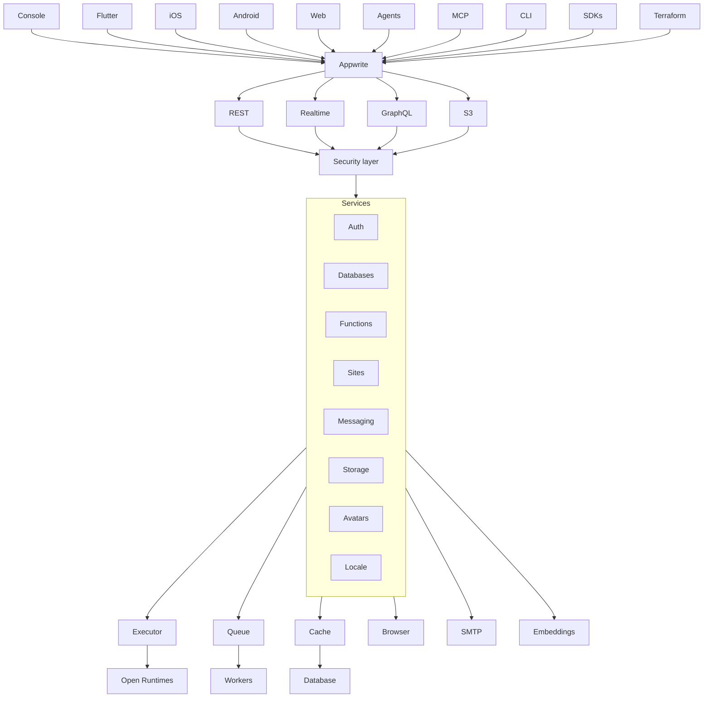

<br />
<p align="center">
    <h1>Appwrite</h1>
    <b>Appwrite is an open-source, MCP and agent-first development platform. Use built-in backend infrastructure, web hosting, and agent tooling, all from a single place.</b>
    <br />
    <br />
</p>

[](https://appwrite.io/discord)
[](https://x.com/appwrite)
[](https://cloud.appwrite.io)

English | [简体中文](README-CN.md)

Appwrite is an open-source, MCP and agent-first platform for building web, mobile, and AI applications. It brings together backend infrastructure, web hosting, and agent tooling in one place, so teams and agents can build, ship, and scale without stitching together a fragmented stack. Appwrite is available as a managed cloud platform and can also be self-hosted on infrastructure you control.

With Appwrite, you can add authentication, databases, storage, functions, messaging, realtime capabilities, and integrated web app hosting through Sites. Connect agents through the hosted MCP server, install agent skills for SDK-accurate code, and give models access to your project and docs. It is designed to reduce the repetitive backend work required to launch modern products while giving developers and agents secure primitives and flexible APIs to build production-ready applications faster.

Find out more at [https://appwrite.io](https://appwrite.io).

Table of Contents:

- [Products](#products)
- [Installation \& Setup](#installation--setup)
- [Self-Hosting](#self-hosting)
  - [Unix](#unix)
  - [Windows](#windows)
    - [CMD](#cmd)
    - [PowerShell](#powershell)
  - [Docker API version mismatch](#docker-api-version-mismatch)
  - [Upgrade from an Older Version](#upgrade-from-an-older-version)
- [One-Click Setups](#one-click-setups)
- [Getting Started](#getting-started)
  - [Agents](#agents)
  - [SDKs](#sdks)
    - [Client](#client)
    - [Server](#server)
- [Architecture](#architecture)
- [Contributing](#contributing)
- [Security](#security)
- [Follow Us](#follow-us)
- [License](#license)


## Products

- **[Appwrite Auth](https://appwrite.io/docs/products/auth)** - Secure user authentication with multiple login methods including email/password, SMS, OAuth, anonymous sessions, and magic URLs. Includes session management, multi-factor authentication, and user verification flows.

- **[Appwrite Databases](https://appwrite.io/docs/products/databases)** - Scalable structured data storage with support for databases, tables, and rows. Includes querying, pagination, indexing, and relationships to model complex application data.

- **[Appwrite Storage](https://appwrite.io/docs/products/storage)** - Secure file storage with support for uploads, downloads, encryption, compression, and file transformations for media and assets.

- **[Appwrite Functions](https://appwrite.io/docs/products/functions)** - Serverless compute platform to run custom backend logic in isolated runtimes, triggered by HTTP, events, or scheduled jobs. Includes templates for hosting your own MCP servers.

- **[Appwrite Messaging](https://appwrite.io/docs/products/messaging)** - Multi-channel messaging system for sending emails, SMS, and push notifications to users for engagement, alerts, and transactional workflows.

- **[Appwrite Sites](https://appwrite.io/docs/products/sites)** - Integrated hosting platform to deploy and scale web applications with support for custom domains, SSR, and seamless backend integration. Git integration and previews are supported.

- **[Appwrite Realtime](https://appwrite.io/docs/apis/realtime)** - Subscribe to Auth, Databases, Storage, Functions, and other project events over WebSockets so apps and agents can react as data changes.

- **[Appwrite MCP](https://appwrite.io/docs/tooling/ai/mcp-servers/api)** - Hosted Model Context Protocol server so agents can search Appwrite docs and operate on your project with natural language. No local install required on Cloud.

- **[Appwrite Network](https://appwrite.io/docs/products/network)** - Global CDN, DDoS protection, TLS, and edge delivery for APIs, functions, and hosted sites on Appwrite Cloud.


## Installation & Setup

The easiest way to get started with Appwrite is by [signing up for Appwrite Cloud](https://cloud.appwrite.io/). Cloud includes a [Free plan](https://appwrite.io/pricing) so you can start building immediately, with paid plans when you need to scale.

## Self-Hosting

Appwrite is designed to run in a containerized environment. Running your server is as easy as running one command from your terminal. You can either run Appwrite on your localhost using docker-compose or on any other container orchestration tool, such as [Kubernetes](https://kubernetes.io/docs/home/), [Docker Swarm](https://docs.docker.com/engine/swarm/), or [Rancher](https://ranchermanager.docs.rancher.com/).

Before running the installation command, make sure you have [Docker](https://www.docker.com/products/docker-desktop) installed on your machine. The setup wizard listens on port **20080**; if you are installing on a remote host, open that port until installation is complete.

### Unix

```bash
docker run -it --rm \
    --publish 20080:20080 \
    --volume /var/run/docker.sock:/var/run/docker.sock \
    --volume "$(pwd)"/appwrite:/usr/src/code/appwrite:rw \
    --entrypoint="install" \
    appwrite/appwrite:2.2.0
```

### Windows

#### CMD

```cmd
docker run -it --rm ^
    --publish 20080:20080 ^
    --volume //var/run/docker.sock:/var/run/docker.sock ^
    --volume "%cd%"/appwrite:/usr/src/code/appwrite:rw ^
    --entrypoint="install" ^
    appwrite/appwrite:2.2.0
```

#### PowerShell

```powershell
docker run -it --rm `
    --publish 20080:20080 `
    --volume /var/run/docker.sock:/var/run/docker.sock `
    --volume ${pwd}/appwrite:/usr/src/code/appwrite:rw `
    --entrypoint="install" `
    appwrite/appwrite:2.2.0
```

Once the installer is running, open http://localhost:20080 to complete the setup wizard. After installation, go to http://localhost to access the Appwrite console from your browser. Please note that on non-Linux native hosts, the server might take a few minutes to start after completing the installation.

### Docker API version mismatch

If install or upgrade fails with an error like `client version 1.52 is too new. Maximum supported API version is 1.42`, the Docker CLI inside the Appwrite image is newer than your host Docker Engine. Pass `DOCKER_API_VERSION` set to the maximum API version from the error (or upgrade Docker on the host):

```bash
docker run -it --rm \
    --env DOCKER_API_VERSION=1.42 \
    --publish 20080:20080 \
    --volume /var/run/docker.sock:/var/run/docker.sock \
    --volume "$(pwd)"/appwrite:/usr/src/code/appwrite:rw \
    --entrypoint="install" \
    appwrite/appwrite:2.2.0
```

Use the same `--env DOCKER_API_VERSION=...` flag with `--entrypoint="upgrade"` when upgrading.

For advanced production and custom installation, check out our Docker [environment variables](https://appwrite.io/docs/advanced/self-hosting/configuration/environment-variables) docs. You can also use our public [docker-compose.yml](https://appwrite.io/install/compose) and [.env](https://appwrite.io/install/env) files to manually set up an environment.

### Upgrade from an Older Version

If you are upgrading your Appwrite server from an older version, you should use the Appwrite migration tool once your setup is completed. For more information regarding this, check out the [Installation Docs](https://appwrite.io/docs/advanced/self-hosting).

## One-Click Setups

In addition to running Appwrite locally, you can also launch Appwrite using a pre-configured setup. This allows you to get up and running quickly with Appwrite without installing Docker on your local machine.

Choose from one of the providers below:

<table border="0">
  <tr>
    <td align="center" width="100" height="100">
      <a href="https://marketplace.digitalocean.com/apps/appwrite">
        
          <br /><sub><b>DigitalOcean</b></sub></a>
        </a>
    </td>
    <td align="center" width="100" height="100">
      <a href="https://www.linode.com/marketplace/apps/appwrite/appwrite/">
        
          <br /><sub><b>Akamai Compute</b></sub></a>
      </a>
    </td>
    <td align="center" width="100" height="100">
      <a href="https://aws.amazon.com/marketplace/pp/prodview-2hiaeo2px4md6">
        
          <br /><sub><b>AWS Marketplace</b></sub></a>
      </a>
    </td>
  </tr>
</table>

## Getting Started

Getting started with Appwrite is as easy as creating a new project, connecting an agent, or integrating an SDK into your code. You can start from a prompt, a quick start tutorial, or the hosted MCP server.

### Agents

Give coding agents access to your Appwrite project and the latest docs. The hosted MCP server uses OAuth, so you do not need to create or manage API keys. For a self-hosted instance, use the [local MCP server](https://appwrite.io/docs/advanced/self-hosting/mcp) instead.

Add the remote server to Cursor, Claude Code, Codex, VS Code, and other MCP clients:

```json
{
    "mcpServers": {
        "appwrite": {
            "url": "https://mcp.appwrite.io/"
        }
    }
}
```

You can also [add the MCP server to Cursor](https://cursor.com/install-mcp?name=appwrite&config=eyJ1cmwiOiJodHRwczovL21jcC5hcHB3cml0ZS5pby8ifQ==) in one click.

Install language-specific [agent skills](https://appwrite.io/docs/tooling/ai/skills) so models generate correct SDK calls:

```bash
npx skills add appwrite/agent-skills
```

Browse [quick start prompts](https://appwrite.io/docs/tooling/ai/quickstart-prompts), generate an [AGENTS.md](https://appwrite.io/docs/tooling/ai/agents-md) file for your repo, or see the [AI tooling docs](https://appwrite.io/docs/tooling/ai) for IDE and vibe coding setup.

Getting started with your platform of choice is also covered in the tutorials below.

| Platform              | Technology                                                                         |
| --------------------- | ---------------------------------------------------------------------------------- |
| **Web app**           | [Quick start for Web](https://appwrite.io/docs/quick-starts/web)                   |
|                       | [Quick start for Next.js](https://appwrite.io/docs/quick-starts/nextjs)            |
|                       | [Quick start for React](https://appwrite.io/docs/quick-starts/react)               |
|                       | [Quick start for Vue.js](https://appwrite.io/docs/quick-starts/vue)                |
|                       | [Quick start for Nuxt](https://appwrite.io/docs/quick-starts/nuxt)                 |
|                       | [Quick start for SvelteKit](https://appwrite.io/docs/quick-starts/sveltekit)       |
|                       | [Quick start for Astro](https://appwrite.io/docs/quick-starts/astro)               |
|                       | [Quick start for TanStack Start](https://appwrite.io/docs/quick-starts/tanstack-start) |
|                       | [Quick start for Refine](https://appwrite.io/docs/quick-starts/refine)             |
|                       | [Quick start for Angular](https://appwrite.io/docs/quick-starts/angular)           |
| **Mobile and Native** | [Quick start for React Native](https://appwrite.io/docs/quick-starts/react-native) |
|                       | [Quick start for Flutter](https://appwrite.io/docs/quick-starts/flutter)           |
|                       | [Quick start for Apple](https://appwrite.io/docs/quick-starts/apple)               |
|                       | [Quick start for Android](https://appwrite.io/docs/quick-starts/android)           |
| **Server**            | [Quick start for Node.js](https://appwrite.io/docs/quick-starts/node)              |
|                       | [Quick start for Python](https://appwrite.io/docs/quick-starts/python)             |
|                       | [Quick start for .NET](https://appwrite.io/docs/quick-starts/dotnet)               |
|                       | [Quick start for Dart](https://appwrite.io/docs/quick-starts/dart)                 |
|                       | [Quick start for Ruby](https://appwrite.io/docs/quick-starts/ruby)                 |
|                       | [Quick start for Deno](https://appwrite.io/docs/quick-starts/deno)                 |
|                       | [Quick start for PHP](https://appwrite.io/docs/quick-starts/php)                   |
|                       | [Quick start for Kotlin](https://appwrite.io/docs/quick-starts/kotlin)             |
|                       | [Quick start for Swift](https://appwrite.io/docs/quick-starts/swift)               |
|                       | [Quick start for Go](https://appwrite.io/docs/quick-starts/go)                     |
|                       | [Quick start for Rust](https://appwrite.io/docs/quick-starts/rust)                 |

### SDKs

Below is a list of currently supported platforms and languages. If you would like to help us add support to your platform of choice, you can go over to our [SDK Generator](https://github.com/appwrite/sdk-generator) project and view our [contribution guide](https://github.com/appwrite/sdk-generator/blob/master/CONTRIBUTING.md).

#### Client

- :white_check_mark: &nbsp; [Web](https://github.com/appwrite/sdk-for-web)
- :white_check_mark: &nbsp; [Flutter](https://github.com/appwrite/sdk-for-flutter)
- :white_check_mark: &nbsp; [Apple](https://github.com/appwrite/sdk-for-apple)
- :white_check_mark: &nbsp; [Android](https://github.com/appwrite/sdk-for-android)
- :white_check_mark: &nbsp; [React Native](https://github.com/appwrite/sdk-for-react-native)

#### Server

- :white_check_mark: &nbsp; [Node.js](https://github.com/appwrite/sdk-for-node)
- :white_check_mark: &nbsp; [Python](https://github.com/appwrite/sdk-for-python)
- :white_check_mark: &nbsp; [Dart](https://github.com/appwrite/sdk-for-dart)
- :white_check_mark: &nbsp; [PHP](https://github.com/appwrite/sdk-for-php)
- :white_check_mark: &nbsp; [Ruby](https://github.com/appwrite/sdk-for-ruby)
- :white_check_mark: &nbsp; [.NET](https://github.com/appwrite/sdk-for-dotnet)
- :white_check_mark: &nbsp; [Go](https://github.com/appwrite/sdk-for-go)
- :white_check_mark: &nbsp; [Swift](https://github.com/appwrite/sdk-for-swift)
- :white_check_mark: &nbsp; [Kotlin](https://github.com/appwrite/sdk-for-kotlin)
- :white_check_mark: &nbsp; [Rust](https://github.com/appwrite/sdk-for-rust)

Looking for more SDKs? - Help us by contributing a pull request to our [SDK Generator](https://github.com/appwrite/sdk-generator)!

## Architecture


```mermaid
flowchart TB
  Console & Flutter & iOS & Android & Web & Agents & MCP & CLI & SDKs & Terraform --> Appwrite
  Appwrite --> REST & Realtime & GraphQL & S3
  REST & Realtime & GraphQL & S3 --> securityLayer[Security layer]
  securityLayer --> services
  subgraph services [Services]
    Auth
    Databases
    Functions
    Sites
    Messaging
    Storage
    Avatars
    Locale
  end
  services --> Executor & Queue & Cache & Browser & SMTP & Embeddings
  Cache --> Database
  Queue --> Workers
  Executor --> openRuntimes[Open Runtimes]
```

Appwrite uses a hybrid monolithic-microservice architecture that was designed for easy scaling and delegation of responsibilities. In addition, Appwrite supports multiple APIs, such as REST, WebSocket, and GraphQL to allow you to interact with your resources by leveraging your existing knowledge and protocols of choice.

The Appwrite API layer was designed to be extremely fast by leveraging in-memory caching and delegating any heavy-lifting tasks to the Appwrite background workers. The background workers also allow you to precisely control your compute capacity and costs using a message queue to handle the load. You can learn more about our architecture in [AGENTS.md](AGENTS.md).

## Contributing

All code contributions, including those of people having commit access, must go through a pull request and be approved by a core developer before being merged. This is to ensure a proper review of all the code.

We truly :heart: pull requests! If you wish to help, you can learn more about how you can contribute to this project in the [contribution guide](CONTRIBUTING.md).

## Security

Please see [SECURITY.md](SECURITY.md) for how to report a vulnerability. Do not open a public GitHub issue for security reports.

## Follow Us

Join our growing community around the world! Read the [Blog](https://appwrite.io/blog), or follow us on [Discord](https://appwrite.io/discord), [GitHub](https://github.com/appwrite), [X](https://x.com/appwrite), [LinkedIn](https://linkedin.com/company/appwrite), [YouTube](https://youtube.com/c/appwrite), [daily.dev](https://app.daily.dev/squads/appwrite), [Bluesky](https://bsky.app/profile/appwrite.io), [TikTok](https://tiktok.com/@appwrite), and [Instagram](https://instagram.com/appwrite.io).

## License

This repository is available under the [BSD 3-Clause License](./LICENSE).
