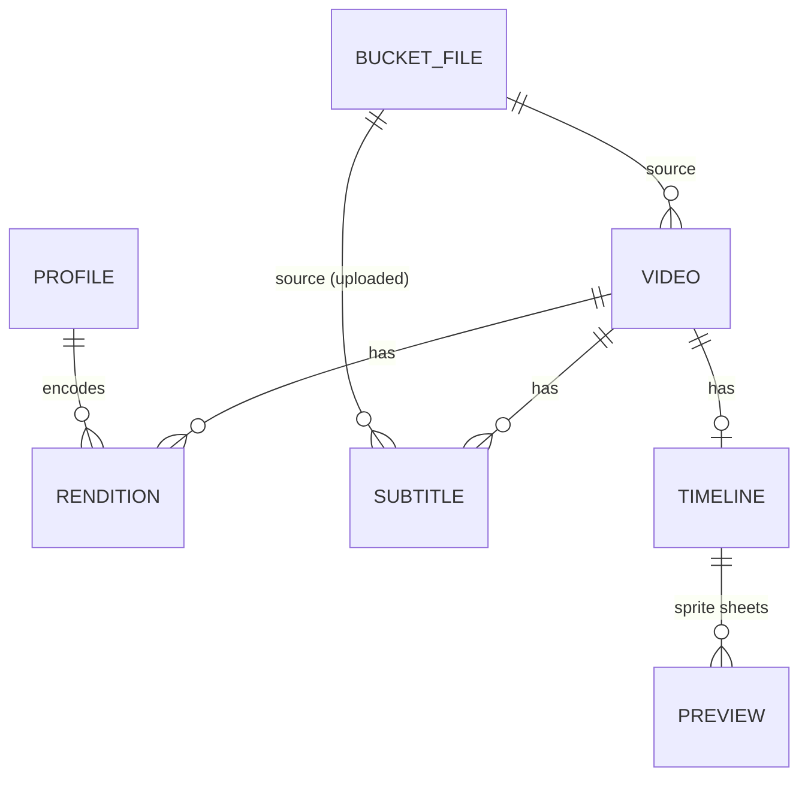

# Videos service spec

The Videos service turns a video or audio file in a Storage bucket into adaptive streams (HLS, DASH, CMAF), with subtitles and scrubbing thumbnails. It is a project-scoped service: `sdk.forProject(projectId).videos`.

Source of truth: `node_modules/@appwrite.io/console/types/services/videos.d.ts` and `Models.Video*` in `models.d.ts`.

## Entity overview

| Entity | Parent | Model | Lifecycle |
| --- | --- | --- | --- |
| Video | Project (references a Storage file) | `Models.Video` | No status. Metadata is filled in by the first rendition or timeline job |
| Profile | Project | `Models.VideoProfile` | Static config, no status |
| Rendition | Video + Profile | `Models.VideoRendition` | `pending` > `started` > `ended` > `uploading` > `ready` |
| Subtitle | Video (references a Storage file, or embedded) | `Models.VideoSubtitle` | `pending` > `started` > `ready` |
| Timeline / Preview | Video | WebVTT text / image | Generated on request |
| Output (stream) | Video + Renditions + Subtitles | Manifests and segments | Read-only, derived |



## Typical flow

1. Upload a video or audio file to a Storage bucket.
2. `create` a Video from `bucketId` + `fileId`. Only the document is stored; nothing is downloaded or probed yet.
3. Use the default profiles seeded into every new project, or `createProfile` per encoding target.
4. `createRendition` per profile and output. Follow `status` and `progress`. Each job downloads its own copy of the source, probes metadata and extracts embedded subtitles if that has not happened yet, and deletes the copy when it ends.
5. Optionally `createTimeline` for scrubbing thumbnails (same per-job download) and `createSubtitle` for authored tracks.
6. Hand the master manifest URL (`getHlsManifest`, `getDashManifest`, `getCmaf*Manifest`) to a player.

---

## 1. Video

The root resource. Points at a source file in Storage and holds probed media metadata.

### Model: `Models.Video`

| Field | Type | Description |
| --- | --- | --- |
| `$id` | string | Video ID |
| `$createdAt` / `$updatedAt` | string | ISO 8601 |
| `bucketId` | string | Bucket holding the source file |
| `fileId` | string | Source file ID |
| `name` | string | Defaults to the source file name. Max 128 chars |
| `previewId` | string | Preview image ID, from the sprite timeline |
| `size` | number | Source size in bytes |
| `format` | string | Container format |
| `duration` | number | Milliseconds |
| `width` / `height` | number | Pixels |
| `aspectRatio` | string | e.g. `16:9` |
| `videoCodec`, `videoFormat`, `videoFormatProfile` | string | Video stream info |
| `videoBitRate` | number | Bits per second |
| `videoFrameRate`, `videoFrameRateMode` | string | Frame rate info |
| `audioCodec`, `audioFormat`, `audioSampleRate` | string | Audio stream info |
| `audioBitRate` | number | Bits per second |

List model: `Models.VideoList` (`{ total, videos }`).

### Status

Videos have no status. The Console derives one from the renditions (`getVideoEncodingStatus`): `encoding` while any rendition is active, `ready` once one is ready, `error` when all settled ones failed, otherwise `none`. Media metadata (`width`, `duration`, codecs) stays empty until the first rendition or timeline job probes the file.

### Endpoints

| Method | SDK | HTTP | Notes |
| --- | --- | --- | --- |
| List | `list({ queries?, search?, total? })` | `GET /videos` | Filterable: `bucketId`, `fileId`, `name`, `size`, `format`, `duration`, `width`, `height`, `videoCodec`, `videoBitRate`, `audioCodec`, `audioBitRate` |
| Create | `create({ bucketId, fileId, name? })` | `POST /videos` | Source must be video or audio. Does not download or probe |
| Get | `get({ videoId })` | `GET /videos/{videoId}` | |
| Update | `update({ videoId, name })` | `PUT /videos/{videoId}` | Name only. The source file cannot be replaced |
| Delete | `delete({ videoId })` | `DELETE /videos/{videoId}` | Cascades to renditions, subtitles, previews, and transcoded artifacts |

---

## 2. Profile

A reusable encoding target. Renditions are encoded against a profile. New projects are seeded with a default ladder (`app/config/videos-profiles.php` on the server).

### Model: `Models.VideoProfile`

| Field | Type | Description |
| --- | --- | --- |
| `$id` | string | Profile ID |
| `$createdAt` / `$updatedAt` | string | ISO 8601 |
| `name` | string | Profile name |
| `codec` | string | Encode codec (`h264`, `hevc`, `vp9`). Default `h264`. Seeded presets set this explicitly |
| `videoBitRate` | number | Target video bitrate, **kbps** |
| `audioBitRate` | number | Target audio bitrate, **kbps** |
| `width` / `height` | number | Target dimensions, pixels |

List model: `Models.VideoProfileList` (`{ total, profiles }`).

Note the unit mismatch: profile and rendition bitrates are in kilobits per second, while `Models.Video` bitrates are in bits per second.

### Endpoints

| Method | SDK | HTTP | Notes |
| --- | --- | --- | --- |
| List | `listProfiles({ search?, codec? })` | `GET /videos/profiles` | Optional `codec` filter (default `h264`). Search only, no query API |
| Create | `createProfile({ name, videoBitRate, audioBitRate, width, height, codec? })` | `POST /videos/profiles` | `codec` defaults to `h264` |
| Get | `getProfile({ profileId })` | `GET /videos/profiles/{profileId}` | |
| Update | `updateProfile({ profileId, name, videoBitRate, audioBitRate, width, height })` | `PATCH /videos/profiles/{profileId}` | All fields required. Existing renditions are not re-encoded |
| Delete | `deleteProfile({ profileId })` | `DELETE /videos/profiles/{profileId}` | Existing renditions are kept |

---

## 3. Rendition

One encode of a Video against a Profile, packaged for a single output format.

### Model: `Models.VideoRendition`

| Field | Type | Description |
| --- | --- | --- |
| `$id` | string | Rendition ID |
| `$createdAt` / `$updatedAt` | string | ISO 8601 |
| `videoId` | string | Parent video |
| `profileId` | string | Profile it was encoded against |
| `name` | string | Derived from dimensions and bitrate |
| `startedAt` / `endedAt` | string | Transcode timing, ISO 8601 |
| `width` / `height` | number | Pixels |
| `videoBitRate` / `audioBitRate` | number | kbps |
| `targetDuration` | string | Longest segment duration, seconds |
| `status` | string | See `VideoRenditionStatus` |
| `progress` | string | Transcode progress, percent |
| `output` | string | `hls`, `dash`, or `cmaf` |

List model: `Models.VideoRenditionList` (`{ total, renditions }`).

### Enums

- `VideoOutput`: `hls`, `dash`, `cmaf`
- `VideoRenditionStatus`: `pending`, `started`, `ended`, `uploading`, `ready`, `error`, `aborted`

### Rules

- Renditions can be created right after the Video. Encoding is enqueued immediately.
- The profile codec must be enabled on the instance (`video_codec_disabled` otherwise).
- One rendition per `(profileId, output)` pair per video. The same profile can be encoded for different outputs.
- A failed or aborted rendition is not retried in place: delete it and create it again.
- CMAF encodes fMP4 segments once and exposes both an HLS and a DASH master for them.

### Endpoints

| Method | SDK | HTTP | Notes |
| --- | --- | --- | --- |
| List | `listRenditions({ videoId, output?, status? })` | `GET /videos/{videoId}/renditions` | Filter by output and status |
| Create | `createRendition({ videoId, profileId, output })` | `POST /videos/{videoId}/renditions` | Created `pending`, transcoded in background |
| Get | `getRendition({ videoId, renditionId })` | `GET /videos/{videoId}/renditions/{renditionId}` | Includes status and progress |
| Delete | `deleteRendition({ videoId, renditionId })` | `DELETE /videos/{videoId}/renditions/{renditionId}` | Removes segments and output |

### Errors

| Code | When |
| --- | --- |
| `video_rendition_already_exists` | Duplicate `(profileId, output)` |

---

## 4. Subtitle

A text track attached to a video. Either uploaded from Storage (WebVTT or SubRip) or auto-extracted from the source container.

### Model: `Models.VideoSubtitle`

| Field | Type | Description |
| --- | --- | --- |
| `$id` | string | Subtitle ID |
| `$createdAt` / `$updatedAt` | string | ISO 8601 |
| `videoId` | string | Parent video |
| `bucketId` / `fileId` | string | Backing file. Empty for embedded tracks |
| `name` | string | Display name. Allowed: `a-z A-Z 0-9`, space, `- . , ( ) _ '` |
| `code` | string | ISO 639-2 three-letter language code (e.g. `heb`, `und`) |
| `default` | boolean | Default track for players |
| `embedded` | boolean | Auto-extracted from the source container |
| `targetDuration` | string | Longest segment duration, seconds |
| `status` | string | `pending`, `started`, `ready`, `error` |

List model: `Models.VideoSubtitleList` (`{ total, subtitles }`).

### Rules

- Uploaded files are normalized to WebVTT and segmented in the background.
- Embedded extraction runs once per video, during the first rendition or timeline job. A deleted embedded track is not re-created.
- Embedded tracks are never removed automatically.
- If the current default is an embedded track with the same language code, a new upload takes over the default flag.
- Update with only `name`, `code`, or `xdefault` to retag a track (e.g. `und` to `heb`) without replacing the file. Changing `bucketId`/`fileId` (both together) re-packages the track.

### Endpoints

| Method | SDK | HTTP | Notes |
| --- | --- | --- | --- |
| List | `listSubtitles({ videoId })` | `GET /videos/{videoId}/subtitles` | |
| Create | `createSubtitle({ videoId, bucketId, fileId, name, code, xdefault? })` | `POST /videos/{videoId}/subtitles` | |
| Update | `updateSubtitle({ videoId, subtitleId, bucketId?, fileId?, name?, code?, xdefault? })` | `PATCH /videos/{videoId}/subtitles/{subtitleId}` | Partial |
| Delete | `deleteSubtitle({ videoId, subtitleId })` | `DELETE /videos/{videoId}/subtitles/{subtitleId}` | Removes packaged segments |

---

## 5. Timeline and Preview

Sprite sheets plus a WebVTT index used for scrubbing thumbnails. The video's `previewId` points at one of these sprites.

### Rules

- No precondition: the job downloads the source itself and probes it if needed.
- Audio-only sources are accepted but produce no WebVTT, so `getTimeline` keeps returning `video_timeline_not_found`. The Console disables the action once probe metadata shows no video track.
- `createTimeline` returns immediately. Poll `getTimeline` until it returns WebVTT instead of `video_timeline_not_found`.

### Endpoints

| Method | SDK | HTTP | Returns |
| --- | --- | --- | --- |
| Create timeline | `createTimeline({ videoId })` | `POST /videos/{videoId}/timeline` | `Models.Video` |
| Get timeline | `getTimeline({ videoId })` | `GET /videos/{videoId}/timeline` | WebVTT text |
| Get preview | `getPreview({ videoId, previewId, width?, height?, output? })` | `GET /videos/{videoId}/previews/{previewId}` | Image URL. `output` is `ImageFormat` (jpeg, jpg, png, gif, webp) |

### Errors

| Code | When |
| --- | --- |
| `video_timeline_not_found` | Timeline not generated yet |

---

## 6. Outputs (streaming)

Read-only, derived from ready renditions and subtitles. These SDK methods return URLs (strings), not promises. Players normally request only the master manifest and follow links from there.

### Master manifests

| Output | SDK | Path |
| --- | --- | --- |
| HLS | `getHlsManifest({ videoId })` | `/videos/{videoId}/outputs/hls/master.m3u8` |
| DASH | `getDashManifest({ videoId })` | `/videos/{videoId}/outputs/dash/master.mpd` |
| CMAF (HLS) | `getCmafHlsManifest({ videoId })` | `/videos/{videoId}/outputs/cmaf/master.m3u8` |
| CMAF (DASH) | `getCmafDashManifest({ videoId })` | `/videos/{videoId}/outputs/cmaf/master.mpd` |

### Per-rendition and per-track resources

| Resource | SDK | Path |
| --- | --- | --- |
| HLS stream playlist | `getStreamManifest({ videoId, renditionId, streamId })` | `/outputs/hls/renditions/{renditionId}/streams/{streamId}/playlist.m3u8` |
| CMAF stream playlist | `getCmafStreamManifest({ videoId, renditionId, streamId })` | `/outputs/cmaf/renditions/{renditionId}/streams/{streamId}/playlist.m3u8` (includes `#EXT-X-MAP`) |
| Media segment | `getSegment({ videoId, output, renditionId, segmentId })` | `/outputs/{output}/renditions/{renditionId}/segments/{segmentId}` |
| Subtitle manifest | `getSubtitleManifest({ videoId, output, subtitleId })` | `/outputs/{output}/subtitles/{subtitleId}/manifest` (HLS playlist, or the WebVTT file for DASH) |
| Subtitle segment | `getSubtitleSegment({ videoId, output, subtitleId, segmentId })` | `/outputs/{output}/subtitles/{subtitleId}/segments/{segmentId}` |

All paths above are relative to `/videos/{videoId}`. Segment content types: HLS MPEG-TS is `video/mp2t`; DASH and CMAF fMP4 are `video/iso.segment`.

---

## Cross-cutting

### Realtime events

The Videos worker publishes raw documents (not response models). Events are also delivered on the `console` channel, scoped by `projects.{projectId}`:

| Event | Entity |
| --- | --- |
| `videos.{videoId}.update` | Video (probe metadata) |
| `videos.{videoId}.renditions.{renditionId}.{action}` | Rendition (status, progress) |
| `videos.{videoId}.subtitles.{subtitleId}.update` | Subtitle (`started`, `ready`, `error`) |

Console handling lives in `src/lib/realtime/video-cache.ts`: payloads are merged into React Query caches by `$id`, with a single list refetch for unknown IDs.

### Scopes (RBAC)

| Scope | Console access |
| --- | --- |
| `videos.read` | `canSeeVideos` |
| `videos.write` | `canWriteVideos` |

Roles that predate the Videos API carry no `videos.*` scopes and fall back to `buckets.read` / `buckets.write` (`src/lib/console-roles.ts`).

### Cascades

| Action | Effect |
| --- | --- |
| Delete Video | Deletes all renditions, subtitles, previews, transcoded artifacts |
| Delete Profile | Renditions encoded against it are kept |
| Update Profile | Existing renditions are not re-encoded |
| Delete Rendition | Deletes its segments and output |
| Delete Subtitle | Deletes its segments. Embedded tracks are not re-extracted |

---

## UI layout concepts

Ten layout options for a Videos UI, derived from the entities above. Each one leads with a different entity or workflow. They can be mixed: for example, the list in layout 1 can open the player in layout 2.

| # | Layout | Leads with | Best for |
| --- | --- | --- | --- |
| 1 | List + tabbed detail | Video | Matching the rest of the console |
| 2 | Player-first studio | Video playback | Reviewing a single video end to end |
| 3 | Pipeline board | Video and Rendition status | Watching many uploads move through processing |
| 4 | Encoding matrix | Video x Profile x Output | Bulk encoding decisions |
| 5 | Media library grid | Preview / Timeline | Browsing a large catalog visually |
| 6 | Split-pane inspector | Video | Fast triage without page navigation |
| 7 | Publish wizard | Typical flow | First-time users, one video at a time |
| 8 | Track timeline editor | Subtitle and Timeline | Subtitle work and QA |
| 9 | Stream inspector | Outputs | Debugging playback and manifests |
| 10 | Bitrate ladder designer | Profile | Designing encoding targets |

### 1. List + tabbed detail

The standard console service view: a table of videos, and a detail page with one tab per child entity.

```text
+--------------------------------------------------------------------+
| Videos              [Videos] [Profiles]     [Search...] [+ Create] |
+--------------------------------------------------------------------+
| [ ] NAME           STATUS     DURATION  SIZE    RENDITIONS CREATED |
| [ ] launch.mp4     Ready      02:14     84 MB   4 ready    2h ago  |
| [ ] keynote.mov    Encoding   48:02     2.1 GB  1/3  42%   5h ago  |
| [ ] podcast.m4a    Not enc.   31:10     40 MB   0          1d ago  |
+--------------------------------------------------------------------+

Detail: /videos/$videoId
+--------------------------------------------------------------------+
| launch.mp4   Ready                                                 |
| [Overview] [Renditions] [Subtitles] [Settings]                     |
+--------------------------------------------------------------------+
| Overview: player, probe metadata (codec, fps, bitrate, aspect),    |
|           source file link, manifest URLs                          |
| Renditions: table of profile, output, status, progress, + Create   |
| Subtitles: table of name, code, default, embedded, status          |
| Settings: name, timeline generation, delete card                   |
+--------------------------------------------------------------------+
```

- **Entities:** Video (list and Overview), Rendition and Subtitle (tabs), Profile (top-level tab).
- **Strengths:** Consistent with Storage, Functions, and Sites. Filters map straight to the `list` query attributes.
- **Tradeoffs:** Playback, renditions, and subtitles are split across tabs, so checking "does this video stream correctly" takes several clicks.

### 2. Player-first studio

The player dominates the page. Everything else sits in a side rail scoped to what is playing.

```text
+--------------------------------------------------------------------+
| < Videos   launch.mp4                         [HLS v] [Copy URL]   |
+-------------------------------------------+------------------------+
|                                           | Renditions             |
|                                           |  1080p 5000k  HLS  ok  |
|              [  PLAYER  ]                 |  720p  2800k  HLS  ok  |
|                                           |  480p  1400k  DASH 64% |
|                                           |  [+ Add rendition]     |
|  |====o-----------------------| 00:42     +------------------------+
|  [scrub thumbnails from timeline]         | Subtitles              |
+-------------------------------------------+  English (eng) default |
| Source  h264 / aac  1920x1080  30fps      |  Hebrew (heb)          |
| 84 MB   02:14   Ready                     |  und (embedded) [Tag]  |
+-------------------------------------------+------------------------+
```

- **Entities:** Video, Rendition, Subtitle, Timeline, Outputs on one screen.
- **Strengths:** The output switcher (HLS, DASH, CMAF) and subtitle list drive the player directly, so you see the result of each change.
- **Tradeoffs:** Weak for bulk work. Needs a list view (layout 1 or 5) in front of it.

### 3. Pipeline board

A kanban board where columns are processing stages. Cards move as realtime events arrive.

```text
+--------------+--------------+--------------+--------------+
| Not encoded  | Encoding     | Ready        | Problems     |
| (2)          | (3)          | (5)          | (1)          |
+--------------+--------------+--------------+--------------+
| intro.mp4    | demo.mp4     | launch.mp4   | old.avi      |
| [Encode]     | 720p HLS 42% | 4 renditions | error        |
|              | 1080p queued | [Encode]     | [Retry]      |
| promo.mov    |              | trailer.mp4  |              |
| [Encode]     |              | ...          |              |
+--------------+--------------+--------------+--------------+
```

- **Entities:** Rendition `status` and `progress`, summarized per video (videos carry no status of their own).
- **Strengths:** Shows at a glance which videos still need encoding and which are streaming.
- **Tradeoffs:** A video can have renditions in several states at once, so columns need a rule (for example, "any rendition active" means Encoding).

### 4. Encoding matrix

A grid of videos by profiles, with one chip per output in each cell. Empty chips are create actions.

```text
+--------------------------------------------------------------------+
| Encoding matrix                     Outputs: [x]HLS [x]DASH [ ]CMAF|
+---------------+--------------+--------------+--------------+-------+
| VIDEO         | 1080p 5000k  | 720p 2800k   | 480p 1400k   | 360p  |
+---------------+--------------+--------------+--------------+-------+
| launch.mp4    | HLS* DASH*   | HLS* DASH*   | HLS* DASH+   | HLS+  |
| keynote.mov   | HLS~42%      | HLS~ DASH+   | +   +        | +     |
| podcast.m4a   | +            | +            | +            | +     |
+---------------+--------------+--------------+--------------+-------+
  * ready   ~ encoding   + not created (click to create)   ! error
```

- **Entities:** Video (rows), Profile (columns), Rendition (cells keyed by profile and output).
- **Strengths:** Matches the "one rendition per profile and output" rule exactly. Supports column and row bulk actions ("encode 720p HLS for all ready videos").
- **Tradeoffs:** Gets wide with many profiles. Less useful for projects with one or two videos.

### 5. Media library grid

A thumbnail grid using `previewId`. Hovering a card scrubs through the timeline sprites. Clicking opens an inspector drawer.

```text
+--------------------------------------------------------------------+
| Videos   [Grid|List]   Status: All v   Codec: All v   [+ Create]   |
+--------------------------------------------------------------------+
| +----------+  +----------+  +----------+  +----------+             |
| | [thumb]  |  | [thumb]  |  | [ audio ]|  | [  ...  ]|             |
| | 02:14    |  | 48:02    |  | 31:10    |  | --:--    |             |
| +----------+  +----------+  +----------+  +----------+             |
| launch.mp4    keynote.mov   podcast.m4a   intro.mp4                |
| Ready 4/4     Encoding 1/3  Ready 2/2     Not encoded              |
+--------------------------------------------------------------------+
```

- **Entities:** Video, Preview, Timeline (hover scrub), Rendition count as a badge.
- **Strengths:** Best visual browsing. Audio-only sources get a waveform or icon placeholder since they cannot have a timeline.
- **Tradeoffs:** Videos without a timeline have no thumbnail, so the grid prompts `createTimeline` or shows a placeholder.

### 6. Split-pane inspector

A mail-client layout: list on the left, full details on the right, no page navigation.

```text
+----------------------+---------------------------------------------+
| [Search...]          | launch.mp4                         [Delete] |
+----------------------+---------------------------------------------+
| > launch.mp4  Ready  | [mini player]       Source                  |
|   keynote.mov  42%   |                     h264 1920x1080 30fps    |
|   podcast.m4a  Ready |                     aac 48kHz 128kbps       |
|   intro.mp4    New   +---------------------------------------------+
|                      | Renditions (4)                      [+ Add] |
|                      |  1080p HLS ready   720p HLS ready  ...      |
|                      +---------------------------------------------+
|                      | Subtitles (2)                       [+ Add] |
|                      | Timeline: generated   Manifests: [Copy]     |
+----------------------+---------------------------------------------+
```

- **Entities:** All Video child entities in collapsible sections.
- **Strengths:** Fast keyboard triage (up and down to move, actions on the right). Realtime progress updates both panes.
- **Tradeoffs:** Cramped on tablets and phones. Needs a stacked fallback.

### 7. Publish wizard

A full-screen, step-by-step flow that follows the typical flow in this spec.

```text
+--------------------------------------------------------------------+
| Publish video                                              [Close] |
| (1) Source  (2) Encode  (3) Subtitles  (4) Share                   |
+--------------------------------------------------------------------+
| Step 2: Encode                                                     |
|                                                                    |
|  Profiles                       Outputs                            |
|  [x] 1080p  5000k / 128k        (o) CMAF (HLS + DASH, one encode)  |
|  [x] 720p   2800k / 128k        ( ) HLS                            |
|  [ ] 480p   1400k / 96k         ( ) DASH                           |
|  [+ New profile]                                                   |
|                                                                    |
|  Source: 1920x1080  (profiles above source size are dimmed)        |
+--------------------------------------------------------------------+
|                                            [Back]  [Continue]      |
+--------------------------------------------------------------------+
```

- **Entities:** Storage file picker, then Video, Profile and Rendition, Subtitle, Outputs.
- **Strengths:** Guides first-time users through create, encode, and share in order. The Share step ends with manifest URLs and an embed snippet.
- **Tradeoffs:** Slow for repeat users. Should be one entry point, not the only one.

### 8. Track timeline editor

A video editor style layout: player on top, horizontal lanes underneath for the timeline sprites and each subtitle track.

```text
+--------------------------------------------------------------------+
|                         [  PLAYER  ]                               |
+--------------------------------------------------------------------+
| 00:00        00:30        01:00        01:30        02:00          |
|      |                                                             |
| Thumbs  [##][##][##][##][##][##][##][##][##][##][##]               |
| eng *   [Hello][  Welcome to..  ][ Today  ][ ...    ]  [Replace]   |
| heb     [ ... ][     ...        ][  ...   ][ ...    ]  [Replace]   |
| und emb [ ... ][     ...        ]                      [Tag lang]  |
|      |                                                             |
+--------------------------------------------------------------------+
| Selected: und (embedded)   Name [Track 3]  Code [heb v]  [Update]  |
+--------------------------------------------------------------------+
```

- **Entities:** Timeline (WebVTT sprites), Subtitle (one lane per track, `default` marked with `*`, `embedded` labeled).
- **Strengths:** Built for retagging embedded tracks (`und` to `heb`) and checking subtitle sync against the picture.
- **Tradeoffs:** Requires fetching and parsing WebVTT for every track. Overkill if subtitles are rare.

### 9. Stream inspector

A developer view of what a player actually receives: the manifest tree, raw manifest text, and segment requests.

```text
+--------------------------+-----------------------------------------+
| Output: [CMAF-HLS v]     | master.m3u8                     [Copy]  |
+--------------------------+-----------------------------------------+
| v master.m3u8            | #EXTM3U                                 |
|   v 1080p (rendition)    | #EXT-X-STREAM-INF:BANDWIDTH=5128000,    |
|     > stream 0 video     |   RESOLUTION=1920x1080                  |
|     > stream 1 audio     | renditions/r1/streams/0/playlist.m3u8   |
|   > 720p (rendition)     | ...                                     |
|   > subtitles/eng        |                                         |
+--------------------------+-----------------------------------------+
| Segments   #  DURATION  SIZE    TYPE                  STATUS       |
|            0  6.0s      1.2 MB  video/iso.segment     200 41ms     |
|            1  6.0s      1.1 MB  video/iso.segment     200 38ms     |
+--------------------------------------------------------------------+
```

- **Entities:** Outputs (master manifests, stream playlists, segments, subtitle manifests), Rendition `targetDuration`.
- **Strengths:** Answers "why does this not play in Safari" type questions. Builds on the existing `StreamDebugPanel`.
- **Tradeoffs:** Too technical for most users. Best as an advanced tab or a debug toggle.

### 10. Bitrate ladder designer

A profile-centric view that plots profiles on a resolution by bitrate chart, with usage counts across videos.

```text
+--------------------------------------------------------------------+
| Profiles                         [Presets: Web | Mobile | 4K] [+]  |
+------------------------------------+-------------------------------+
| kbps                               | NAME    SIZE       V/A   USED |
| 8000 |                      o 4K   | 4K      3840x2160  8000/192 0 |
| 5000 |               o 1080p       | 1080p   1920x1080  5000/128 12|
| 2800 |        o 720p               | 720p    1280x720   2800/128 15|
| 1400 |  o 480p                     | 480p    854x480    1400/96  15|
|      +---------------------------- | 360p    640x360    800/64   3 |
|        360  480  720  1080  2160   |                               |
+------------------------------------+-------------------------------+
| Updating a profile does not re-encode existing renditions.         |
+--------------------------------------------------------------------+
```

- **Entities:** Profile, plus Rendition counts per `profileId`.
- **Strengths:** Makes gaps and outliers in the ladder obvious. Surfaces the "update does not re-encode" and "delete keeps renditions" rules where they matter.
- **Tradeoffs:** Usage counts need a rendition query per profile (or a server-side aggregate). Only useful once a project has several profiles.
