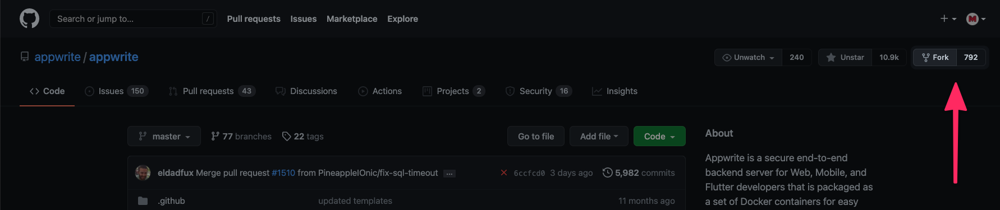

# Adding a new OAuth2 provider 🛡

This document is part of the Appwrite contributors' guide. Before you continue reading this document make sure you have read the [Code of Conduct](https://github.com/appwrite/.github/blob/main/CODE_OF_CONDUCT.md) and the [Contributing Guide](https://github.com/appwrite/appwrite/blob/master/CONTRIBUTING.md).

## Getting started

OAuth2 providers help users to log in to the apps and websites without the need to provide passwords or any other type of credentials. Appwrite's goal is to have support from as many **major** OAuth2 providers as possible.

As of the writing of these lines, we do not accept any minor OAuth2 providers. For us to accept some smaller and potentially unlimited number of OAuth2 providers, some product design and software architecture changes must be applied first.

## 1. Prerequisites

It's really easy to contribute to an open source project, but when using GitHub, there are a few steps we need to follow. This section will take you step-by-step through the process of preparing your own local version of Appwrite, where you can make any changes without affecting Appwrite right away.

> If you are experienced with GitHub or have made a pull request before, you can skip to [Implement new provider](#2-implement-new-provider).

### 1.1 Fork the Appwrite repository

Before making any changes, you will need to fork Appwrite's repository to keep branches on the official repo clean. To do that, visit the [Appwrite Github repository](https://github.com/appwrite/appwrite) and click on the fork button.



This will redirect you from `github.com/appwrite/appwrite` to `github.com/YOUR_USERNAME/appwrite`, meaning all changes you do are only done inside your repository. Once you are there, click the highlighted `Code` button, copy the URL and clone the repository to your computer using `git clone` command:

```shell
$ git clone COPIED_URL
```

> To fork a repository, you will need a basic understanding of CLI and git-cli binaries installed. If you are a beginner, we recommend you to use `Github Desktop`. It is a really clean and simple visual Git client.

Finally, you will need to create a `feat-XXX-YYY-oauth` branch based on the `master` branch and switch to it. The `XXX` should represent the issue ID and `YYY` the OAuth provider name.

## 2. Implement new provider

### 2.1 List your new provider

The first step in adding a new OAuth2 provider is to add it to the list of providers located at:

```
app/config/authProviders.php
```

Make sure to fill in all data needed and that your provider array key name:

- is in [`camelCase`](https://en.wikipedia.org/wiki/Camel_case) format
- has no spaces or special characters

> Please make sure to keep the list of providers in `authProviders.php` in the alphabetical order A-Z.

### 2.2 Add Provider Logo

Add a logo image to your new provider in this path: `public/images/users`. Your logo should be a png 100×100px file with the name of your provider (all lowercase). Please make sure to leave about 30px padding around the logo to be consistent with other logos.

### 2.3 Add Provider Class

Once you have finished setting up all the metadata for the new provider, you need to start coding.

Create a new file `XXX.php` where `XXX` is the name of the OAuth provider in [`PascalCase`](https://stackoverflow.com/a/41769355/7659504) in this location

```bash
src/Appwrite/Auth/OAuth2/XXX.php
```

Inside this file, create a new class that extends the basic OAuth2 provider abstract class. Note that the class name should start with a capital letter, as PHP FIG standards suggest.

Once a new class is created, you can start to implement your new provider's login flow. We have prepared a starting point for Oauth provider class below, but you should also consider looking at other provider's implementation and try to follow the same standards.

```php
<?php

namespace Appwrite\Auth\OAuth2;

use Appwrite\Auth\OAuth2;

// Reference Material
// [DOCS FROM OAUTH PROVIDER]

class [PROVIDER NAME] extends OAuth2
{
    private string $endpoint = '[ENDPOINT API URL]';
    protected array $user = [];
    protected array $tokens = [];
    protected array $scopes = [
        // [ARRAY_OF_REQUIRED_SCOPES]
    ];

    public function getName(): string
    {
        return '[PROVIDER NAME]';
    }

    public function getLoginURL(): string
    {
        $url = $this->endpoint . '[LOGIN_URL_STUFF]';
        return $url;
    }

    protected function getTokens(string $code): array
    {
        if (empty($this->tokens)) {
            // TODO: Fire request to oauth API to generate access_token
            // Make sure to use '$this->getScopes()' to include all scopes properly
            $this->tokens = ["[FETCH TOKEN RESPONSE]"];
        }

        return $this->tokens;
    }

    public function refreshTokens(string $refreshToken): array
    {
        // TODO: Fire request to oauth API to generate access_token using refresh token
        $this->tokens = ["[FETCH TOKEN RESPONSE]"];

        return $this->tokens;
    }

    public function getUserID(string $accessToken): string
    {
        $user = $this->getUser($accessToken);

        // TODO: Pick user ID from $user response
        $userId = "[USER ID]";

        return $userId;
    }

    public function getUserEmail(string $accessToken): string
    {
        $user = $this->getUser($accessToken);

        // TODO: Pick user email from $user response
        $userEmail = "[USER EMAIL]";

        return $userEmail;
    }

    public function isEmailVerified(string $accessToken): bool
    {
        $user = $this->getUser($accessToken);

        // TODO: Pick user verification status from $user response
        $isVerified = "[USER VERIFICATION STATUS]";

        return $isVerified;
    }

    public function getUserName(string $accessToken): string
    {
        $user = $this->getUser($accessToken);

        // TODO: Pick username from $user response
        $username = "[USERNAME]";

        return $username;
    }

    protected function getUser(string $accessToken): array
    {
        if (empty($this->user)) {
            // TODO: Fire request to oauth API to get information about users
            $this->user = "[FETCH USER RESPONSE]";
        }

        return $this->user;
    }
}

```

> If you copy this template, make sure to replace all placeholders wrapped like `[THIS]` and to implement everything marked as `TODO:`.

> If your OAuth2 provider has different endpoints for getting username/email/id, you can fire specific requests from specific get-method, and stop using `getUser` method.

Please mention in your documentation what resources or API docs you used to implement the provider's OAuth2 protocol.

## 3. Test your provider

After you finished adding your new provider to Appwrite, you should be able to see it in your Appwrite console. Navigate to 'Project > Users > Providers' and check your new provider's settings form.

> To start Appwrite console from the source code, you can simply run `docker compose up -d'.

Add credentials and check both a successful and a failed login (where the user denies integration on the provider page).

You can test your OAuth2 provider by trying to login using the [OAuth2 method](https://appwrite.io/docs/client/account#accountCreateOAuth2Session) when integrating the Appwrite Web SDK in a demo app.

Pass your new adapter name as the provider parameter. If login is successful, you will be redirected to your success URL parameter. Otherwise, you will be redirected to your failure URL.

If everything goes well, raise a pull request and be ready to respond to any feedback which can arise during our code review.

## 4. Raise a pull request

First of all, commit the changes with the message `Added XXX OAuth2 Provider` and push it. This will publish a new branch to your forked version of Appwrite. If you visit it at `github.com/YOUR_USERNAME/appwrite`, you will see a new alert saying you are ready to submit a pull request. Follow the steps GitHub provides, and at the end, you will have your pull request submitted.

## 🤕 Stuck ?

If you need any help with the contribution, feel free to head over to [our Discord channel](https://appwrite.io/discord) and we'll be happy to help you out.

## 😉 Need more freedom

If your OAuth provider requires special configuration apart from `clientId` and `clientSecret` you can create a custom form. Currently this is being realized through putting all custom fields as JSON into the `clientSecret` field to keep the project API stable. You can implement your custom form following these steps:

1. Add your custom form in `app/views/console/users/oauth/[PROVIDER].phtml`. Below is a template you can use. Add the filename to `app/config/authProviders.php`.

```php
<?php
$provider = $this->getParam('provider', '');
?>
<label for="oauth2<?php echo $this->escape(ucfirst($provider)); ?>Appid">Application (Client) ID<span class="tooltip" data-tooltip="Provided by AzureAD"><i class="icon-info-circled"></i></span></label>
<input name="appId" id="oauth2<?php echo $this->escape(ucfirst($provider)); ?>Appid" type="text" autocomplete="off" data-ls-bind="{{console-project.provider<?php echo $this->escape(ucfirst($provider)); ?>Appid}}" placeholder="Application ID" />
<?php /*Hidden input for the final secret. Gets filled with a JSON via JS. */ ?>
<input name="secret" data-forms-oauth-custom="<?php echo $this->escape(ucfirst($provider)); ?>" id="oauth2<?php echo $this->escape(ucfirst($provider)); ?>Secret" type="hidden" autocomplete="off" data-ls-bind="{{console-project.provider<?php echo $this->escape(ucfirst($provider)); ?>Secret}}" />
<!-- [Your custom form inputs go here] -->
```

2. Add the config for creating the JSON in `public/scripts/views/forms/oauth-custom.js` using this template

```js
{
    "[Provider]":{
        "[JSON property name 1]":"[html element Id 1]",
        "[JSON property name 2]":"[html element Id 2]"
    }
}
```

3. In your provider class `src/Appwrite/Auth/OAuth2/[Provider].php` add logic to decode the JSON using the same property names.
