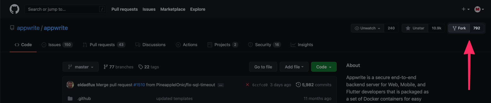

# Adding a new OAuth2 provider 🛡

This document is part of the Appwrite contributors' guide. Before you continue reading this document make sure you have read the [Code of Conduct](https://github.com/appwrite/.github/blob/main/CODE_OF_CONDUCT.md) and the [Contributing Guide](https://github.com/appwrite/appwrite/blob/master/CONTRIBUTING.md).

## Getting started

OAuth2 providers help users to log in to the apps and websites without the need to provide passwords or any other type of credentials. Appwrite's goal is to have support from as many **major** OAuth2 providers as possible.

As of the writing of these lines, we do not accept any minor OAuth2 providers. For us to accept some smaller and potentially unlimited number of OAuth2 providers, some product design and software architecture changes must be applied first.

> **Tip:** Use an existing simple provider such as [Yahoo](https://github.com/search?q=repo%3Aappwrite%2Fappwrite+Yahoo&type=code) as a copy-paste reference. Search the Appwrite repository for that provider name and update every matching file for your new provider.

## 1. Prerequisites

It's really easy to contribute to an open source project, but when using GitHub, there are a few steps we need to follow. This section will take you step-by-step through the process of preparing your own local version of Appwrite, where you can make any changes without affecting Appwrite right away.

> If you are experienced with GitHub or have made a pull request before, you can skip to [Implement new provider](#2-implement-new-provider-backend).

### 1.1 Fork the Appwrite repository

Before making any changes, you will need to fork Appwrite's repository to keep branches on the official repo clean. To do that, visit the [Appwrite Github repository](https://github.com/appwrite/appwrite) and click on the fork button.



This will redirect you from `github.com/appwrite/appwrite` to `github.com/YOUR_USERNAME/appwrite`, meaning all changes you do are only done inside your repository. Once you are there, click the highlighted `Code` button, copy the URL and clone the repository to your computer using `git clone` command:

```shell
$ git clone COPIED_URL
```

> To fork a repository, you will need a basic understanding of CLI and git-cli binaries installed. If you are a beginner, we recommend you to use `Github Desktop`. It is a really clean and simple visual Git client.

Finally, you will need to create a `feat-XXX-YYY-oauth` branch based on the `main` branch and switch to it. The `XXX` should represent the issue ID and `YYY` the OAuth provider name.

Adding a provider usually spans **two repositories**:

1. **[appwrite/appwrite](https://github.com/appwrite/appwrite)** — backend adapter, config, Project OAuth2 API, response models, and tests
2. **[appwrite/console](https://github.com/appwrite/console)** — Console UI list, update switch, and icons

The Console served by `docker compose` in this repository is a **prebuilt image** (`appwrite-console`). Local Console source changes are not picked up until you run the Console repo locally (or build and point compose at your own image).

## 2. Implement new provider (backend)

Throughout this guide, replace `XXX` / `Xxx` / `xxx` with your provider name in the correct casing (`Yahoo` / `yahoo`, `GitHub` / `github`, `paypalSandbox` / `PaypalSandbox`, and so on).

### 2.1 Checklist

| Step | File / location |
|------|-----------------|
| Config | `app/config/oAuthProviders.php` |
| Adapter | `src/Appwrite/Auth/OAuth2/Xxx.php` |
| Update action | `src/Appwrite/Platform/Modules/Project/Http/Project/OAuth2/Xxx/Update.php` |
| Provider registry | `src/Appwrite/Platform/Modules/Project/Http/Project/OAuth2/Base.php` (`getProviderActions()`) |
| HTTP registration | `src/Appwrite/Platform/Modules/Project/Services/Http.php` |
| Get response models | `src/Appwrite/Platform/Modules/Project/Http/Project/OAuth2/Get.php` |
| Response model class | `src/Appwrite/Utopia/Response/Model/OAuth2Xxx.php` |
| Response constant | `src/Appwrite/Utopia/Response.php` (`MODEL_OAUTH2_XXX`) |
| Provider list model | `src/Appwrite/Utopia/Response/Model/OAuth2ProviderList.php` |
| Model registration | `app/init/models.php` |
| Unit test allow-list | `tests/unit/Platform/Modules/Project/OAuth2/OAuth2ProviderTest.php` |
| Changelog | `CHANGES.md` |

Do **not** invent a separate test class for the provider unless it needs adapter-specific unit coverage. Add the provider id to the existing `OAuth2ProviderTest` expected list so the registry stays complete.

### 2.2 List your new provider

Add an entry to:

```
app/config/oAuthProviders.php
```

Make sure to fill in all data needed and that your provider array key name:

- is in [`camelCase`](https://en.wikipedia.org/wiki/Camel_case) format for sentence, but lowercase for names. `github` must be all lowercased, but `paypalSandbox` should have uppercase S
- has no spaces or special characters
- matches `getName()` on your adapter class and `getProviderId()` on your Update action

Keep the list of providers in `oAuthProviders.php` in alphabetical order A–Z.

Example shape:

```php
'yahoo' => [
    'name' => 'Yahoo',
    'developers' => 'https://developer.yahoo.com/oauth2/guide/flows_authcode/',
    'icon' => 'icon-yahoo',
    'enabled' => true,
    'sandbox' => false,
    'form' => false,
    'beta' => false,
    'mock' => false,
    'class' => 'Appwrite\\Auth\\OAuth2\\Yahoo',
],
```

The `icon` value is metadata for the backend. Console icons live in the Console repository (see [section 3](#3-console-and-sdk)).

### 2.3 Add Provider Class

Create a new file `Xxx.php` where `Xxx` is the name of the OAuth provider in [`PascalCase`](https://stackoverflow.com/a/41769355/7659504) in this location:

```bash
src/Appwrite/Auth/OAuth2/Xxx.php
```

Inside this file, create a new class that extends the basic OAuth2 provider abstract class. Note that the class name should start with a capital letter, as PHP FIG standards suggest.

Once a new class is created, you can start to implement your new provider's login flow. We have prepared a starting point for Oauth provider class below, but you should also consider looking at other provider's implementation and try to follow the same standards.

```php
<?php

namespace Appwrite\Auth\OAuth2;

use Appwrite\Auth\OAuth2;

// Reference Material
// [DOCS FROM OAUTH PROVIDER]

class [PROVIDER NAME] extends OAuth2
{
    private string $endpoint = '[ENDPOINT API URL]';
    protected array $user = [];
    protected array $tokens = [];
    protected array $scopes = [
        // [ARRAY_OF_REQUIRED_SCOPES]
    ];

    public function getName(): string
    {
        return '[providerId]'; // must match oAuthProviders.php key, e.g. 'yahoo'
    }

    public function getLoginURL(): string
    {
        $url = $this->endpoint . '[LOGIN_URL_STUFF]';
        return $url;
    }

    protected function getTokens(string $code): array
    {
        if (empty($this->tokens)) {
            // TODO: Fire request to oauth API to generate access_token
            // Make sure to use '$this->getScopes()' to include all scopes properly
            $this->tokens = ["[FETCH TOKEN RESPONSE]"];
        }

        return $this->tokens;
    }

    public function refreshTokens(string $refreshToken): array
    {
        // TODO: Fire request to oauth API to generate access_token using refresh token
        $this->tokens = ["[FETCH TOKEN RESPONSE]"];

        return $this->tokens;
    }

    public function getUserID(string $accessToken): string
    {
        $user = $this->getUser($accessToken);

        // TODO: Pick user ID from $user response
        $userId = "[USER ID]";

        return $userId;
    }

    public function getUserEmail(string $accessToken): string
    {
        $user = $this->getUser($accessToken);

        // TODO: Pick user email from $user response
        $userEmail = "[USER EMAIL]";

        return $userEmail;
    }

    public function isEmailVerified(string $accessToken): bool
    {
        $user = $this->getUser($accessToken);

        // TODO: Pick user verification status from $user response
        $isVerified = "[USER VERIFICATION STATUS]";

        return $isVerified;
    }

    public function getUserName(string $accessToken): string
    {
        $user = $this->getUser($accessToken);

        // TODO: Pick username from $user response
        $username = "[USERNAME]";

        return $username;
    }

    protected function getUser(string $accessToken): array
    {
        if (empty($this->user)) {
            // TODO: Fire request to oauth API to get information about users
            $this->user = "[FETCH USER RESPONSE]";
        }

        return $this->user;
    }

    /**
     * Optional. Called when enabling the provider from the Console with
     * credentials set. Throw \Exception if client id/secret are invalid.
     * See Github::verifyCredentials() for a token-endpoint probe pattern.
     */
    // public function verifyCredentials(): void {}
}

```

> If you copy this template, make sure to replace all placeholders wrapped like `[THIS]` and to implement everything marked as `TODO:`.

> If your OAuth2 provider has different endpoints for getting username/email/id, you can fire specific requests from specific get-method, and stop using `getUser` method.

Please mention in your pull request what resources or API docs you used to implement the provider's OAuth2 protocol.

### 2.4 Project OAuth2 Update action

Each provider exposes `PATCH /v1/project/oauth2/{providerId}` through a dedicated Update action. Copy a simple provider such as Yahoo:

```bash
src/Appwrite/Platform/Modules/Project/Http/Project/OAuth2/Xxx/Update.php
```

Implement at least:

- `getProviderId()` — same key as in `oAuthProviders.php`
- `getProviderClass()` — your adapter class
- `getProviderLabel()` — human-readable name (e.g. `Yahoo`)
- `getProviderSDKMethod()` — e.g. `updateOAuth2Yahoo`
- `getResponseModel()` — e.g. `Response::MODEL_OAUTH2_YAHOO`
- `getClientIdName()` / `getClientIdExample()`
- `getClientSecretName()` / `getClientSecretExample()`

Then wire the action in:

1. `Base::getProviderActions()` — map `'xxx' => Xxx\Update::class`
2. `Modules/Project/Services/Http.php` — `use` + `$this->addAction(...)`

### 2.5 Response model

1. Add `public const MODEL_OAUTH2_XXX = 'oAuth2Xxx';` in `src/Appwrite/Utopia/Response.php`
2. Create `src/Appwrite/Utopia/Response/Model/OAuth2Xxx.php` extending `OAuth2Base` (see `OAuth2Yahoo.php`)
3. Register it in `app/init/models.php` with `Response::setModel(new OAuth2Xxx());`
4. Include `Response::MODEL_OAUTH2_XXX` in:
   - `OAuth2ProviderList.php`
   - `Project/Http/Project/OAuth2/Get.php`

### 2.6 Tests and changelog

1. Add your provider id to the `$expected` array in `OAuth2ProviderTest::testProviderRegistryIsExplicitAndComplete()`
2. Add a line under the relevant section in `CHANGES.md`

## 3. Console and SDK

Backend-only changes are **not enough** for the provider to appear or save correctly in the Console.

### 3.1 Console repository ([appwrite/console](https://github.com/appwrite/console))

Open a companion PR that:

1. Adds the provider to `src/lib/stores/oauth-providers.ts` (name, icon key, docs URL, usually `component: Main`). Auth settings **filters out** providers missing from this map.
2. Adds a `case` in `src/routes/(console)/project-[region]-[project]/auth/updateOAuth.ts` that calls `projectSdk.updateOAuth2Xxx(...)`.
3. Adds SVG icons under:
   - `static/icons/light/color/{provider}.svg`
   - `static/icons/light/grayscale/{provider}.svg`
   - `static/icons/dark/color/{provider}.svg`
   - `static/icons/dark/grayscale/{provider}.svg`

Use an existing provider folder (for example `yahoo`) as the icon template.

### 3.2 Specs and Console SDK

The Console checks `OAuthProvider` from `@appwrite.io/console` before calling Update:

```ts
if (!isValueOfStringEnum(OAuthProvider, provider.key)) {
    throw new Error(`Invalid OAuth2 provider: ${provider.key}`);
}
```

Until the generated SDK enum includes your provider:

1. Regenerate Appwrite API specs after the backend endpoints/models land
2. Regenerate / bump the Console SDK so `OAuthProvider` and `updateOAuth2Xxx` exist
3. Point local Console at that SDK build while developing

Without the SDK update, enabling the provider in the UI fails with **Invalid OAuth2 provider**, even when `PATCH /v1/project/oauth2/{providerId}` works via curl.

### 3.3 Local development tips

- Rebuild / recreate the Appwrite containers after backend changes: `docker compose up -d --force-recreate --build`
- Confirm the backend lists the provider, for example:
  - `GET /v1/project/oauth2` (Network tab while on Auth settings), or
  - `docker exec -it appwrite php -r "print_r(require '/usr/src/code/app/config/oAuthProviders.php');"`
- To exercise Console UI changes, run the Console repository against your local Appwrite endpoint. The `appwrite-console` service in this repo’s compose file uses a published image and will not include your unreleased Console edits.
- You can still validate the Project API without Console by calling `PATCH /v1/project/oauth2/{providerId}` directly.

## 4. Test your provider

1. Run unit coverage for the Project OAuth2 registry:

   ```shell
   docker compose exec appwrite test tests/unit/Platform/Modules/Project/OAuth2/
   ```

2. With backend + Console wired, open **Auth → Settings**, find your provider, save Client ID / Client Secret, and enable it.

3. Exercise login with the [OAuth2 session API](https://appwrite.io/docs/references/cloud/client-web/account#createOAuth2Session) (or a small Web SDK demo). Pass your provider id as the `provider` parameter. Confirm both success and failure (user denies consent) redirects.

If everything goes well, raise pull requests for Appwrite and Console and be ready to respond to code review feedback.

## 5. Raise a pull request

Commit the changes with a clear message such as `Added XXX OAuth2 Provider` and push your branch. Open a PR from your fork. Link the related feature issue, and link the Console PR when you have one.

## Stuck?

If you need any help with the contribution, feel free to head over to [our Discord channel](https://appwrite.io/discord) and we'll be happy to help you out.

## Providers with extra fields

If your OAuth provider needs more than a single client id + client secret (domain, tenant, realm, Apple key material, OIDC discovery URLs, and so on), do **not** add legacy `.phtml` Console forms. Those paths are obsolete.

Instead, follow an existing multi-field provider such as Auth0, Microsoft, Apple, or OIDC:

1. Override `getParameters()` (and often the Update action constructor) in `.../OAuth2/Xxx/Update.php` so the Project API exposes the extra params.
2. Store non-secret extras in the JSON blob under `{providerId}Secret` when that is the existing pattern for that style of provider (see Auth0 / Gitlab / Apple).
3. Override `buildReadResponse()` when the Console needs those extras back (with secrets zeroed).
4. In the Console, either reuse `mainOAuth.svelte` with parameters from the API, or add a dedicated component under `auth/(providers)/` when the UI is special-cased (Google and OIDC are examples).
5. Extend the `updateOAuth.ts` switch to pass every field through to `updateOAuth2Xxx`.
