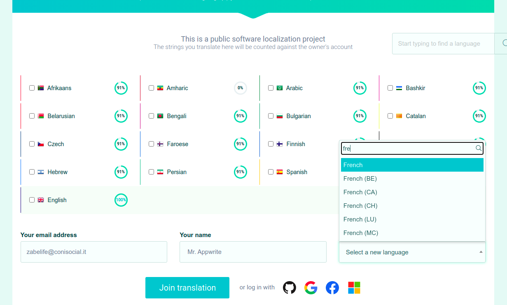
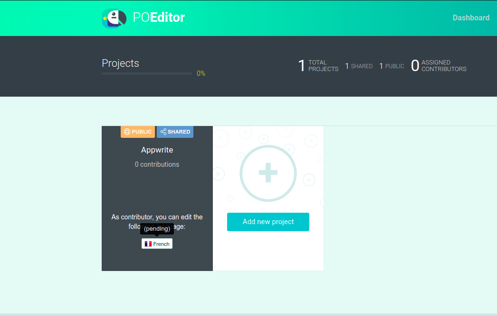
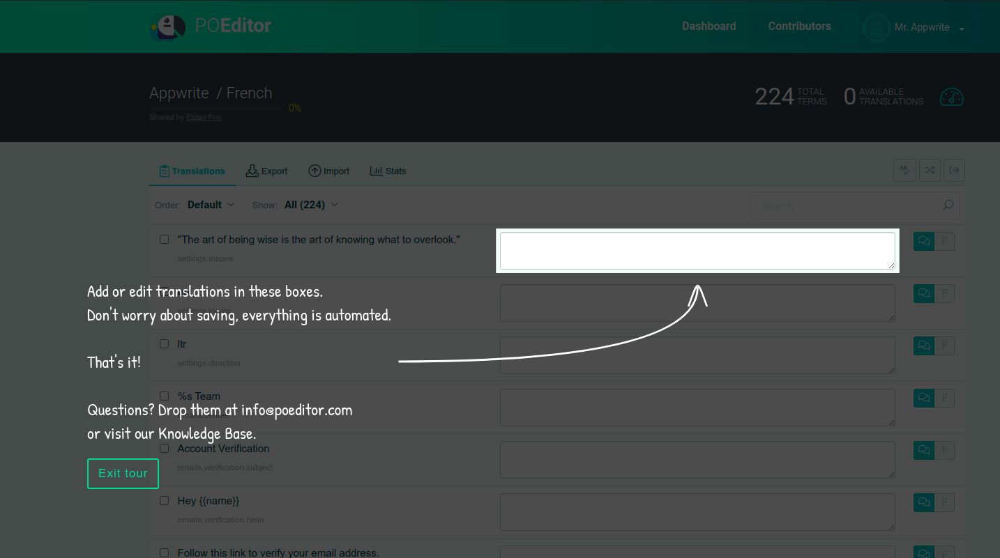
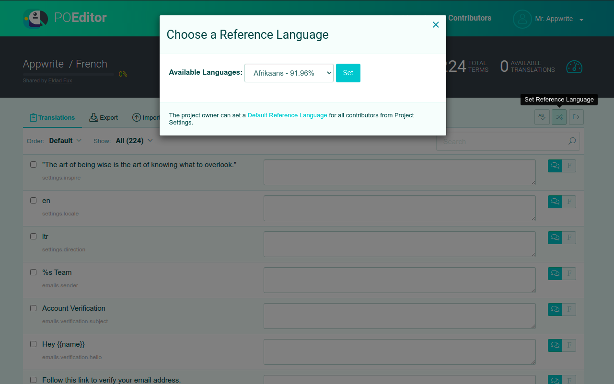
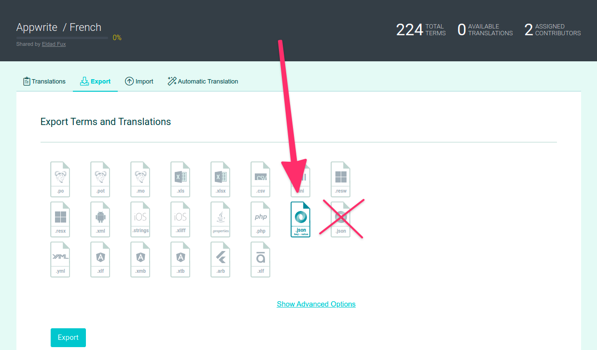

# Help translate Appwrite to your language ✍️

This document is part of the Appwrite contributors' guide. Before you continue reading this document make sure you have read the [Code of Conduct](https://github.com/appwrite/appwrite/blob/master/CODE_OF_CONDUCT.md) and the [Contributing Guide](https://github.com/appwrite/appwrite/blob/master/CONTRIBUTING.md).

## Getting Started

### Agenda

Appwrite's Locale API, Email Templates ( and soon our Dashboard ) has support for returning responses in your own locale based on the value of the `X-Appwrite-Locale` header. Behind the scenes, we use the value in this header to find the correct translation file for the locale. This guide will walk you through the process of adding a new Locale to Appwrite. 

You can help in three distinct ways 
* Adding support for new locales.
* Helping us with existing incomplete translations. 
* Reviewing existing translations for correctness.

You can choose to contribute either directly on [**Github**](#contributing-with-github) or using [**POEditor**](#contributing-with-po-editor) if you prefer a GUI.

### Contributing with Github

We maintain a [`locale branch`](https://github.com/appwrite/appwrite/tree/locale/) under the [appwrite/appwrite repo](https://github.com/appwrite/appwrite/) exclusively for translations related PRs. Here are a few files that you need to refer to help with your contribution.

1. **terms.json**

    [terms.json](https://github.com/appwrite/appwrite/blob/locale/app/config/locale/terms.json) contains all the terms that are used in Appwrite that require translation. Each term is a JSON object as shown below.

    ```json
    [
        {
            "term": "settings.inspire",
            "comment": "This string is used as an easter egg in the appwrite.io source code.",
            "reference": ""
        }
    ]
    ```

2. **en.json**

    [en.json]((https://github.com/appwrite/appwrite/blob/locale/app/config/locale/translations/en.json)) contains the English translation for all the terms that are present in **terms.json**. You can use this file as a reference when making a contribution for your language.

    ```json
    {
        "settings.inspire": "\"The art of being wise is the art of knowing what to overlook.\"",
        "settings.locale": "en",
        "settings.direction": "ltr",
        "emails.sender": "%s Team",
        ....
        ....
    }
    ```

3. **languages.php**

    [languages.php](https://github.com/appwrite/appwrite/blob/locale/app/config/locale/languages.php) contains all the languages listed in **[ISO 639-1](https://en.wikipedia.org/wiki/List_of_ISO_639-1_codes)**. You can use this file to find your language code when making a contribution for your language. 

Great, let's start. First, find the code of the language you want to add. For example, if you want to add support for **Spanish**, you can find the code for Spanish in [languages.php](https://github.com/appwrite/appwrite/blob/locale/app/config/locale/languages.php#L202).

Once you have found the ISO language code for **Spanish** (es), create a new file `/app/config/locale/translations/es.json` just like all [the other languages](https://github.com/appwrite/appwrite/tree/locale/app/config/locale/translations). 

Next, choose a reference language. If English is your reference language, copy the contents of [`en.json`](https://github.com/appwrite/appwrite/blob/locale/app/config/locale/translations/en.json) into `/app/config/locale/translations/es.json` and translate all the corresponding strings like so 

```json
{
    "settings.inspire": "\"El arte de ser sabio es el arte de saber qué pasar por alto\"",
    "settings.locale": "es",
    "settings.direction": "ltr",
    "emails.sender": "Equipo %s"
    ... ...
}
```
Add your language code to [codes.php](https://github.com/appwrite/appwrite/blob/locale/app/config/locale/codes.php#L14) in the following format
```php
    ...
    'es', // Spanish
    ...
```

Finally, load your translation file in `init.php` by following a pattern similar to the [existing languages](https://github.com/appwrite/appwrite/blob/locale/app/init.php#L269).

### Contributing with PO Editor

We use [PO Editor](https://poeditor.com/) to manage all our translations in a convenient way. The first step is to join the Appwrite Project on PO Editor using [our invite link](https://poeditor.com/join/project?hash=BNrWbRXyk6). 

On the home page, you can see all the languages that we currently support and the progress in each one. You can choose to be help us complete the existing translations or add new ones.



Once you've chosen the languages you want to contribute to, click on **Join Translation** with your email ID and name or choose one of the OAuth providers.

Continue with the rest of the process until you arrive at your dashboard.



Your request might be pending, so you can ping us on Discord and we'll make the process faster 😀 . Once your request has been accepeted, you can proceed.



You're now ready to start contributing. On the left, you'll find the string to be translated in the default reference language ( which is English ). You can also change the default language to something that you're more familiar with using the toggle. 



Once you're happy with your translations, you can export them. Head over to the **Exports** tab and choose the **Key-Value JSON** option only. Download the file and you can then follow the steps similar to the Github approach. 



### 🤕 Stuck ? 
If you need any help with the contribution, feel free to head over to [our discord channel](https://appwrite.io/discord) and we'll be happy to help you out.
