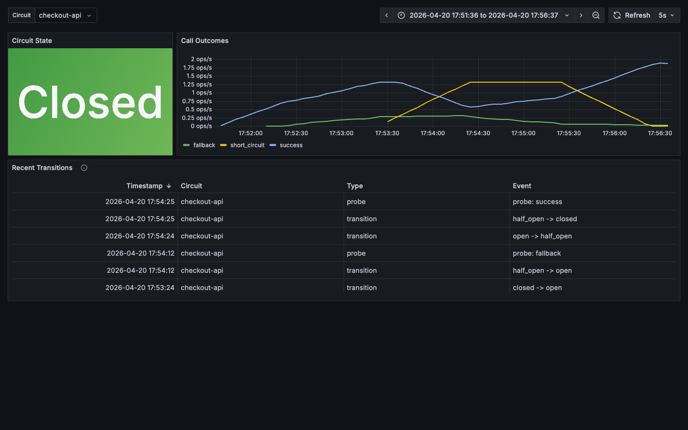

# Utopia Circuit Breaker

> [!IMPORTANT]
> This repository is a read-only mirror of the [utopia-php monorepo](https://github.com/utopia-php/monorepo). Development happens in [`packages/circuit-breaker`](https://github.com/utopia-php/monorepo/tree/main/packages/circuit-breaker) — please open issues and pull requests there.

[](https://github.com/utopia-php/circuit-breaker/actions/workflows/tests.yml)

[](https://appwrite.io/discord)

Utopia Circuit Breaker is a simple and lite library for protecting PHP applications from cascading failures when a downstream dependency misbehaves. The breaker tracks failures, short-circuits calls when a service is unhealthy, and gradually probes recovery — with optional shared state (Redis / Swoole Table) and native telemetry via [`utopia-php/telemetry`](https://github.com/utopia-php/telemetry). This library is aiming to be as simple and easy to learn and use. This library is maintained by the [Appwrite team](https://appwrite.io).

Although this library is part of the [Utopia Framework](https://github.com/utopia-php/framework) project it is dependency free and can be used as standalone with any other PHP project or framework.

## Getting started

Install using Composer:

```bash
composer require utopia-php/circuit-breaker
```

Init in your PHP code:

```php
require_once __DIR__ . '/vendor/autoload.php';

use Utopia\CircuitBreaker\CircuitBreaker;

$breaker = new CircuitBreaker(
    timeout: 30,             // Try half-open after 30 seconds
    successThreshold: 2,     // Require 2 successes to close circuit
    window: 10,              // Judge the failure rate over 10 seconds
    failureRatio: 0.5,       // Open when half the calls in the window fail
    minimumThroughput: 20    // ...once there are enough calls to be sure
);

$result = $breaker->call(
    open: fn () => 'Service unavailable - circuit is open',
    close: fn () => makeExternalApiCall(),
    halfOpen: fn () => makeExternalApiCall() // Optional: called during recovery testing
);
```

## How it works

The circuit breaker operates in three states:

1. **CLOSED** (normal operation) — calls pass through to the protected service. Outcomes are recorded in a rolling `window`; once at least `minimumThroughput` calls have been seen and `failureRatio` of them failed, the circuit transitions to **OPEN**. See [why a rate and not a count](#why-a-rate-and-not-a-count).
2. **OPEN** (blocking) — calls are immediately short-circuited to the `open` callback (your fallback). After `timeout` seconds the circuit transitions to **HALF_OPEN**.
3. **HALF_OPEN** (probing recovery) — the next calls execute the `halfOpen` callback (or `close` if not provided). After `successThreshold` consecutive successes the circuit transitions back to **CLOSED**; any failure immediately re-opens it. At most `halfOpenPermittedCalls` probes run at a time; callers arriving while that many are in flight take the fallback, as they would while the circuit is open.

The optional `halfOpen` callback lets you apply different behaviour while probing (shorter timeouts, smaller payloads, extra logging).

### Why a rate and not a count

The circuit opens on a failure *rate* over a rolling window, never on a run of consecutive failures.

A count answers "how many calls failed". On any shared connection or pool that is partly a fact about how many calls were in flight when something broke, rather than about how unhealthy the dependency is. One fault fails everything queued behind it, so the same fault costs three failures on an idle caller and ninety on a busy one — and the busy one opens its circuit on a fault the idle one shrugs off. Counting consecutive failures also cannot see a steady trickle at all, because the successes interleaved with it keep resetting the tally.

A rate is the same number either way.

`minimumThroughput` is what stops a quiet circuit opening on thin evidence: one failure among two calls is a 50% failure rate, and means nothing. Below that many calls in the window, the circuit stays closed however badly they went.

The window is two buckets, each `window` wide — the one being filled and the one before it. Totalling both covers between one and two windows depending on where the current bucket started. That is the trade for not keeping a timestamp per call, and it only ever errs by remembering slightly too much, never by forgetting a failure early.

It is measured per process, and not written to the cache adapter. What is worth sharing between processes is the verdict — the state and when it was reached — and that still is. The tally behind it is a measurement of recent local traffic, and persisting it would mean writing counters on every call, successes included: a cost on the hot path, paid to share a number each process can compute for itself. Any process that sees a bad enough rate opens the shared circuit for all of them.

### Limiting the recovery herd

Half open asks one question — is the dependency back — and one probe answers it. Letting every waiting caller ask at the same moment sends the dependency the full load it just failed under, at the moment it is least able to take it.

`halfOpenPermittedCalls` (default `1`) caps how many probes run concurrently. Callers arriving while the cap is reached take the fallback without executing, exactly as they would while the circuit is open, and they count as neither recovery nor failure. The cap applies only to the half-open state: a closed circuit is not probing, and throttling it would be a concurrency limiter rather than a breaker.

Probes are counted per process. That bounds the herd one process can send, which is the part a process can observe; a cross-process count would need a lease with its own timeout to survive a crashed holder.

## Examples

### Using all three states

```php
use Utopia\CircuitBreaker\CircuitBreaker;

$breaker = new CircuitBreaker(timeout: 30, successThreshold: 2, minimumThroughput: 3);

$result = $breaker->call(
    open: function () {
        // Circuit is OPEN — service is down
        logger()->warning('Circuit breaker is OPEN - using fallback');
        return getCachedData() ?? ['error' => 'Service unavailable'];
    },
    close: function () {
        // Circuit is CLOSED — normal operation
        return apiClient()->fetchData();
    },
    halfOpen: function () {
        // Circuit is HALF_OPEN — testing recovery
        logger()->info('Circuit breaker testing recovery...');
        return apiClient()->fetchData(['timeout' => 5]);
    }
);
```

### Wrapping a real HTTP call

```php
use Utopia\CircuitBreaker\CircuitBreaker;

$breaker = new CircuitBreaker(timeout: 60, successThreshold: 2, minimumThroughput: 5);

$data = $breaker->call(
    open: fn () => cache()->get('user_data') ?? ['error' => 'Service temporarily unavailable'],
    close: function () {
        $response = Http::get('https://api.example.com/users');

        if (!$response->successful()) {
            throw new \Exception('API request failed');
        }

        return $response->json();
    }
);
```

### Shared cache state

By default, each `CircuitBreaker` instance keeps state in memory. To share circuit state between PHP workers, pass a cache adapter and a stable `key`.

#### Redis

```php
use Utopia\CircuitBreaker\Adapter\Redis as RedisAdapter;
use Utopia\CircuitBreaker\CircuitBreaker;

$redis = new \Redis();
$redis->connect('127.0.0.1');

$breaker = new CircuitBreaker(
    minimumThroughput: 5,
    timeout: 60,
    successThreshold: 2,
    cache: new RedisAdapter($redis),
    key: 'users-api'
);
```

#### Swoole Table

Use the Swoole adapter when workers need to share state through Swoole shared memory.

```php
use Utopia\CircuitBreaker\Adapter\SwooleTable;
use Utopia\CircuitBreaker\CircuitBreaker;

$table = SwooleTable::createTable(size: 1024);
$cache = new SwooleTable($table);

$breaker = new CircuitBreaker(
    minimumThroughput: 5,
    timeout: 60,
    successThreshold: 2,
    cache: $cache,
    key: 'users-api'
);
```

### Telemetry

Telemetry is opt-in. The `telemetry` constructor argument defaults to `null`, which emits no metrics and does not require `utopia-php/telemetry` at runtime. Install `utopia-php/telemetry` and pass any adapter to emit counters and gauges for calls, fallbacks, callback failures, transitions, state, failure counts, success counts, active calls, and transition/probe events.

```bash
composer require utopia-php/telemetry
```

```php
use Utopia\CircuitBreaker\CircuitBreaker;
use Utopia\Telemetry\Adapter\OpenTelemetry;

$telemetry = new OpenTelemetry(
    'http://otel-collector:4318/v1/metrics',
    'backend',
    'orders',
    gethostname() ?: 'local'
);

$breaker = new CircuitBreaker(
    minimumThroughput: 5,
    timeout: 60,
    successThreshold: 2,
    key: 'orders-api',
    telemetry: $telemetry,
    metricPrefix: 'backend'
);

$result = $breaker->call(
    open: fn () => ['fallback' => true],
    close: fn () => $client->request('/orders')
);

$telemetry->collect();
```

By default, metrics are emitted as `breaker.*`. Pass `metricPrefix` to namespace those metric names for a host application; for example `metricPrefix: 'backend'` emits `backend.breaker.calls`.

You can also attach or replace the adapter after construction:

```php
$breaker = new CircuitBreaker(metricPrefix: 'backend');
$breaker->setTelemetry($telemetry);
```

## API

### Constructor parameters

- `timeout` (int, default `30`) — seconds to wait before transitioning to half-open
- `successThreshold` (int, default `2`) — consecutive half-open successes required to close
- `cache` (`?Utopia\CircuitBreaker\Adapter`, default `null`) — optional shared cache adapter
- `key` (string, default `default`) — cache namespace for one circuit's state
- `telemetry` (`?Utopia\Telemetry\Adapter`, default `null`) — optional telemetry adapter
- `metricPrefix` (string, default `''`) — optional prefix for telemetry metric names (e.g. `edge`)
- `window` (int, default `10`) — seconds of history the failure rate is judged over
- `failureRatio` (float, default `0.5`) — share of calls in the window that must fail to open the circuit, greater than 0 and at most 1
- `minimumThroughput` (int, default `20`) — calls required in the window before the ratio is trusted
- `halfOpenPermittedCalls` (int, default `1`) — probes allowed to run concurrently while half open

### `call()` parameters

```php
$breaker->call(
    open: callable,      // Required: Called when circuit is OPEN
    close: callable,     // Required: Called when circuit is CLOSED (or HALF_OPEN if no halfOpen callback)
    halfOpen: ?callable  // Optional: Called when circuit is HALF_OPEN
);
```

### State inspection

```php
$state = $breaker->getState();  // Utopia\CircuitBreaker\CircuitState enum

$breaker->isOpen();
$breaker->isClosed();
$breaker->isHalfOpen();

$breaker->getFailureCount();
$breaker->getSuccessCount();
```

## System requirements

- PHP 8.2 or later
- Optional: `utopia-php/telemetry`, `ext-opentelemetry`, and `ext-protobuf` for OpenTelemetry metrics and the local telemetry demo
- Optional: `ext-redis` for `Utopia\CircuitBreaker\Adapter\Redis`
- Optional: `ext-swoole` for `Utopia\CircuitBreaker\Adapter\SwooleTable`

## Tests

Unit tests avoid Redis and Swoole runtime dependencies:

```bash
composer test
```

E2E tests run Redis and a PHP runtime with the Redis/Swoole extensions through Docker:

```bash
composer test:e2e:docker
```

### Local telemetry demo

Start Redis, an instrumented PHP demo server, OpenTelemetry Collector, Prometheus, and Grafana:

```bash
composer telemetry:up
```

- Demo UI: http://localhost:8080
- Grafana: http://localhost:3030/d/circuit-breaker/circuit-breaker-telemetry
- Prometheus: http://localhost:9090

Preview from a five-minute `checkout-api` scenario:



Populate the dashboard with the same scenario:

```bash
composer telemetry:scenario
```

Stop the stack and remove local volumes:

```bash
composer telemetry:down
```

## Copyright and license

The MIT License (MIT) [http://www.opensource.org/licenses/mit-license.php](http://www.opensource.org/licenses/mit-license.php)
